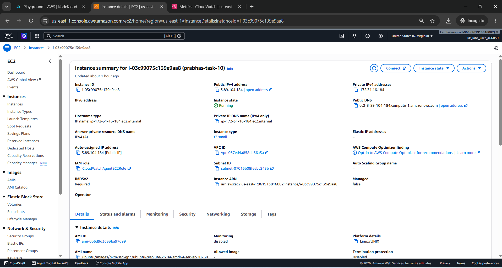
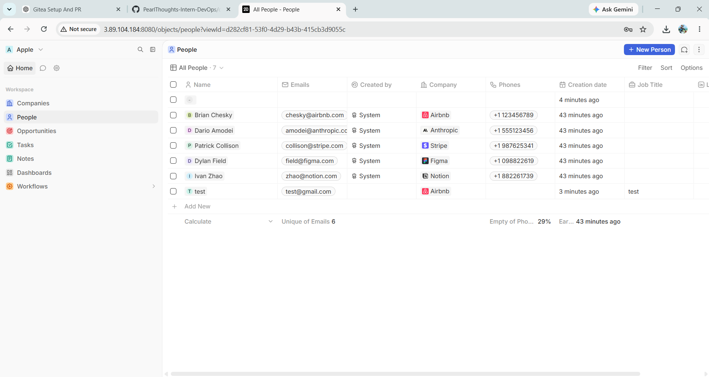
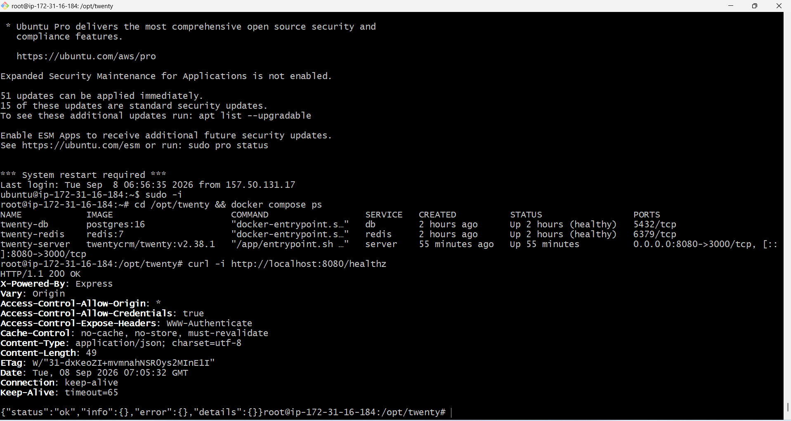
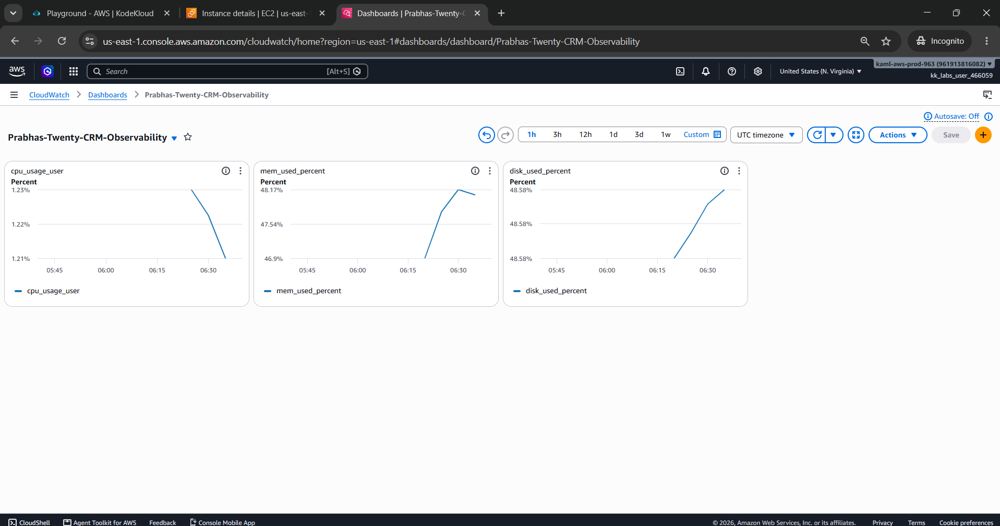
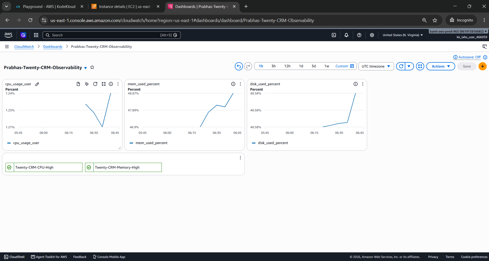
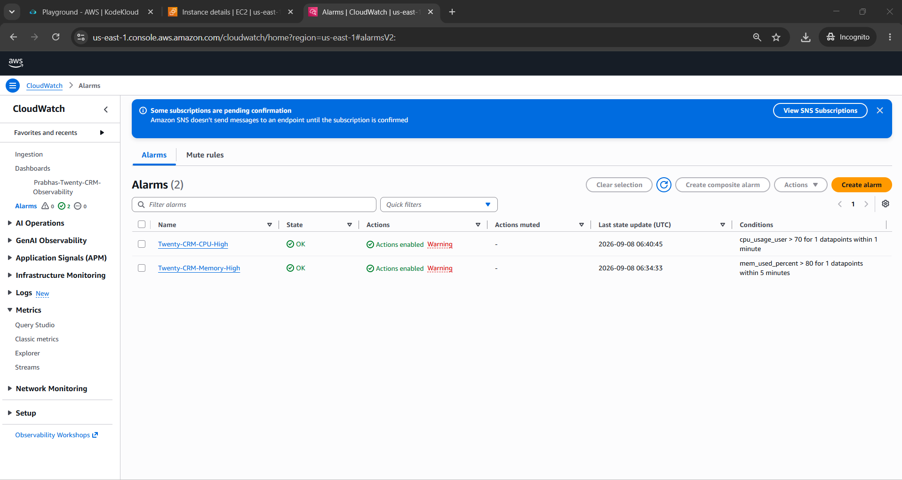
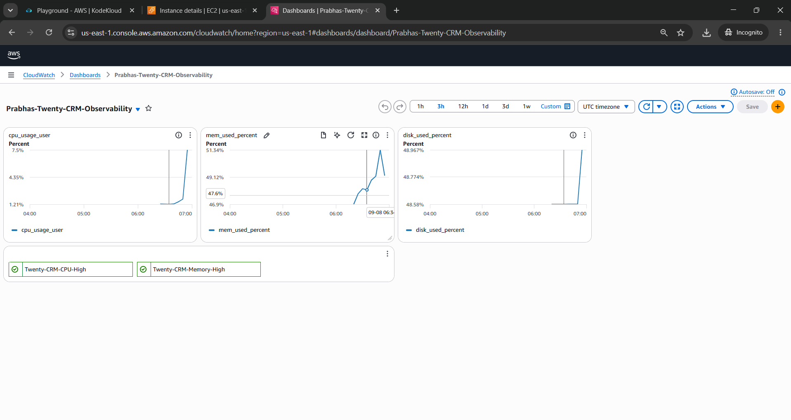

# Task 10: AWS Observability with CloudWatch

## 1. Objective

The objective of this task was to deploy Twenty CRM on an AWS EC2 instance and implement AWS CloudWatch monitoring and alerting for system-level observability.

The implementation includes:

- Twenty CRM deployment using Docker Compose
- PostgreSQL and Redis containers
- EC2 default CloudWatch metrics
- CloudWatch Agent installation and configuration
- CPU, memory, and disk monitoring
- CloudWatch alarms
- CloudWatch dashboard
- Application activity testing
- Health-check verification
- Troubleshooting and validation

## 2. AWS Environment

| Component | Configuration |
|---|---|
| Cloud Provider | AWS |
| Instance Type | t3.small |
| Operating System | Ubuntu |
| Application | Twenty CRM |
| Application Port | 8080 |
| CloudWatch Agent | 1.300072.0b1766 |
| Monitoring Namespace | CWAgent |

## 3. IAM Configuration

An IAM role was created and attached to the EC2 instance:

`CloudWatchAgentEC2Role`

The role was configured with:

- `CloudWatchAgentServerPolicy`
- `AmazonSSMManagedInstanceCore`

The role allows the CloudWatch Agent running on EC2 to publish monitoring metrics to CloudWatch.

## 4. Twenty CRM Deployment

Twenty CRM was deployed using Docker Compose.

The deployment contains:

```text
twenty-server
twenty-db
twenty-redis
```

The application is exposed through:

```text
EC2:8080 -> Container:3000
```

### Container verification

```bash
cd /opt/twenty
docker compose ps
```

The containers were verified as running, with PostgreSQL and Redis reporting healthy status.

### Application health check

```bash
curl -i http://localhost:8080/healthz
```

Result:

```text
HTTP/1.1 200 OK
```

Response:

```json
{
  "status": "ok",
  "info": {},
  "error": {},
  "details": {}
}
```

The Twenty CRM dashboard was also accessed successfully through the EC2 public address.

## 5. EC2 Default CloudWatch Metrics

The default EC2 CloudWatch metrics were explored through:

```text
CloudWatch -> Metrics -> EC2
```

EC2 default metrics were checked before configuring the CloudWatch Agent.

## 6. CloudWatch Agent Installation

The CloudWatch Agent was downloaded and installed on the Ubuntu EC2 instance.

Download:

```bash
cd /tmp
wget https://amazoncloudwatch-agent.s3.amazonaws.com/ubuntu/amd64/latest/amazon-cloudwatch-agent.deb
```

Installation:

```bash
sudo dpkg -i /tmp/amazon-cloudwatch-agent.deb
```

## 7. CloudWatch Agent Configuration

The configuration file was created at:

```text
/opt/aws/amazon-cloudwatch-agent/etc/amazon-cloudwatch-agent.json
```

Configuration:

```json
{
  "agent": {
    "metrics_collection_interval": 60,
    "run_as_user": "root"
  },
  "metrics": {
    "namespace": "CWAgent",
    "append_dimensions": {
      "InstanceId": "${aws:InstanceId}"
    },
    "metrics_collected": {
      "cpu": {
        "measurement": [
          "cpu_usage_idle",
          "cpu_usage_user",
          "cpu_usage_system"
        ],
        "metrics_collection_interval": 60,
        "totalcpu": true
      },
      "mem": {
        "measurement": [
          "mem_used_percent"
        ],
        "metrics_collection_interval": 60
      },
      "disk": {
        "measurement": [
          "used_percent"
        ],
        "resources": [
          "/"
  }
}

### Metrics collected
| Metric | Purpose |
| `cpu_usage_idle` | CPU idle percentage |
| `cpu_usage_user` | CPU used by user processes |
| `cpu_usage_system` | CPU used by system processes |
| `disk_used_percent` | Percentage of disk space used |
The collection interval was configured for **60 seconds**.


```bash
The configuration validation completed successfully.


```bash
sudo /opt/aws/amazon-cloudwatch-agent/bin/amazon-cloudwatch-agent-ctl -a status


```json
{
  "status": "running",
  "starttime": "2026-09-08T06:24:46+00:00",
  "configstatus": "configured",
  "version": "1.300072.0b1766"
}
```

## 9. CloudWatch Metrics Verification

The custom metrics were verified in:

```text
CloudWatch -> Metrics -> CWAgent
```
Result:
```

Metrics successfully observed:
### Agent status verification

```text

cpu_usage_user
```
mem_used_percent
sudo /opt/aws/amazon-cloudwatch-agent/bin/amazon-cloudwatch-agent-ctl   -a fetch-config   -m ec2   -c file:/opt/aws/amazon-cloudwatch-agent/etc/amazon-cloudwatch-agent.json   -s
disk_used_percent
## 8. Starting the CloudWatch Agent
```

The metrics were associated with the EC2 instance through the `InstanceId` dimension.


| `mem_used_percent` | Percentage of memory used |
## 10. CloudWatch Alarms

Two CloudWatch alarms were created.
|---|---|

### Memory alarm


```text
Name: Twenty-CRM-Memory-High
Metric: mem_used_percent
Statistic: Average
```
Period: 5 minutes
Threshold: > 80%
```

### CPU alarm

```text
Name: Twenty-CRM-CPU-High
Metric: cpu_usage_user
Statistic: Average
Period: 5 minutes

Threshold: > 70%
```

The alarms were configured with notification actions through Amazon SNS.

Immediately after creation, the CPU alarm temporarily showed `Insufficient data` while CloudWatch collected the required datapoints. The memory alarm subsequently showed `OK`.

## 11. CloudWatch Dashboard

A dedicated CloudWatch dashboard was created:

```text
Prabhas-Twenty-CRM-Observability
```

The dashboard contains:

- CPU usage
- Memory usage
- Disk usage
- Twenty CRM CPU alarm
- Twenty CRM memory alarm

Dashboard metrics:

```text
cpu_usage_user
mem_used_percent
disk_used_percent
```

The dashboard was saved successfully.

## 12. Application Activity Testing

Twenty CRM was accessed through the browser and normal CRM activity was performed.

Additional lightweight HTTP activity was generated against the health endpoint:

```bash
for i in {1..30}; do
  curl -s http://localhost:8080/healthz > /dev/null
  sleep 1
done
```

After allowing time for CloudWatch to collect new datapoints, the dashboard was refreshed.

The dashboard showed changes in the monitored metrics, demonstrating that the CloudWatch Agent was actively collecting system metrics.

Observed activity included:

- CPU increased from the previous low baseline
- Memory usage changed
- Disk usage was updated
- CloudWatch dashboard datapoints were refreshed

The alarms remained in their normal state during the test because the configured thresholds were not intentionally exceeded.

## 13. Troubleshooting

### Issue 1: IAM role was initially not attached

The EC2 instance was initially launched without an IAM role.

Resolution:

A dedicated IAM role named `CloudWatchAgentEC2Role` was created with:

- `CloudWatchAgentServerPolicy`
- `AmazonSSMManagedInstanceCore`

The role was then attached to the running EC2 instance.


### Issue 2: CloudWatch Agent metrics were not immediately visible


After starting the agent, the metrics required some time to appear in CloudWatch.

Resolution:


- Verified the agent status locally.
- Waited for metric collection.
- Checked the `CWAgent` namespace.
- Verified the `InstanceId` dimension.
- Confirmed CPU, memory, and disk metrics were available.

### Issue 3: Twenty CRM startup/resource constraints

The EC2 instance was a small `t3.small` instance with approximately 2 GiB RAM.

A 2 GiB swap file was configured to provide additional memory headroom during application startup and monitoring activities.

Twenty CRM was eventually verified as healthy through:

```bash
curl -i http://localhost:8080/healthz

```

with:

```text
HTTP/1.1 200 OK
```

## 14. Verification Summary

| Requirement | Status |
|---|---|
| EC2 launched | Completed |
| Twenty CRM deployed | Completed |
| Twenty CRM dashboard accessed | Completed |
| EC2 default metrics checked | Completed |
| CloudWatch Agent installed | Completed |
| CPU monitoring | Completed |
| Memory monitoring | Completed |
| Disk monitoring | Completed |
| CloudWatch metrics verified | Completed |
| Memory alarm created | Completed |
| CPU alarm created | Completed |
| CloudWatch dashboard created | Completed |
| Application activity generated | Completed |
| Metrics change verified | Completed |
| Twenty CRM health check | `200 OK` |
| Docker containers verified | Healthy |

## 15. Evidence / Screenshots

The following screenshots were captured during implementation:

1. EC2 instance and configuration
2. Twenty CRM dashboard
3. Twenty CRM Docker containers
4. Twenty CRM health check
5. EC2 default CloudWatch metrics
6. CloudWatch Agent status
7. `CWAgent` memory metric
8. `Twenty-CRM-Memory-High` alarm
9. `Twenty-CRM-CPU-High` alarm
10. CloudWatch dashboard with CPU, memory and disk
11. CloudWatch dashboard with alarms
12. Dashboard after Twenty CRM activity showing metric changes

## 16. Conclusion

AWS CloudWatch observability was successfully implemented for the Twenty CRM application running on EC2.

The CloudWatch Agent collects CPU, memory, and disk metrics every 60 seconds. CloudWatch alarms provide threshold-based monitoring for high CPU and memory usage, while the dedicated dashboard provides a centralized view of infrastructure health.

Twenty CRM was accessed and tested during monitoring, and changes in system metrics were observed on the CloudWatch dashboard.

## Screenshots

### 1. EC2 Instance


### 2. Twenty CRM Dashboard


### 3. Docker Containers and Health Check


### 4. CloudWatch Metrics


### 5. CloudWatch Dashboard


### 6. CloudWatch Alarms


### 5. CloudWatch Hike Dashboard

