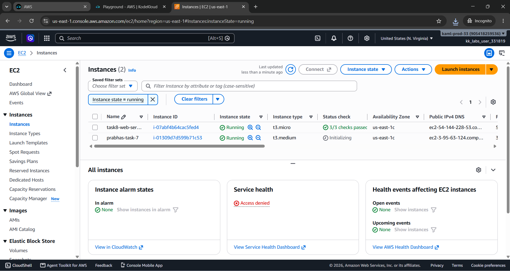
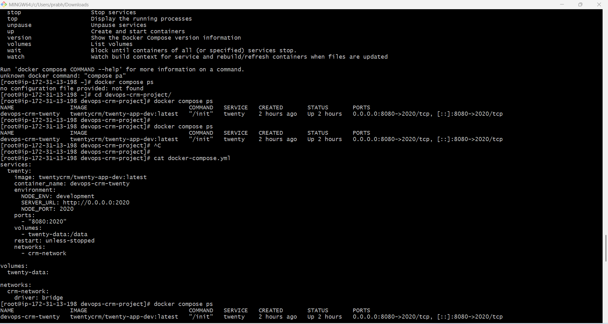
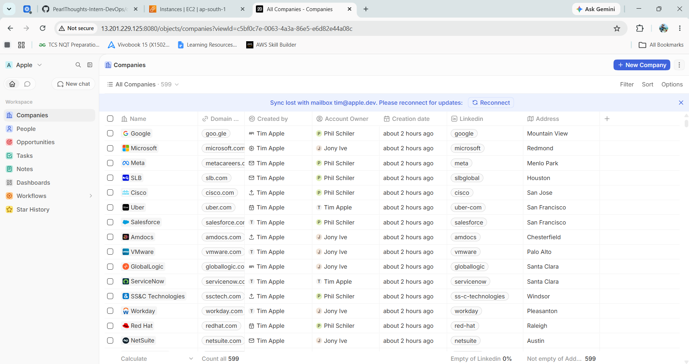

Task 7: AWS EC2 – Twenty CRM Deployment

1. Objective

The objective of this task was to launch and configure an AWS EC2 instance and deploy the Twenty CRM application on the EC2 instance.

The task included:

Launching an EC2 instance

Selecting an appropriate AMI and instance type

Configuring a key pair

Configuring a Security Group

Connecting to the EC2 instance

Installing the required software

Cloning the devops-crm-project repository

Installing and configuring Docker

Deploying Twenty CRM using Docker Compose

Configuring port forwarding

Verifying application health

Accessing the Twenty CRM dashboard from a browser

Documenting issues and solutions

Creating a Git branch

Preparing the Task 7 Pull Request

2. AWS Console Login

The provided AWS credentials were used to sign in to the AWS Management Console.

Navigation:

AWS Console → EC2 → Instances → Launch Instance

3. Launch EC2 Instance

An EC2 instance was launched in the provided AWS account.

Configuration

Value

Service

Amazon EC2

Operating System

Amazon Linux

Architecture

x86_64

Instance Type

As required by the task

Key Pair

Configured SSH key pair

Storage

EBS storage

Network

VPC configuration

Security Group

Custom Security Group

After configuration, the instance was launched and its state was verified as Running.

4. AMI Configuration

An Amazon Linux AMI was selected.

An AMI (Amazon Machine Image) provides the operating system and initial configuration used to launch an EC2 instance.

5. Instance Type

An appropriate instance type was selected according to the task requirements.

The instance type determines CPU, memory, network performance, and available compute resources.

6. Key Pair Configuration

A key pair was configured during EC2 instance creation.

The private key was stored securely and used for SSH authentication.

Example:

ssh -i <key-file.pem> ec2-user@<EC2-PUBLIC-IP>

The private key was not shared publicly.

7. Security Group Configuration

A Security Group was configured as the virtual firewall for the EC2 instance.

Type

Protocol

Port

Source

Purpose

SSH

TCP

22

Required administration source

EC2 SSH access

Custom TCP

TCP

8080

0.0.0.0/0

Twenty CRM access

Port 8080 was opened so the Twenty CRM dashboard could be accessed through the EC2 public IP.

For production environments, access to port 8080 should preferably be restricted to trusted IP addresses.

8. Connect to EC2

The EC2 instance was accessed through SSH.

ssh -i <key-file.pem> ec2-user@<EC2-PUBLIC-IP>

9. Install Docker

Docker was installed on the EC2 instance.

Verification:

docker --version

10. Clone the Repository

git clone <repository-url>
cd devops-crm-project
ls

11. Create Task 7 Git Branch

git switch -c prabhas-task-7

Verify:

git branch --show-current

Expected:

prabhas-task-7

12. Docker Compose Configuration

Twenty CRM was deployed using Docker Compose.

docker-compose.yml:

services:
  twenty:
    image: twentycrm/twenty-app-dev:latest
    container_name: devops-crm-twenty

    environment:
      NODE_ENV: development
      SERVER_URL: http://0.0.0.0:2020
      NODE_PORT: 2020

    ports:
      - "8080:2020"

    volumes:
      - twenty-data:/data

    restart: unless-stopped

    networks:
      - crm-network

volumes:
  twenty-data:

networks:
  crm-network:
    driver: bridge

13. Configuration Explanation

Image

image: twentycrm/twenty-app-dev:latest

The Twenty CRM application image.

Container

container_name: devops-crm-twenty

Provides a fixed container name.

Environment

NODE_ENV: development
SERVER_URL: http://0.0.0.0:2020
NODE_PORT: 2020

Configures the Twenty application server.

Port Mapping

ports:
  - "8080:2020"

Mapping:

EC2 Host Port 8080
        ↓
Container Port 2020
        ↓
Twenty CRM

Persistent Storage

volumes:
  - twenty-data:/data

Provides persistent application data.

Restart Policy

restart: unless-stopped

Allows Docker to restart the container unless it was intentionally stopped.

14. Start Twenty CRM

docker compose up -d

15. Verify Container Status

docker compose ps

Expected:

devops-crm-twenty
Up
0.0.0.0:8080->2020/tcp

16. Twenty CRM Initialization

During first startup, Twenty CRM initializes:

Redis

PostgreSQL

Database

Database schemas

Database migrations

Workspace data

Cache

Twenty server

Twenty worker

Cron jobs

The first startup can take several minutes.

Monitor logs:

docker compose logs --tail=50 twenty

17. Verify Application Port

docker exec devops-crm-twenty sh -c 'netstat -lntp'

Expected:

tcp  0  0  :::2020  :::*  LISTEN  .../node

18. Application Health Check

curl http://localhost:8080/healthz

Successful response:

{"status":"ok","info":{},"error":{},"details":{}}

This confirmed that Twenty CRM was healthy.

19. Browser Dashboard Verification

The application was accessed using:

http://<EC2-PUBLIC-IP>:8080

The Twenty CRM dashboard successfully loaded.

This confirmed:

EC2 networking was working

Security Group port 8080 was accessible

Docker port mapping was working

Twenty CRM was running successfully

## EC2 Instance

## Docker Deployment

## Twenty CRM Dashboard

