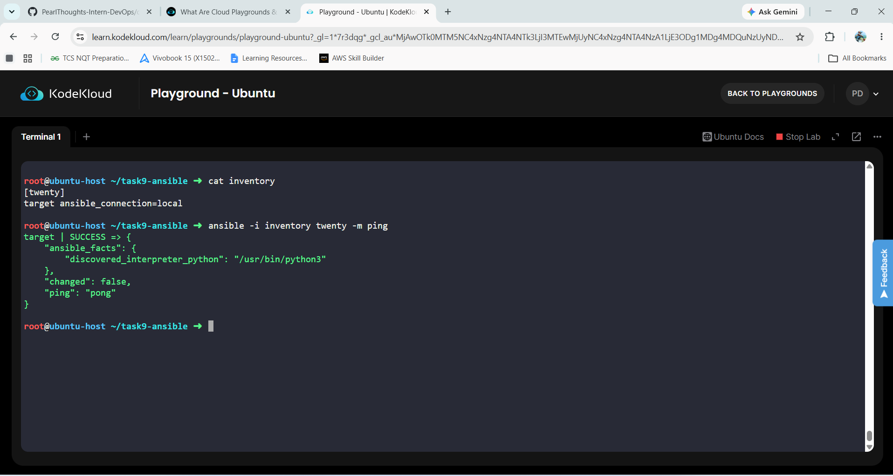
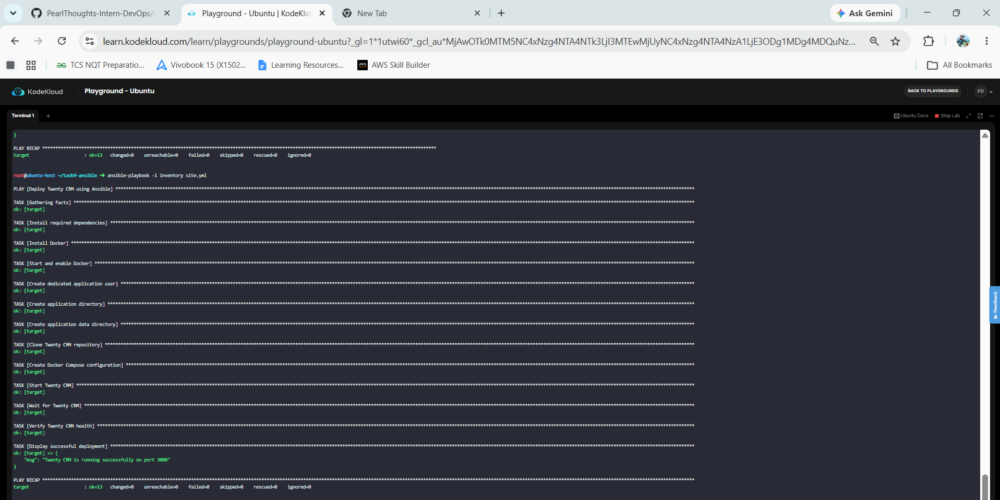
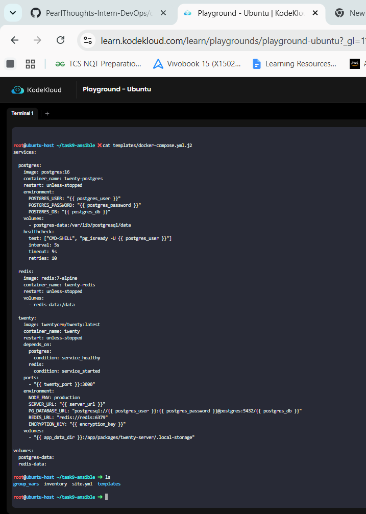
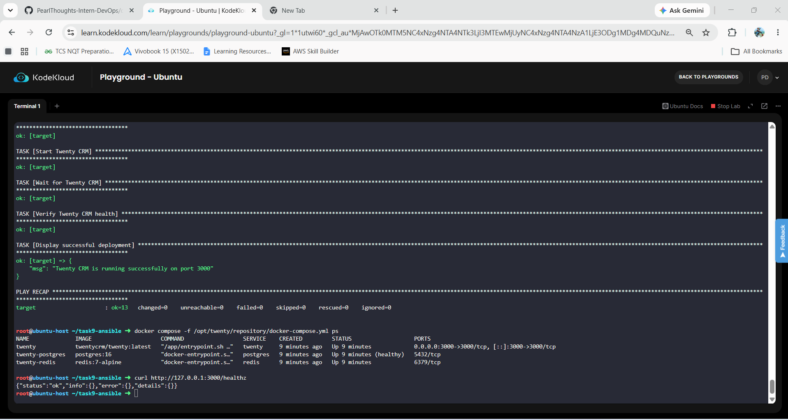

# Task 9: Ansible Playbook – Twenty CRM Deployment

## Overview

This task demonstrates the automated deployment of Twenty CRM using Ansible on an Ubuntu Linux environment.

The deployment automates Docker installation, application-user creation, directory setup, repository cloning, Docker Compose configuration using Jinja2, application startup, health verification, and restart handling through an Ansible handler.

## Objectives

- Automate Twenty CRM deployment using Ansible.
- Configure an Ansible inventory for the target host.
- Install required dependencies, Docker, and Docker Compose.
- Create a dedicated `twenty` application user.
- Create application directories with appropriate ownership and permissions.
- Clone the Twenty CRM project repository.
- Generate Docker Compose configuration using Ansible variables and Jinja2.
- Start Twenty CRM using Docker Compose.
- Restart the application when configuration changes through an Ansible handler.
- Verify the application health.
- Demonstrate Ansible idempotency.

## Architecture

```text
                    Ansible Playbook
                           |
                           v
                    Ubuntu Target Host
                           |
                    +------+------+
                    |             |
                  Docker      Application
                    |             |
          +---------+---------+   |
          |         |         |   |
       Twenty   PostgreSQL  Redis |
          |                       |
          +------ Port 3000 ------+
```

## Technologies Used

| Technology | Purpose |
|---|---|
| Ansible | Automation and configuration management |
| Ubuntu | Linux target environment |
| Docker | Container runtime |
| Docker Compose | Multi-container deployment |
| Jinja2 | Dynamic configuration templating |
| PostgreSQL 16 | Twenty CRM database |
| Redis 7 Alpine | Application support/cache |
| Twenty CRM | Application being deployed |

## Project Structure

```text
task9-ansible/
├── inventory
├── site.yml
├── group_vars/
│   └── all.yml
├── templates/
│   └── docker-compose.yml.j2
└── Docs/
    └── TASK9_ANSIBLE.md
```

### File Description

- `inventory` — Defines the Ansible target host.
- `site.yml` — Main deployment playbook.
- `group_vars/all.yml` — Stores deployment variables.
- `templates/docker-compose.yml.j2` — Jinja2 template for Docker Compose.
- `Docs/TASK9_ANSIBLE.md` — Task documentation and evidence.

## Deployment Process

### 1. Install Dependencies

The playbook installs:

```text
git
curl
ca-certificates
docker.io
docker-compose-v2
```

### 2. Configure Docker

Ansible ensures Docker is started and enabled:

```yaml
state: started
enabled: true
```

### 3. Create Dedicated Application User

A dedicated Linux user named `twenty` is created and added to the Docker group.

Verify with:

```bash
id twenty
```

### 4. Create Application Directories

The playbook creates:

```text
/opt/twenty
/opt/twenty/data
```

The directories are owned by the `twenty` user.

### 5. Clone the Repository

The repository is cloned into:

```text
/opt/twenty/repository
```

The Ansible Git module maintains the repository in the desired state.

## Ansible Variables

Deployment configuration is maintained in:

```text
group_vars/all.yml
```

Example:

```yaml
app_user: twenty
app_dir: /opt/twenty
app_data_dir: /opt/twenty/data

twenty_repo: https://github.com/PearlThoughts-Intern-DevOps/devops-crm-project.git
twenty_version: main

twenty_port: 3000
server_url: "http://localhost:3000"
```

Using variables keeps the playbook reusable and avoids hardcoding configuration values in tasks.

## Jinja2 Docker Compose Template

The Docker Compose configuration is generated from:

```text
templates/docker-compose.yml.j2
```

Example variable usage:

```yaml
ports:
  - "{{ twenty_port }}:3000"
```

```yaml
SERVER_URL: "{{ server_url }}"
```

Database configuration is also generated dynamically:

```yaml
PG_DATABASE_URL: "postgresql://{{ postgres_user }}:{{ postgres_password }}@postgres:5432/{{ postgres_db }}"
```

## Docker Compose Services

The generated Compose configuration runs:

### Twenty CRM

```text
twentycrm/twenty:latest
```

Exposed on port `3000`.

### PostgreSQL

```text
postgres:16
```

Used as the Twenty CRM database.

### Redis

```text
redis:7-alpine
```

Used by Twenty CRM for application support.

## Starting Twenty CRM

Ansible starts the application with:

```bash
docker compose up -d
```

The services use:

```yaml
restart: unless-stopped
```

## Ansible Handler

The playbook includes a restart handler:

```yaml
- name: Restart Twenty CRM
  ansible.builtin.command:
    cmd: docker compose restart
    chdir: "{{ app_dir }}/repository"
```

The template task notifies the handler:

```yaml
notify: Restart Twenty CRM
```

When the generated Compose configuration changes, Ansible triggers the handler.

## Health Verification

Ansible waits for port `3000` and checks:

```bash
curl http://127.0.0.1:3000/healthz
```

Expected response:

```json
{"status":"ok","info":{},"error":{},"details":{}}
```

A successful HTTP `200 OK` response confirms that Twenty CRM is running.

## Deployment Verification

Check the containers:

```bash
docker compose -f /opt/twenty/repository/docker-compose.yml ps
```

Expected services:

```text
twenty
twenty-postgres
twenty-redis
```

PostgreSQL should show:

```text
Up (healthy)
```

## Idempotency

The playbook was executed multiple times:

```bash
ansible-playbook -i inventory site.yml
```

The second execution completed with:

```text
changed=0
failed=0
```

Example:

```text
PLAY RECAP
target : ok=13 changed=0 unreachable=0 failed=0 skipped=0 rescued=0 ignored=0
```

This demonstrates idempotent behavior: once the desired state is present, Ansible does not make unnecessary changes.

## Application User and Permissions

Verify the dedicated user:

```bash
id twenty
```

Verify directory ownership:

```bash
ls -ld /opt/twenty /opt/twenty/data /opt/twenty/repository
```

The directories should be owned by:

```text
twenty:twenty
```

## Screenshots

### 1. Ansible Connectivity Test

_Add screenshot here._

Show the successful:

```bash
ansible -i inventory twenty -m ping
```

### 2. Ansible Playbook Execution

_Add screenshot here._

Show the successful playbook execution and `PLAY RECAP`.

### 3. Docker Compose Services

_Add screenshot here._

Show Twenty CRM, PostgreSQL, and Redis running.

### 4. Twenty CRM Health Check

_Add screenshot here._

Show:

```bash
curl http://127.0.0.1:3000/healthz
```

with HTTP 200/status `ok`.

### 5. Idempotency Test

_Add screenshot here._

Show the second playbook execution with:

```text
changed=0
failed=0
```

### 6. Dedicated User and Permissions

_Add screenshot here._

Show `id twenty` and the `/opt/twenty` directory ownership.

## Verification Commands

```bash
ansible -i inventory twenty -m ping
```

```bash
ansible-playbook -i inventory --syntax-check site.yml
```

```bash
ansible-playbook -i inventory site.yml
```

```bash
docker compose -f /opt/twenty/repository/docker-compose.yml ps
```

```bash
curl http://127.0.0.1:3000/healthz
```

```bash
id twenty
```

```bash
ls -ld /opt/twenty /opt/twenty/data /opt/twenty/repository
```

## Key Learnings

- Ansible inventory and playbook structure
- Ansible variables and `group_vars`
- Jinja2 templates
- Ansible handlers
- Linux users and permissions
- Docker automation with Ansible
- Docker Compose deployment
- Application health checks
- Idempotent infrastructure automation
- Troubleshooting containerized applications

## Final Result

Twenty CRM was successfully automated and deployed on an Ubuntu Linux environment using Ansible, Docker, and Docker Compose.

The deployment includes automated dependency installation, Docker configuration, a dedicated application user, directory management, repository cloning, Jinja2-based Compose configuration, Twenty CRM with PostgreSQL and Redis, an Ansible restart handler, health verification, and idempotency validation.

The deployment completed successfully with zero failures, and repeated Ansible execution demonstrated idempotent behavior.

## Screenshots

### 1. Ansible , Docker and Docker compose verions



### 2. Ansible Connectivity Test


### 3. Ansible Playbook Success


### 4. Docker Compose Services


### 5. Twenty CRM Health Check



