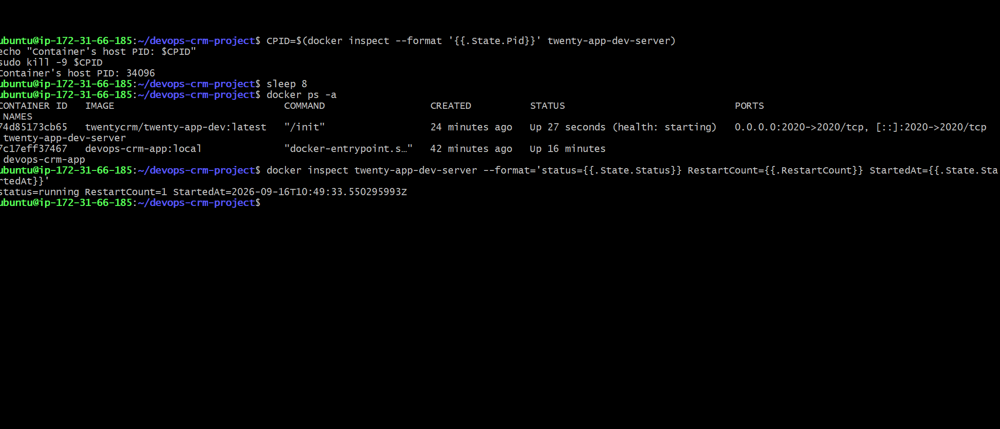
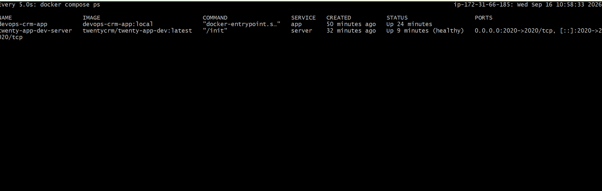
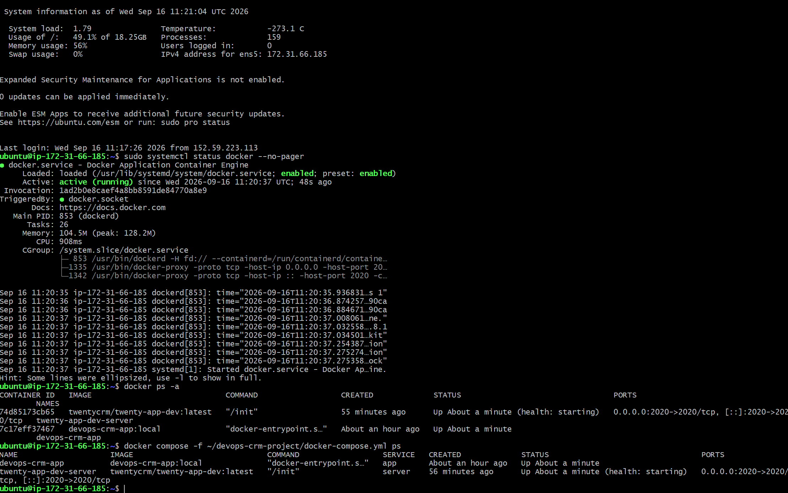
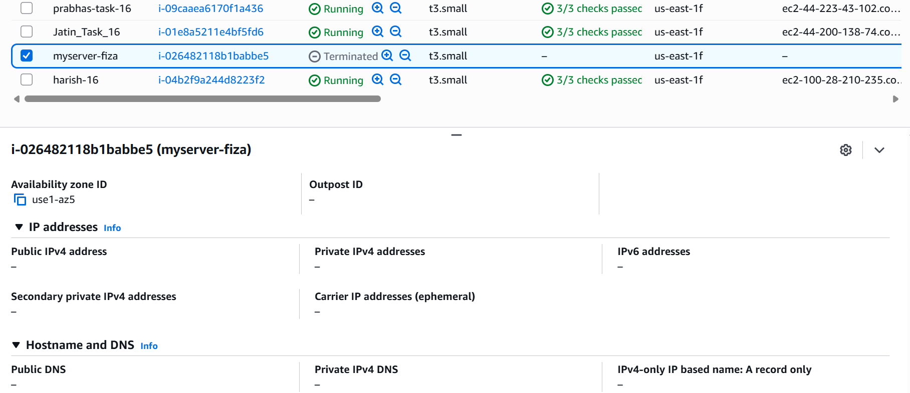
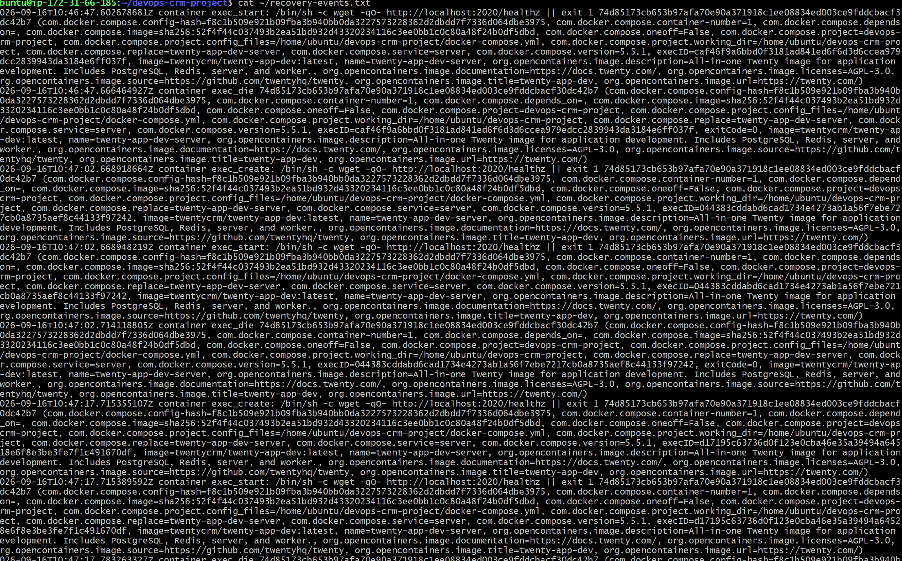
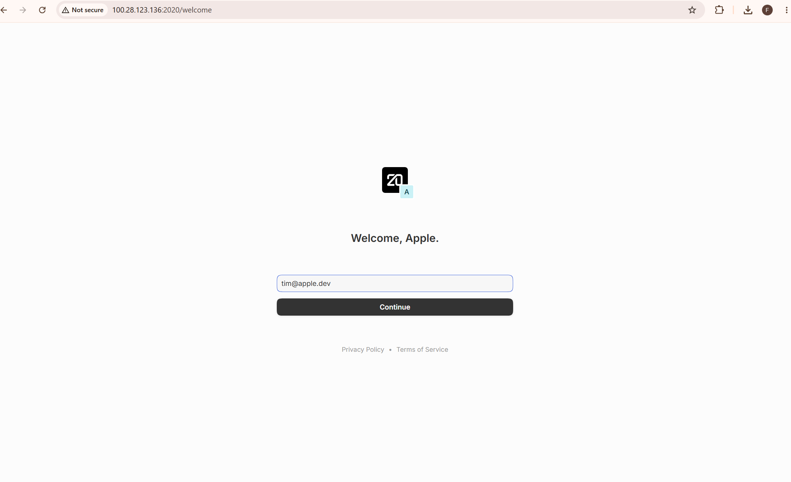

## Task 16: Twenty CRM Failure & Recovery – Implementation Documentation

This project demonstrates the deployment of Twenty CRM on an AWS EC2 instance using Docker Compose, with automatic failure recovery at both the container and EC2 instance levels.

The project includes:

- Twenty CRM deployment using Docker Compose.
- Docker container restart policies.
- Server healthcheck configuration.
- Persistent Docker volumes.
- Container-level failure and recovery testing.
- EC2 instance stop/start recovery testing.
- Recovery log verification.
- Screenshots and implementation documentation.

---

## 1. Project Objective

The objective of this task is to deploy Twenty CRM on an AWS EC2 instance and configure automatic recovery when:

1. A Docker container crashes unexpectedly.
2. The EC2 instance is stopped and started again.

The recovery process should work without manually running `docker compose up` after an EC2 restart.

---

### 2. Components

- **AWS EC2:** Ubuntu Server 22.04 LTS.
- **Instance type:** t3.medium.
- **Docker Engine:** Container runtime.
- **Docker Compose:** Application orchestration.
- **Twenty CRM:** Main CRM application.
- **PostgreSQL:** Database bundled in the all-in-one server image.
- **Redis:** Used by the Twenty CRM server image.
- **Docker volumes:** Persistent application data and storage.


---

## 3. AWS EC2 Configuration

The EC2 instance was provisioned through the AWS Console.

| Configuration | Value |
|---|---|
| Instance Name | myserver-fiza |
| AMI | Ubuntu Server 22.04 LTS |
| Instance Type | t3.medium |
| vCPU | 2 |
| RAM | 4 GB |
| Storage | 30 GB gp3 |
| Application Port | 2020 |
| SSH Port | 22 |

### Security Group

| Protocol | Port | Source |
|---|---|---|
| SSH | 22 | Restricted admin IP |
| Custom TCP | 2020 | 0.0.0.0/0 |

> **Security note:** For production environments, restrict application access to trusted networks or use a load balancer with appropriate security controls.

---

## 4. Repository Structure

```text
devops-crm-project/
│
├── Dockerfile
├── docker-compose.yml
├── README.md
├── fiza-task16.pdf
│
└── screenshots/
    ├── dockerps.png
    ├── dockerpscompose.png
    ├── dockerrunning.png
    ├── instanceterminated.png
    ├── recoverylogs.png
    └── webpage.png
```

### File Description

| File / Directory | Description |
|---|---|
| `Dockerfile` | Builds the custom application image |
| `docker-compose.yml` | Defines the server and app services |
| `README.md` | Project setup and recovery documentation |
| `fiza-task16.docx` | Detailed implementation documentation |
| `screenshots/` | Evidence of deployment and recovery tests |

---

## 5. Prerequisites

Before starting the deployment, ensure the following are available:

- AWS account.
- EC2 instance with Ubuntu Server 22.04 LTS.
- SSH key pair.
- Git.
- Docker Engine.
- Docker Compose plugin.
- Open inbound TCP port 2020.
- Sufficient EC2 resources for the application.

---

## 6. Connecting to EC2

Connect to the EC2 instance using SSH:

```bash
ssh -i "twenty-crm-key.pem" ubuntu@<EC2_PUBLIC_IP>
```

Replace `<EC2_PUBLIC_IP>` with the public IPv4 address of the instance.

---

## 7. Installing Docker and Docker Compose

Update the system and install the required packages:

```bash
sudo apt update && sudo apt upgrade -y
sudo apt install -y ca-certificates curl gnupg git
```

Add the Docker repository:

```bash
sudo install -m 0755 -d /etc/apt/keyrings

curl -fsSL https://download.docker.com/linux/ubuntu/gpg | \
sudo gpg --dearmor -o /etc/apt/keyrings/docker.gpg

sudo chmod a+r /etc/apt/keyrings/docker.gpg
```

```bash
echo \
  "deb [arch=$(dpkg --print-architecture) signed-by=/etc/apt/keyrings/docker.gpg] https://download.docker.com/linux/ubuntu \
  $(. /etc/os-release && echo "$VERSION_CODENAME") stable" | \
  sudo tee /etc/apt/sources.list.d/docker.list > /dev/null
```

Install Docker Engine and Compose:

```bash
sudo apt update

sudo apt install -y \
  docker-ce \
  docker-ce-cli \
  containerd.io \
  docker-buildx-plugin \
  docker-compose-plugin
```

Add the current user to the Docker group:

```bash
sudo usermod -aG docker $USER
newgrp docker
```

Enable and start Docker:

```bash
sudo systemctl enable docker
sudo systemctl start docker
```

Verify the installation:

```bash
docker --version
docker compose version
sudo systemctl status docker --no-pager
```

---

## 8. Cloning the Repository

Clone the project repository:

```bash
git clone https://github.com/PearlThoughts-Intern-DevOps/devops-crm-project
```

Move into the project directory:

```bash
cd devops-crm-project
```

Checkout the implementation branch:

```bash
git checkout fiza-task5
```

> Ensure that the branch name matches the branch containing your implementation.

---

## 9. Docker Compose Configuration

The application uses two services:

### Server

The `server` service runs the official Twenty CRM all-in-one image.

Responsibilities:

- Twenty CRM application.
- PostgreSQL.
- Redis.
- Application worker.
- Healthcheck endpoint.
- Persistent volumes.

### App

The `app` service is a custom image built using the repository's Dockerfile.

It starts after the `server` service becomes healthy.

### Restart Policy

Both services use:

```yaml
restart: unless-stopped
```

This allows Docker to restart containers after unexpected failures and when Docker starts again after an EC2 reboot, provided the containers were not deliberately stopped.

### Healthcheck

The server healthcheck verifies the application endpoint:

```yaml
healthcheck:
  test: ["CMD-SHELL", "wget -qO- http://localhost:2020/healthz || exit 1"]
  interval: 15s
  timeout: 10s
  retries: 30
  start_period: 300s
```

The five-minute startup period allows the all-in-one image time to initialize its services during first startup.

---

## 10. Build and Start the Application

Build the custom application image:

```bash
docker compose build
```

Start the services in detached mode:

```bash
docker compose up -d
```

Check container status:

```bash
docker compose ps
```

Check all containers:

```bash
docker ps -a
```

View server logs:

```bash
docker compose logs server --tail=150
```

---

## 11. Accessing Twenty CRM

Open the following URL in a browser:

```text
http://<EC2_PUBLIC_IP>:2020
```

Replace `<EC2_PUBLIC_IP>` with the current public IP address of the EC2 instance.

The Twenty CRM login/onboarding screen should be displayed.

---

## 12. Failure Recovery Configuration

### Container Restart Policy

Both containers use:

```yaml
restart: unless-stopped
```

This provides automatic recovery when a container exits unexpectedly.

### Docker Service Auto-Start

The Docker service is enabled using:

```bash
sudo systemctl enable docker
```

This ensures Docker starts automatically when the EC2 instance boots.

### Persistent Storage

The application uses named Docker volumes:

```yaml
volumes:
  twenty-app-dev-data:
  twenty-app-dev-storage:
```

These volumes are used to preserve application data and storage across container recreation and restart.

---

## 13. Test 1 — Container Failure and Recovery

### Objective

Verify that the Twenty CRM server container automatically restarts after an unexpected process failure.

### Simulate Container Failure

Get the container's host process ID:

```bash
CPID=$(docker inspect --format '{{.State.Pid}}' twenty-app-dev-server)
```

Terminate the process:

```bash
sudo kill -9 $CPID
```

### Verify Recovery

Wait for the container to restart:

```bash
sleep 10
```

Check container status:

```bash
docker ps -a
```

Check restart count and startup time:

```bash
docker inspect twenty-app-dev-server \
  --format='status={{.State.Status}} RestartCount={{.RestartCount}} StartedAt={{.State.StartedAt}}'
```

### Expected Result

- The container exits unexpectedly.
- Docker automatically restarts the container.
- `RestartCount` increases.
- The container returns to the `running` state.
- The healthcheck eventually reports `healthy`.

### Recovery Evidence







---

## 14. Test 2 — EC2 Instance Stop/Start Recovery

### Objective

Verify that Twenty CRM recovers automatically after the entire EC2 instance is stopped and started.

### Procedure

1. Open the AWS EC2 Console.
2. Select the `myserver-fiza` instance.
3. Choose **Instance state → Stop instance**.
4. Wait until the instance state becomes `Stopped`.
5. Start the instance again.
6. Wait until the instance state becomes `Running`.
7. Confirm that EC2 status checks have passed.
8. Note the new public IPv4 address if it changed.
9. Reconnect using SSH.

### Verify Docker Service

```bash
sudo systemctl status docker --no-pager
```

### Verify Containers

```bash
docker ps -a
docker compose ps
```

### Expected Result

- Docker starts automatically during instance boot.
- The containers restart automatically.
- The server becomes healthy.
- The application becomes reachable again.
- No manual `docker compose up` is required after the reboot.

### Recovery Evidence





---

## 15. Log Verification

Review the application logs:

```bash
docker compose logs server --tail=150
```

Review Docker events:

```bash
docker events --since 1h \
  --filter container=twenty-app-dev-server \
  --filter event=die \
  --filter event=start \
  --filter event=health_status
```

### Expected Log Sequence

```text
Container process exits
        |
        v
Docker detects failure
        |
        v
Container restarts
        |
        v
Application initializes
        |
        v
Healthcheck passes
        |
        v
Container becomes healthy
```

The recovery logs provide evidence of the restart and healthcheck sequence.

---

## 16. Screenshots

The following screenshots are included in the repository:

| Screenshot | Purpose |
|---|---|
| `dockerps.png` | Docker container status |
| `dockerpscompose.png` | Docker Compose service status |
| `dockerrunning.png` | Running containers |
| `instanceterminated.png` | EC2 instance stop/start evidence |
| `recoverylogs.png` | Recovery logs |
| `webpage.png` | Twenty CRM application webpage |

### Application Screenshot



---

## 17. Implementation Documentation

Detailed implementation documentation is available in:

[fiza-task16.docx](fiza-task16.docx)

The document covers:

- EC2 provisioning.
- Docker installation.
- Repository setup.
- Docker Compose configuration.
- Container failure testing.
- EC2 instance recovery testing.
- Log verification.
- Final conclusion.

---

## 18. Verification Checklist

- [x] EC2 instance provisioned.
- [x] Docker Engine installed.
- [x] Docker Compose installed.
- [x] Repository cloned.
- [x] Twenty CRM deployed using Docker Compose.
- [x] Docker restart policy configured.
- [x] Server healthcheck configured.
- [x] Persistent volumes configured.
- [x] Container failure recovery tested.
- [x] EC2 instance stop/start recovery tested.
- [x] Recovery logs reviewed.
- [x] Screenshots added.
- [x] Implementation documentation added.

---

## 19. Conclusion

Twenty CRM was deployed on AWS EC2 using Docker Compose with automatic failure recovery.

The implementation demonstrates recovery at two levels:

1. **Container-level recovery:** Docker automatically restarts the server container after an unexpected process failure.
2. **Instance-level recovery:** Docker starts automatically after EC2 boot, and the containers recover without manually running `docker compose up`.

This project demonstrates the use of Docker restart policies, healthchecks, persistent storage, and EC2 service auto-start to improve application availability and recovery.

---

## Author

**Fiza**

Task: 16 — Twenty CRM Failure & Recovery
