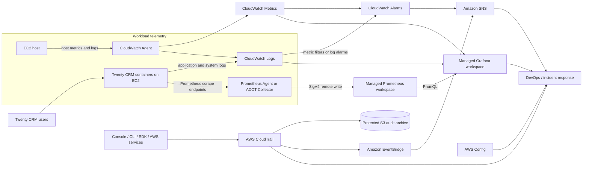
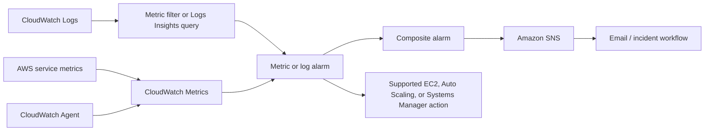
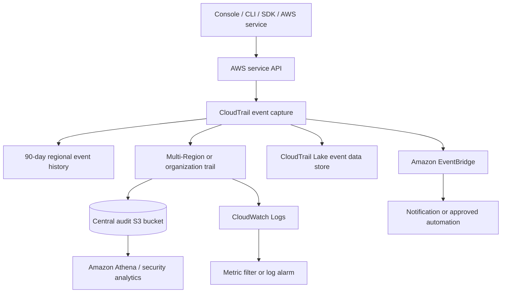
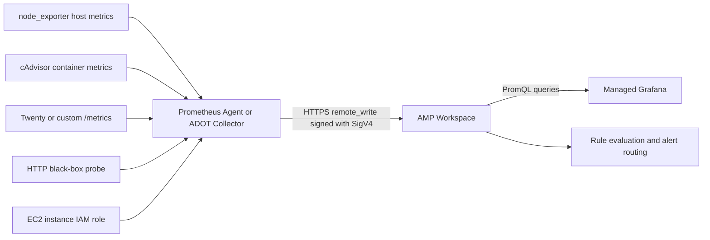
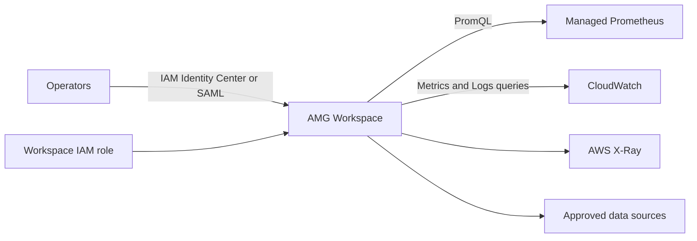
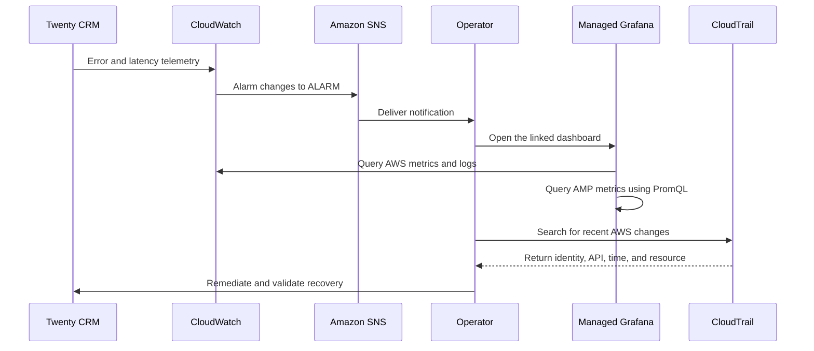

# AWS Observability for Twenty CRM

## Task 8 — Learning Report and Architecture Guide

## 1. Objective

The objective of this task is to understand AWS observability services and how
DevOps teams use them to monitor infrastructure, applications, metrics, logs,
traces, security events, configuration changes, and overall system health.

The main services explored in depth are:

- AWS CloudTrail
- Amazon Managed Service for Prometheus (AMP)
- Amazon Managed Grafana (AMG)
- Amazon CloudWatch Alarms

The document also explains Amazon CloudWatch, AWS X-Ray, AWS Config, and the
three pillars of observability because they provide the context needed to
understand the complete AWS observability ecosystem.

## 2. Executive Summary

Observability is the ability to understand the internal state of a system from
the data it produces. It helps answer both:

- **What is wrong?** — for example, the application is returning HTTP 500 errors.
- **Why is it wrong?** — for example, database connections were exhausted after
  a configuration change made by a particular IAM role.

The services have different responsibilities:

| Service | Main responsibility | Simple question it answers |
| --- | --- | --- |
| Amazon CloudWatch | AWS and application metrics, logs, dashboards, and alarms | Is the workload healthy? |
| CloudWatch Alarms | Continuous condition evaluation and automated response | Should the team or system take action now? |
| AWS X-Ray | Distributed request tracing | Where did the request fail or become slow? |
| AWS CloudTrail | AWS account and API activity auditing | Who changed an AWS resource, what changed, and when? |
| AWS Config | Resource configuration history and compliance evaluation | Is the resource configured according to policy? |
| Amazon Managed Service for Prometheus | Scalable Prometheus-compatible metric storage and querying | What do the Prometheus metrics show? |
| Amazon Managed Grafana | Shared visualization and correlation | How can operators analyze the telemetry together? |

No single service provides every capability. A mature design combines the
services according to the operational question being answered.

## 3. Monitoring vs. Observability

### Monitoring

Monitoring checks known conditions using predefined metrics, thresholds, logs,
and alerts. It answers: **“Is the system operating normally?”**

Examples:

- EC2 CPU utilization is above 80%.
- The instance status check failed.
- Free disk space is below 10%.
- The HTTP 5xx error rate exceeded its limit.

### Observability

Observability uses telemetry to investigate system behavior, including problems
that were not predicted when the monitoring rules were created. It answers:
**“Why is the system behaving this way?”**

For a slow request, observability can reveal:

- which request was slow;
- which service or container handled it;
- where the request spent its time;
- which database query or dependency caused delay;
- which error was logged; and
- whether an infrastructure change happened at the same time.

Monitoring is therefore a part of observability, not a replacement for it.

## 4. Observability Signals

The traditional pillars are metrics, logs, and traces. Audit and configuration
events add important operational and security context.

| Signal | Description | Example | AWS service |
| --- | --- | --- | --- |
| Metrics | Numerical measurements recorded over time | CPU, latency, request rate | CloudWatch Metrics, AMP |
| Logs | Timestamped records describing events | Application exception, authentication failure | CloudWatch Logs, OpenSearch Service |
| Traces | End-to-end path of a request through components | Browser → API → database | AWS X-Ray, OpenTelemetry tooling |
| Audit events | Records of AWS account/API activity | An IAM role changed a security group | CloudTrail |
| Configuration state | Resource configuration and compliance history | An S3 bucket became public | AWS Config |

Good telemetry should include consistent timestamps and useful context such as
environment, service, Region, instance, version, and correlation or trace ID.
Sensitive values must not be placed in logs or metric labels.

## 5. Overall Architecture

The repository deploys Twenty CRM through Docker Compose on an EC2 instance.
The following target architecture adds monitoring without changing the purpose
of the application deployment.



Data moves through four layers:

1. **Instrumentation and collection:** AWS services, application code, agents,
   and exporters produce or collect telemetry.
2. **Storage and query:** CloudWatch stores metrics/logs, AMP stores Prometheus
   metrics, and CloudTrail stores audit events in a trail or event data store.
3. **Visualization and investigation:** AMG queries the underlying data sources.
4. **Detection and response:** alarms and event rules notify operators or invoke
   carefully selected automated actions.

## 6. Amazon CloudWatch

### Purpose

Amazon CloudWatch provides near-real-time monitoring and observability for AWS
resources and applications. Many AWS services automatically publish metrics to
CloudWatch. Applications and agents can publish custom metrics and logs.

### Main capabilities

- **Metrics:** time-ordered numerical data.
- **Logs:** collection, retention, search, Logs Insights queries, and metric
  extraction.
- **Dashboards:** visualizations across metrics and logs.
- **Alarms:** condition evaluation and actions.
- **Application and infrastructure monitoring:** service health, containers,
  hosts, networks, synthetic tests, and application signals.

### Metric concepts

- A **namespace** separates related metrics, such as `AWS/EC2`.
- A **metric** is identified by its namespace, name, and dimensions.
- A **dimension** is a key/value identifier such as `InstanceId=i-123...`.
- A **period** controls the time window being aggregated.
- A **statistic** can be Average, Sum, Minimum, Maximum, SampleCount, or a
  percentile when supported.

EC2 publishes metrics such as CPU utilization, network traffic, and status
checks. Guest operating-system memory and filesystem usage are not included in
standard EC2 metrics; an agent or another telemetry collector is required.

## 7. CloudWatch Alarms

### Purpose

A CloudWatch alarm watches a metric or query result and changes state when the
configured condition is satisfied. It converts telemetry into an operational
decision.

### Alarm types

| Type | What it evaluates | Best use |
| --- | --- | --- |
| Metric alarm | One metric or metric-math expression | CPU, latency, availability, error rate |
| Composite alarm | Boolean rule over other alarm states | Reduce noise and represent service impact |
| Log alarm | Scheduled CloudWatch Logs Insights result | Detect error patterns directly in logs |
| PromQL alarm | PromQL over metrics ingested through CloudWatch's OTLP path | Prometheus-style evaluation within CloudWatch |

CloudWatch PromQL alarms should not be confused with AMP rule evaluation. They
do not automatically evaluate any arbitrary query in an AMP workspace.

### Alarm evaluation

An alarm definition includes:

- metric or query;
- aggregation statistic;
- comparison operator and threshold;
- period;
- **N evaluation periods**;
- **M datapoints to alarm**; and
- missing-data treatment.

Example: “CPU is greater than 85% for 3 of the last 5 five-minute periods” is an
M-out-of-N alarm where M=3 and N=5. This is less noisy than alarming on one
isolated data point.

The three states are:

- `OK` — the condition is not breaching;
- `ALARM` — enough datapoints are breaching; and
- `INSUFFICIENT_DATA` — there is not enough usable data.

Missing data can be treated as `breaching`, `notBreaching`, `ignore`, or
`missing`. The correct choice depends on meaning. Missing CPU data for a stopped
instance may be expected, but a missing health-check heartbeat may mean that
monitoring or the application has failed.

### Alarm architecture



Most actions execute when the alarm **changes state**, not continuously simply
because it remains in `ALARM`. CloudWatch does not validate that every external
action target will deliver successfully, so the full notification route must be
tested.

### Recommended starting alarms for Twenty CRM

| Condition | Starting rule | Purpose |
| --- | --- | --- |
| EC2 status failure | `StatusCheckFailed >= 1`, 2 of 2 one-minute periods | Detect host or instance failure |
| HTTP health failure | 2 of 3 probes fail | Detect user-facing unavailability |
| CPU high | Above 85%, 3 of 5 periods | Detect sustained compute pressure |
| Memory high | Above 90%, 3 of 5 periods | Detect OOM risk; requires custom metric |
| Disk warning/critical | Above 80% / 90% used | Protect PostgreSQL and local storage |
| Application error rate | Above a tested baseline | Detect user-impacting failures |
| Telemetry heartbeat absent | No sample for the defined interval | Detect agent or instance silence |

These are starting points. Production thresholds should be based on baseline
traffic, service-level objectives, and tested runbooks.

### Alarm best practices

- Alert on user symptoms—availability, latency, and errors—not CPU alone.
- Use M-out-of-N evaluation and composite alarms to control noise.
- Define an owner, severity, description, dashboard link, and runbook.
- Confirm SNS subscriptions and test delivery end to end.
- Use an encrypted SNS topic and least-privilege policies.
- Do not enable destructive automatic actions until their failure modes have
  been tested.
- Regularly remove alarms that are noisy, duplicated, or no longer actionable.

## 8. AWS CloudTrail

### Purpose

AWS CloudTrail records AWS account activity and supported API operations made
through the console, CLI, SDKs, users, roles, AWS services, and external callers.

A CloudTrail event can show:

- the caller identity;
- API operation;
- event time and Region;
- source IP and user agent;
- request parameters and affected resources; and
- response information or error code.

CloudTrail is an **AWS audit service**, not an application logging service. It
can record who changed an EC2 security group, but it does not contain errors
printed by the Twenty CRM container.

### CloudTrail event types

| Event | Description | Example |
| --- | --- | --- |
| Management event | Control-plane resource operation | `RunInstances`, `StopInstances`, IAM policy update |
| Data event | Often high-volume operation on or within a resource | S3 `GetObject`, Lambda `Invoke` |
| Network activity event | Supported API activity denied by a VPC endpoint policy | Denied request through a VPC endpoint |
| Insights event | Unusual management API call/error-rate activity | Unexpected spike in write calls |

Management events are included by default in trails and event data stores.
Data, network activity, and Insights events require deliberate selection and can
increase cost.

### Recording options

| Option | Use | Important behavior |
| --- | --- | --- |
| Event history | Quick recent investigation | Automatically available 90-day management-event history in each Region |
| Trail | Continuous, durable delivery | Sends selected events to S3 and optionally CloudWatch Logs |
| CloudTrail Lake | Managed audit analytics | Immutable event data stores, SQL queries, dashboards, selectable retention |

Event history alone is not a permanent audit solution. Create a trail for
ongoing delivery and retention.

### CloudTrail architecture



CloudTrail records should not be treated as an ordered application stack trace.
Analysis systems should tolerate delivery delay, duplicates, and events that
arrive out of order.

### Recommended production configuration

1. Create a multi-Region trail; use an organization trail for multi-account
   environments.
2. Record read and write management events.
3. Select data events only where there is an audit or detection requirement.
4. Deliver to a dedicated S3 bucket, preferably in a separate log-archive
   account.
5. Block public access, enable versioning, apply least privilege, and configure
   retention/lifecycle policies.
6. Use KMS encryption when customer-controlled key access is required.
7. Enable CloudTrail log-file validation so modification or deletion is
   detectable through signed digest files.
8. Restrict permission to stop logging, modify the trail, delete logs, or
   disable its KMS key.
9. Send only actionable security events to EventBridge or CloudWatch alarms.

High-value detections include root login, failed console login, IAM policy
changes, CloudTrail changes, KMS key disabling, security-group changes, and EC2
stop or terminate activity.

### Example investigation

If Twenty CRM suddenly becomes unreachable:

1. Confirm application and instance status using CloudWatch and AMG.
2. Search CloudTrail for security-group, route, network ACL, instance, or IAM
   changes around the failure time.
3. Inspect `userIdentity`, `eventName`, `eventTime`, `sourceIPAddress`,
   `requestParameters`, and `errorCode`.
4. Restore the approved configuration.
5. Preserve the CloudTrail event in the incident timeline.

## 9. Amazon Managed Service for Prometheus

### Purpose

Amazon Managed Service for Prometheus (AMP) is a serverless,
Prometheus-compatible service for ingesting, storing, and querying time-series
metrics. AWS manages the backend's scaling, availability, patching, and storage,
while users keep familiar Prometheus metrics and PromQL queries.

AMP is especially useful for Kubernetes, containers, microservices, and
applications already exposing Prometheus-formatted metrics.

### Important concepts

- **Workspace:** logical metric store and access boundary.
- **Sample:** numeric value at a timestamp.
- **Time series:** metric name plus an exact label set.
- **Labels:** dimensions such as `service`, `instance`, or `status`.
- **Scrape:** collector pulls an application's `/metrics` endpoint.
- **Remote write:** collector sends batched samples to AMP.
- **PromQL:** Prometheus Query Language used to analyze time series.

AMP automatically scales ingestion, storage, and querying. AWS documents that
workspace data is replicated across three Availability Zones. Metrics are
retained for 150 days by default, and workspace retention can be configured up
to 1,095 days. Current limits, Regions, and pricing should be checked before a
production rollout.

### AMP architecture



AMP does not automatically instrument or scrape every workload. A Prometheus
agent, ADOT Collector, or another supported collector still runs near the
application and sends metrics to AMP.

### Twenty CRM metric sources

- `node_exporter` for Linux CPU, memory, filesystem, and network metrics;
- cAdvisor for Docker container resource metrics;
- an application `/metrics` endpoint, if available and approved;
- a black-box exporter for HTTP success, TLS, and response latency; and
- collector self-metrics for scrape failures, dropped samples, and queue health.

Example PromQL:

```promql
# CPU utilization percentage by instance
100 * (1 - avg by (instance) (rate(node_cpu_seconds_total{mode="idle"}[5m])))

# Available root filesystem percentage
100 * node_filesystem_avail_bytes{mountpoint="/"}
  / node_filesystem_size_bytes{mountpoint="/"}

# HTTP p95 latency, when histogram metrics are available
histogram_quantile(
  0.95,
  sum by (le) (rate(http_request_duration_seconds_bucket[5m]))
)
```

### AMP security and cost practices

- Use the EC2 instance role and SigV4 instead of static access keys.
- Give collectors only remote-write permissions and dashboards only query
  permissions.
- Use private connectivity where required by the network design.
- Monitor remote-write failures and throttling.
- Control label cardinality. Never use request ID, timestamp, email address, or
  an unrestricted URL as a metric label.
- Drop unused metrics and labels before ingestion.
- Choose scrape intervals and retention from operational needs, not habit.

## 10. Amazon Managed Grafana

### Purpose

Amazon Managed Grafana (AMG) is a fully managed visualization and analytics
service based on Grafana. AWS provisions, maintains, and scales isolated Grafana
workspaces so teams can build dashboards without operating Grafana servers.

AMG can query sources including AMP, CloudWatch, X-Ray, OpenSearch Service,
Timestream, and approved third-party sources. It normally does not own the
telemetry shown in a panel; the original source remains the system of record.

### AMG architecture and access



Two authorization layers must be designed:

1. **Human access:** users authenticate through IAM Identity Center or SAML and
   receive Viewer, Editor, or Admin responsibilities.
2. **Data-source access:** the workspace IAM role receives least-privilege query
   access to specified accounts, Regions, workspaces, and log groups.

### Suggested Twenty CRM dashboard

| Dashboard row | Panels |
| --- | --- |
| User experience | HTTP availability, request rate, errors, p50/p95/p99 latency |
| EC2 host | Status checks, CPU, memory, disk, I/O, network |
| Containers | Container state, restarts, CPU, memory |
| Dependencies | PostgreSQL health/connections, Redis health, storage capacity |
| Changes | Deployment and configuration annotations |
| Response | Active alarms and links to runbooks |

Dashboards should use clear units, legends, thresholds, time zones, and
variables such as environment, Region, and instance. Important dashboards and
data-source definitions should be version-controlled or provisioned as code.

### AMG best practices

- Use least privilege for human roles and data-source IAM permissions.
- Separate production dashboards from experiments.
- Protect folders and restrict editor/admin access.
- Never embed credentials in dashboard JSON.
- Back up or version important dashboards.
- Track active users and data-source query costs.
- Link alert notifications to the relevant dashboard and runbook.

## 11. AWS X-Ray

AWS X-Ray traces requests through distributed application components. A trace
contains segments and subsegments that show service calls, timing, errors, and
faults. A service map helps identify dependencies and latency hotspots.

```text
User request -> Load balancer -> Application -> API -> Database
                    trace records timing and errors at each step
```

X-Ray is most valuable when a request crosses multiple services. The
application must be instrumented using supported SDKs or OpenTelemetry tooling.
It complements metrics and logs; it does not replace them.

## 12. AWS Config

AWS Config continuously records supported AWS resource configurations,
relationships, and changes. Config rules can evaluate whether resources comply
with required policies.

Examples:

- security groups must not expose SSH to the internet;
- EBS volumes must be encrypted;
- CloudTrail must be enabled; and
- S3 buckets must block public access.

CloudTrail and Config are related but different:

| CloudTrail | AWS Config |
| --- | --- |
| Records API/account activity | Records resource configuration state/history |
| Identifies who called an operation | Shows how a resource was configured |
| Used for audit and investigations | Used for compliance and configuration drift |

Together they can show both **who made a change** and **what configuration state
resulted from it**.

## 13. Incident Walkthrough

Scenario: Twenty CRM becomes slow after an infrastructure change.



The investigation process is:

1. **Detect:** CloudWatch Alarm reports a latency or availability problem.
2. **Notify:** SNS sends the alert to the response channel.
3. **Scope:** AMG shows whether impact is global or limited to one resource.
4. **Correlate:** metrics show saturation, logs show errors, and traces identify
   the slow component.
5. **Audit:** CloudTrail identifies recent AWS changes and their caller.
6. **Validate:** AWS Config shows the resulting resource state or compliance.
7. **Recover:** follow the runbook, confirm the alarm returns to `OK`, and record
   the evidence in the incident report.

## 14. Implementation Plan

### Phase 1 — Essential monitoring and audit

- Create a protected multi-Region CloudTrail trail with S3 delivery and
  log-file validation.
- Configure audit retention and test log retrieval/validation.
- Install and configure the CloudWatch Agent for memory, disk, and required logs.
- Add EC2 status, HTTP health, disk, memory, and telemetry-heartbeat alarms.
- Configure SNS and test the entire notification path.
- Enable relevant AWS Config recording and compliance rules.

### Phase 2 — Prometheus and dashboards

- Create an AMP workspace for the environment.
- Run a Prometheus agent or ADOT Collector near the EC2 workload.
- Use the instance role for least-privilege remote-write permission.
- Add node, container, HTTP probe, and approved application metrics.
- Create an AMG workspace with IAM Identity Center or SAML authentication.
- Grant read-only data-source permissions and build the Twenty CRM dashboard.

### Phase 3 — Production maturity

- Define service-level indicators and objectives for availability and latency.
- Tune alarms using representative baseline data.
- Add composite alarms and planned-maintenance suppression.
- Add application tracing where the architecture benefits from it.
- Centralize telemetry across accounts where required.
- Review retention, log volume, metric cardinality, users, and alarms for cost.
- Run controlled failure exercises and verify collection, alerting, audit, and
  recovery paths.

## 15. Security, Reliability, and Cost Checklist

### Security

- Prefer IAM roles and temporary credentials.
- Apply least privilege to collectors, AMG, S3, KMS, SNS, and CloudTrail.
- Encrypt telemetry in transit and protected data at rest.
- Separate the audit archive from workload administration where possible.
- Do not log credentials, tokens, customer records, or unnecessary personal data.

### Reliability

- Monitor the monitoring pipeline itself.
- Alert on missing heartbeats and failed scrapes.
- Test alarms and notification routes regularly.
- Keep dashboards and runbooks available during application incidents.
- Use infrastructure as code for reproducible configuration.

### Cost

- Set log retention instead of retaining all logs indefinitely.
- Enable high-volume CloudTrail data events only for defined use cases.
- Control Prometheus label cardinality and drop unused series.
- Choose appropriate metric resolution and scrape intervals.
- Review AMG active users, dashboard queries, and data-source charges.
- Tag resources and review CloudWatch, AMP, AMG, S3, KMS, and CloudTrail costs.

## 16. Common Mistakes

- Calling CloudTrail an application log service.
- Depending only on the 90-day CloudTrail Event history.
- Assuming AMP automatically scrapes applications.
- Assuming Grafana stores every metric shown on a dashboard.
- Using customer IDs or request IDs as Prometheus labels.
- Monitoring CPU but ignoring availability, memory, disk, and error rate.
- Leaving alarm missing-data behavior undefined.
- Creating alarms without owners or runbooks.
- Confirming an alarm configuration but not testing SNS delivery.
- Sending a page for every low-level symptom and creating alert fatigue.
- Granting broad administrator permissions merely to make integration easier.

## 17. How to Explain This Architecture Professionally

### Two-minute explanation

> “The solution uses multiple AWS services because each one answers a different
> operational question. CloudWatch collects AWS metrics and logs, while its
> alarms detect conditions such as instance failure, high error rate, or low
> disk capacity and notify the team through SNS. For detailed container and
> application metrics, a Prometheus or ADOT collector scrapes the EC2-hosted
> workload and securely remote-writes the data to Amazon Managed Service for
> Prometheus using an IAM role and SigV4. Amazon Managed Grafana queries both AMP
> and CloudWatch to provide a single operational dashboard. CloudTrail separately
> records AWS API activity so we can identify who changed infrastructure and
> when, while AWS Config records the resulting resource configuration and
> compliance state. X-Ray can add request-level tracing when the application is
> distributed. Together these services support detection, investigation,
> auditing, and recovery.”

### Key distinctions to remember

- CloudWatch says **what is happening to the workload**.
- CloudWatch Alarms decide **when action is necessary**.
- AMP stores and queries **Prometheus metrics**.
- AMG **visualizes and correlates** data; it is not the primary metric store.
- X-Ray shows **where a distributed request spent time**.
- CloudTrail says **who performed an AWS action**.
- AWS Config shows **the resource state and whether it complies with policy**.

### Questions you should be ready to answer

**Why use AMP if CloudWatch already stores metrics?**  
AMP is appropriate when the team uses the Prometheus ecosystem, exposition
format, exporters, and PromQL—especially for containers and Kubernetes.
CloudWatch remains strong for native AWS service metrics, logs, and actions.

**Why use AMG instead of only CloudWatch dashboards?**  
AMG provides the Grafana experience and can correlate multiple data sources,
including AMP and CloudWatch. CloudWatch dashboards may be sufficient when all
telemetry is already in CloudWatch and Grafana capabilities are unnecessary.

**Does CloudTrail monitor application performance?**  
No. It audits AWS account and API activity. Application performance belongs in
metrics, logs, and traces.

**What is the difference between an alarm and a dashboard?**  
A dashboard supports human analysis. An alarm continuously evaluates a
condition and triggers a response when its state changes.

**What is the most important alarm?**  
There is no universal single alarm. Start with user-impacting availability,
latency, and error signals, then add resource saturation and telemetry-health
alarms that have clear actions.

## 18. Final Learning Outcome

The most important lesson is that observability is a system, not one AWS
product. Metrics detect and quantify problems, logs explain events, traces show
request paths, CloudTrail supplies change accountability, and AWS Config adds
configuration history. AMP provides scalable Prometheus metrics, AMG provides a
shared analysis interface, and CloudWatch Alarms convert selected signals into
action.

A professional implementation must also include least privilege, protected
audit retention, cost controls, meaningful alarm thresholds, tested
notifications, dashboards, runbooks, and regular failure exercises.

