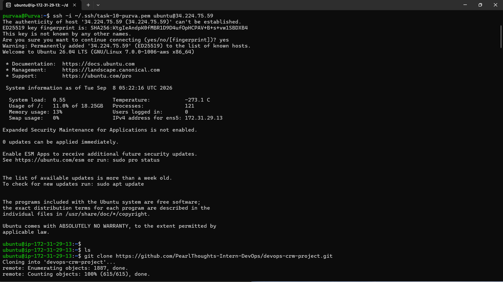
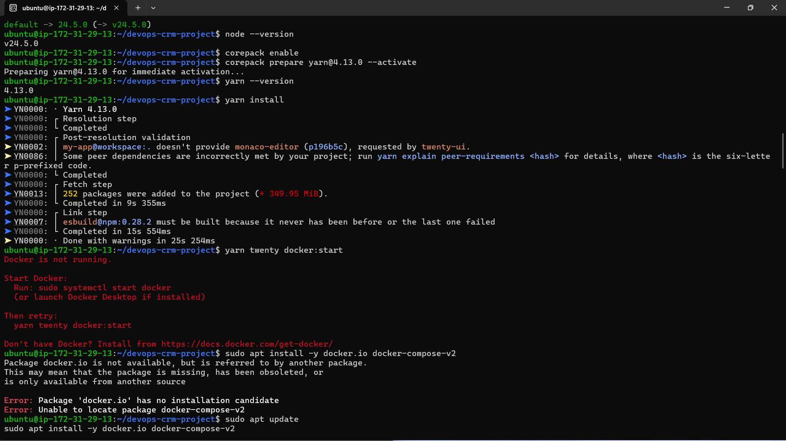
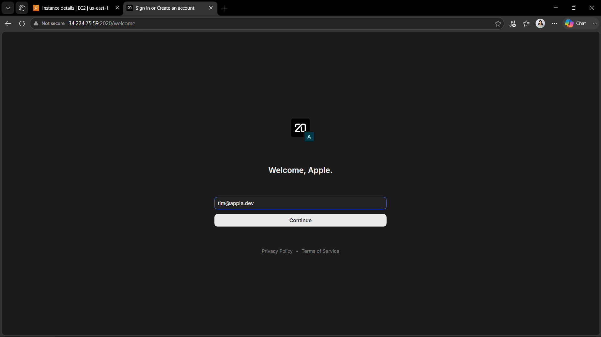
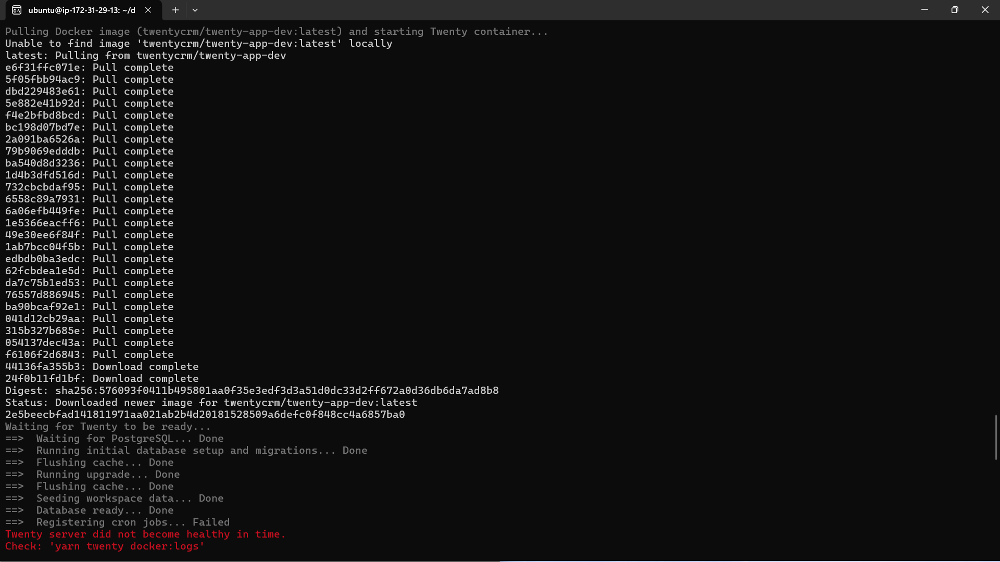
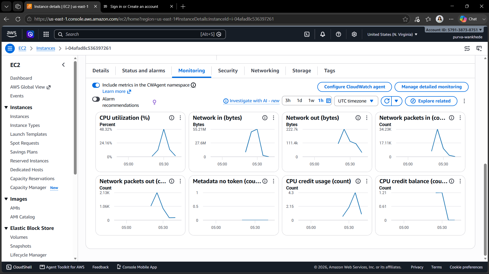
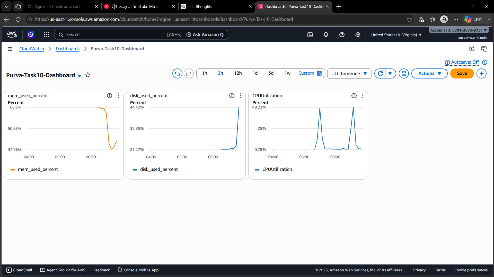
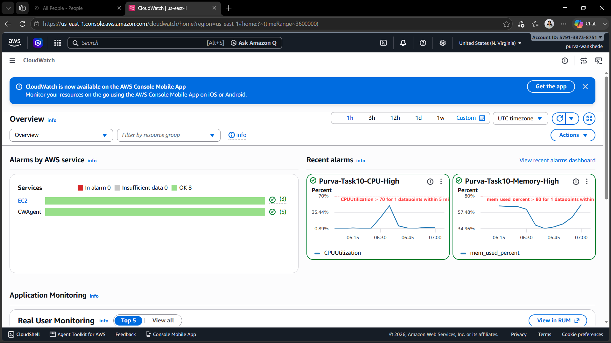

# Task 10: AWS Observability with CloudWatch

## 1. Objective

The objective was to deploy Twenty CRM on AWS EC2 and configure CloudWatch monitoring and alerting.  

The task included installing the CloudWatch Agent, collecting CPU, memory, and disk metrics, and verifying them in CloudWatch.  
A CloudWatch dashboard and alarms were created, followed by generating application activity to validate monitoring and alarm states.  
The EC2 instance was terminated after completing the implementation and documentation.

---

## 2. EC2 Instance Setup

A new Ubuntu EC2 instance was launched for Task 10.

The instance was accessed through SSH.

The required project repository was used from:

```text
~/devops-crm-project
```

### SSH Connection



---

## 3. Environment Setup

The repository requires Node.js 24.5.0 and Yarn 4.13.0.

The required versions were configured on the EC2 instance:

```text
Node.js: v24.5.0
Yarn: 4.13.0
```

Dependencies were installed using:

```bash
yarn install
```

The installation completed successfully.

### Environment and Dependency Installation



---

## 4. Deploying Twenty CRM

Twenty CRM was deployed from the `devops-crm-project` repository using the repository's Twenty CLI workflow.

The following command was used:

```bash
yarn twenty docker:start
```

The application was verified locally on the EC2 instance using:

```bash
curl http://localhost:2020
```
The command returned the Twenty CRM HTML response.

The application was then accessed successfully through the EC2 public IP and port `2020` from a web browser.

### Twenty CRM Running



### Twenty Deployment



---

## 5. Exploring Default EC2 CloudWatch Metrics

Before configuring the CloudWatch Agent, the default EC2 CloudWatch metrics were explored from the EC2 Monitoring section.

The default metrics included:

- CPU Utilization
- Network In
- Network Out
- Network Packets In
- Network Packets Out
- CPU Credit Usage
- CPU Credit Balance

### EC2 Monitoring



---

## 6. CloudWatch Agent Installation

The CloudWatch Agent was installed on the EC2 instance using the official AWS package.

The agent was verified after installation.

The EC2 instance was configured with the existing IAM role:

```text
CloudWatchAgentEC2Role
```

The CloudWatch Agent was configured using the CloudWatch Agent configuration wizard.

---

## 7. CloudWatch Agent Configuration

The CloudWatch Agent configuration was created at:

```text
/opt/aws/amazon-cloudwatch-agent/bin/config.json
```

The configuration was set to collect metrics every 60 seconds.

The final configuration collected the following metrics.

### CPU

```text
cpu_usage_idle
cpu_usage_user
cpu_usage_system
```

### Memory

```text
mem_used_percent
```

### Disk

```text
used_percent
```

The configuration was validated using:

```bash
python3 -m json.tool /opt/aws/amazon-cloudwatch-agent/bin/config.json
```

The CloudWatch Agent was then started using the generated configuration.

The agent status was verified as:

```text
status: running
```

---

## 8. CloudWatch Metrics Verification

The collected metrics were verified in:

```text
CloudWatch → Metrics → CWAgent → InstanceId
```

The following metrics were available:

- CPU metrics
- `mem_used_percent`
- `disk_used_percent`

The metrics were associated with the Task 10 EC2 instance.

The memory and disk metrics showed active datapoints in CloudWatch.

The CloudWatch dashboard also displayed the collected CPU, memory, and disk metrics.

### CloudWatch Metrics and Dashboard



---

## 9. CloudWatch Alarms

Two CloudWatch alarms were created.

### CPU Alarm

**Alarm name:**

```text
Purva-Task10-CPU-High
```

Configuration:

```text
Metric: CPUUtilization
Statistic: Average
Period: 5 minutes
Threshold: Greater than 70%
Evaluation: 1 datapoint
```

### Memory Alarm

**Alarm name:**

```text
Purva-Task10-Memory-High
```

Configuration:

```text
Metric: mem_used_percent
Statistic: Average
Period: 5 minutes
Threshold: Greater than 80%
Evaluation: 1 datapoint
```

### CloudWatch Alarms



---

## 10. CloudWatch Dashboard

A dedicated CloudWatch dashboard was created:

```text
Purva-Task10-Dashboard
```

The dashboard contains the main monitoring metrics for the EC2 instance:

- CPU Utilization
- Memory Utilization
- Disk Utilization

The dashboard uses:

```text
AWS/EC2
```

for CPU metrics and:

```text
CWAgent
```

for memory and disk metrics.

### CloudWatch Dashboard


---

## 11. Twenty CRM Activity and Monitoring Verification

The Twenty CRM application was accessed through the EC2 public IP and port `2020`.

Normal CRM activity was generated by navigating through and interacting with the CRM application.

CloudWatch was then used to observe the server metrics.

The dashboard showed active CPU and memory data, while disk utilization remained relatively stable.

The CloudWatch alarms were also checked after sufficient monitoring data was available.

Both alarms showed:

```text
OK
```

This confirmed that CloudWatch was successfully receiving and evaluating the configured metrics.

---

## 12. Issues Faced and Solutions

### Issue 1: CloudWatch Agent Package Was Not Available Through APT

Attempting to install the agent using:

```bash
sudo apt install -y amazon-cloudwatch-agent
```

returned:

```text
Unable to locate package amazon-cloudwatch-agent
```

**Solution:**

The official AWS CloudWatch Agent `.deb` package was downloaded and installed manually.

---

### Issue 2: EC2 IAM Role Was Not Initially Available

The CloudWatch Agent required AWS credentials to publish metrics.

The existing:

```text
CloudWatchAgentEC2Role
```

was attached to the EC2 instance.

After attaching the role, the instance metadata confirmed that the role was available.

---

### Issue 3: Twenty CLI Health-Check Timeout

The command:

```bash
yarn twenty docker:start
```

reported:

```text
Twenty server did not become healthy in time
```

However, the application was actually running.

The application was verified using:

```bash
curl http://localhost:2020
```

which returned the Twenty CRM HTML response.

The application was also successfully accessed through the browser.

---

## 14. Conclusion

The task showed how CloudWatch can monitor EC2 resources using metrics, dashboards, and alarms.

### Thank You!