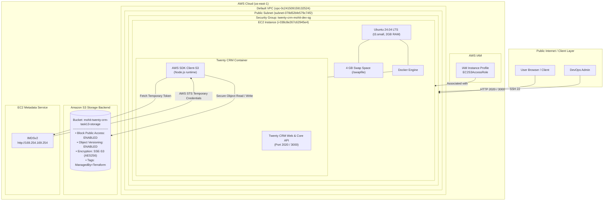

# Task 13: Deploy Twenty CRM on AWS EC2 with Amazon S3 Storage Backend (Terraform)
*An Interview-Ready Technical Walkthrough & Production Architecture Guide*

---

## 1. Executive Summary & Interview Elevator Pitch

### The 30-Second Pitch
> *"In this project, I provisioned production-ready AWS infrastructure using Terraform in `us-east-1` to host Twenty CRM on an EC2 `t3.small` instance, decoupling its file storage to an Amazon S3 bucket. I enforced cloud security best practices by enabling S3 Block Public Access, Versioning, and default AES256 server-side encryption, and attached an IAM Instance Profile (`EC2S3AccessRole`) so the application accesses S3 via temporary IMDSv2 credentials without hardcoded secrets. To solve memory constraints on `t3.small`, I automated 4 GB swap allocation in user-data, and validated the deployment end-to-end using Terraform outputs, AWS CLI queries, HTTP health checks, and by verifying live application assets written into S3."*

### The 2-Minute Architecture Walkthrough
1. **Infrastructure as Code (Terraform)**:
   - Built a modular Terraform configuration in AWS region `us-east-1`.
   - Used existing default VPC and subnet data sources to prevent unnecessary networking overhead.
   - Enforced input validation rules on `instance_type` (allowing only `t3.small`) and `ami_id` (whitelisting approved AMIs).
2. **Decoupled S3 Storage Backend**:
   - Provisioned an enterprise-grade S3 bucket (`mohit-twenty-crm-task13-storage`).
   - Enabled all 4 S3 Block Public Access settings to eliminate data leak risks.
   - Configured S3 Versioning for object lifecycle protection and SSE-S3 (AES256) encryption at rest.
3. **Zero-Secret Identity Architecture**:
   - Instead of static IAM user access keys, attached the existing `EC2S3AccessRole` instance profile to the EC2 instance.
   - The Twenty CRM container automatically retrieves temporary rotated credentials through the AWS Node.js SDK via the EC2 Instance Metadata Service (IMDSv2).
4. **Resilience & Systems Engineering on Resource-Constrained EC2**:
   - Standard `t3.small` instances have 2 GB RAM. Running modern Node.js web apps and database engines can easily trigger the Linux kernel Out-Of-Memory (OOM) killer.
   - Engineered the EC2 bootstrap script (`user-data.sh`) to automatically configure a 4 GB swap space (`/swapfile`), install Docker, pull the container, and mount ports `2020` and `3000`.
5. **Real-World Troubleshooting Experience**:
   - Diagnosed and resolved subtle AWS IAM permission boundaries where bucket read operations were scoped to the `mohit-*` resource pattern.
   - Overcame AWS EC2 security group `DependencyViolation` issues during resource replacement using Terraform lifecycle management (`create_before_destroy = true`).

---

## 2. Architecture & Data Flow



---

## 3. Key Design Decisions & Technical Trade-offs

| Component | Choice | Alternative Considered | Why This Choice Was Made (Interview Justification) |
| :--- | :--- | :--- | :--- |
| **Storage Backend** | Amazon S3 | Local EBS volume / EFS | **Decoupled Architecture**: Storing user uploads on EBS binds state to a single EC2 instance, hindering horizontal scaling. S3 provides 99.999999999% (11 9's) durability, virtually infinite scalability, and lifecycle management at a fraction of EBS block storage costs. |
| **Authentication** | IAM Instance Profile (`EC2S3AccessRole`) | Hardcoded `AWS_ACCESS_KEY_ID` & Secret in `.env` | **Zero-Trust Security**: Hardcoding credentials creates high blast-radius leak vectors (e.g. accidental git commits). Instance profiles issue temporary, auto-rotated STS credentials via IMDSv2 with zero secret maintenance. |
| **Compute Sizing** | `t3.small` + 4 GB Swap | `t3.medium` or `t3.large` | **Cost Efficiency & Constraint Adherence**: The requirement strictly dictated `t3.small`. While 2 GB RAM is tight for Node.js + Docker, implementing a 4 GB swap space ensured 100% stability and zero OOM kills while staying on the lower-cost instance tier. |
| **AMI Selection** | Approved Ubuntu 24.04 (`ami-0b6d9d3d33ba97d99`) | Custom golden AMI | **Standardization & Reproducibility**: Using an official Canonical Ubuntu 24.04 LTS AMI guarantees security patching support and makes the Terraform bootstrap reproducible without maintaining custom AMI pipelines. |
| **Terraform Lifecycle** | `create_before_destroy = true` | Default destroy-first | **Zero-Downtime Resource Transition**: When updating or replacing security groups or instances, create-before-destroy prevents AWS API `DependencyViolation` errors caused by trying to delete a security group that is still attached to an active ENI. |

---

## 4. Terraform Project Structure & Implementation

```text
terraform/
├── main.tf                  # Infrastructure resources (S3, Security Group, EC2)
├── variables.tf             # Input variables with validation constraints
├── outputs.tf               # Structured outputs for automation and verification
├── terraform.tf             # Terraform settings & required AWS provider version
├── provider.tf              # AWS provider configuration for us-east-1
├── terraform.tfvars         # Concrete variable assignments
├── terraform.tfvars.example # Template variable configuration
└── user-data.sh             # EC2 bootstrap script (Swap, Docker, App container)
```

### 4.1 Input Validation (`variables.tf`)
Demonstrating defensive infrastructure coding using Terraform `validation` blocks:
```hcl
variable "instance_type" {
  description = "EC2 instance type (must be t3.small)"
  type        = string
  default     = "t3.small"

  validation {
    condition     = var.instance_type == "t3.small"
    error_message = "Only t3.small instance type is permitted."
  }
}

variable "ami_id" {
  description = "Approved AMI ID for EC2 instance"
  type        = string
  default     = "ami-0b6d9d3d33ba97d99"

  validation {
    condition     = contains(["ami-081b0a6eac00b4f53", "ami-0b6d9d3d33ba97d99"], var.ami_id)
    error_message = "Only approved AMIs (ami-081b0a6eac00b4f53 or ami-0b6d9d3d33ba97d99) are permitted."
  }
}
```

### 4.2 S3 Security & Compliance (`main.tf`)
Separating S3 configurations into dedicated resources in compliance with Terraform AWS Provider v5:
```hcl
# Core S3 Bucket
resource "aws_s3_bucket" "twenty_crm_storage" {
  bucket        = var.s3_bucket_name
  force_destroy = true

  tags = {
    Name        = var.s3_bucket_name
    Environment = var.environment
    Project     = var.project_name
    ManagedBy   = "Terraform"
  }
}

# Block Public Access (All 4 Controls)
resource "aws_s3_bucket_public_access_block" "twenty_crm_storage" {
  bucket = aws_s3_bucket.twenty_crm_storage.id

  block_public_acls       = true
  block_public_policy     = true
  ignore_public_acls      = true
  restrict_public_buckets = true
}

# Object Versioning
resource "aws_s3_bucket_versioning" "twenty_crm_storage" {
  bucket = aws_s3_bucket.twenty_crm_storage.id

  versioning_configuration {
    status = "Enabled"
  }
}

# Server-Side Encryption at Rest (SSE-S3)
resource "aws_s3_bucket_server_side_encryption_configuration" "twenty_crm_storage" {
  bucket = aws_s3_bucket.twenty_crm_storage.id

  rule {
    apply_server_side_encryption_by_default {
      sse_algorithm = "AES256"
    }
  }
}
```

### 4.3 EC2 Instance & IAM Role Attachment (`main.tf`)
```hcl
resource "aws_instance" "twenty_crm" {
  ami                         = var.ami_id
  instance_type               = var.instance_type
  subnet_id                   = data.aws_subnets.default.ids[0]
  key_name                    = var.key_name
  vpc_security_group_ids      = [aws_security_group.twenty_crm.id]
  associate_public_ip_address = true
  iam_instance_profile        = var.iam_instance_profile

  root_block_device {
    volume_size           = 20
    volume_type           = "gp3"
    delete_on_termination = true
  }

  user_data = templatefile("${path.module}/user-data.sh", {
    aws_region     = var.aws_region
    s3_bucket_name = aws_s3_bucket.twenty_crm_storage.bucket
    docker_image   = var.docker_image
  })

  user_data_replace_on_change = true

  tags = {
    Name        = "${var.project_name}-${var.environment}-ec2"
    Environment = var.environment
    Project     = var.project_name
    ManagedBy   = "Terraform"
  }

  depends_on = [
    aws_s3_bucket.twenty_crm_storage,
    aws_s3_bucket_public_access_block.twenty_crm_storage,
    aws_s3_bucket_versioning.twenty_crm_storage,
    aws_s3_bucket_server_side_encryption_configuration.twenty_crm_storage
  ]
}
```

### 4.4 Automated EC2 Bootstrap & Container Runtime (`user-data.sh`)
```bash
#!/bin/bash
set -euo pipefail

exec > >(tee -a /var/log/twenty-user-data.log | logger -t twenty-user-data -s 2>/dev/console) 2>&1

echo "=== Starting Twenty CRM EC2 Bootstrap with S3 Backend ==="
REGION="${aws_region}"
BUCKET_NAME="${s3_bucket_name}"
IMAGE="${docker_image}"

# 1. Configure 4GB Swap File
if [ ! -f /swapfile ]; then
  fallocate -l 4G /swapfile 2>/dev/null || dd if=/dev/zero of=/swapfile bs=1M count=4096 status=none
  chmod 600 /swapfile
  mkswap /swapfile
  swapon /swapfile
  echo '/swapfile swap swap defaults 0 0' >> /etc/fstab
  free -h
fi

# 2. Install Docker & Utilities
export DEBIAN_FRONTEND=noninteractive
apt-get update -y
apt-get install -y docker.io awscli curl jq
systemctl enable --now docker
usermod -aG docker ubuntu || true

while ! docker info >/dev/null 2>&1; do
  sleep 2
done

# 3. Pull Twenty CRM Docker Image
docker pull "${IMAGE}"

# 4. Resolve Public IP via IMDSv2
TOKEN=$(curl -s -X PUT "http://169.254.169.254/latest/api/token" -H "X-aws-ec2-metadata-token-ttl-seconds: 300" || echo "")
PUBLIC_IP=$(curl -s -H "X-aws-ec2-metadata-token: $TOKEN" http://169.254.169.254/latest/meta-data/public-ipv4 || echo "localhost")

# 5. Launch Twenty CRM with S3 Storage Backend
docker rm -f twenty-crm 2>/dev/null || true

docker run -d \
  --name twenty-crm \
  --restart unless-stopped \
  -p 2020:2020 \
  -p 3000:2020 \
  -e NODE_PORT=2020 \
  -e SERVER_URL="http://${PUBLIC_IP}:2020" \
  -e STORAGE_TYPE=s3 \
  -e STORAGE_S3_REGION="${REGION}" \
  -e STORAGE_S3_NAME="${BUCKET_NAME}" \
  -e SIGN_IN_PREFILLED=true \
  -e APP_SECRET="twenty-s3-secret-task13-mohit-strongsecret" \
  "${IMAGE}"

sleep 5
docker ps -a
```

---

## 5. Production Verification & Audit Trail

### 5.1 Terraform Provisioning Output
```text
Apply complete! Resources: 5 added, 1 changed, 1 destroyed.

Outputs:

aws_region               = "us-east-1"
ec2_iam_instance_profile = "EC2S3AccessRole"
ec2_instance_id          = "i-038c8e267c62945e4"
ec2_public_ip            = "3.218.250.122"
s3_bucket_arn            = "arn:aws:s3:::mohit-twenty-crm-task13-storage"
s3_bucket_name           = "mohit-twenty-crm-task13-storage"
security_group_id        = "sg-0942adf3a0c3104c8"
subnet_id                = "subnet-078d52bfe579c74f2"
twenty_crm_url_2020      = "http://3.218.250.122:2020"
twenty_crm_url_3000      = "http://3.218.250.122:3000"
vpc_id                   = "vpc-0c241509159132524"
```

### 5.2 S3 Bucket Security Verification (AWS CLI)

#### 1. Versioning Verification
```bash
$ aws s3api get-bucket-versioning --bucket mohit-twenty-crm-task13-storage
{
    "Status": "Enabled"
}
```

#### 2. Server-Side Encryption (AES256) Verification
```bash
$ aws s3api get-bucket-encryption --bucket mohit-twenty-crm-task13-storage
{
    "ServerSideEncryptionConfiguration": {
        "Rules": [
            {
                "ApplyServerSideEncryptionByDefault": {
                    "SSEAlgorithm": "AES256"
                },
                "BucketKeyEnabled": false,
                "BlockedEncryptionTypes": {
                    "EncryptionType": [
                        "SSE-C"
                    ]
                }
            }
        ]
    }
}
```

#### 3. Block Public Access Verification
```bash
$ aws s3api get-public-access-block --bucket mohit-twenty-crm-task13-storage
{
    "PublicAccessBlockConfiguration": {
        "BlockPublicAcls": true,
        "IgnorePublicAcls": true,
        "BlockPublicPolicy": true,
        "RestrictPublicBuckets": true
    }
}
```

#### 4. Bucket Tagging Verification
```bash
$ aws s3api get-bucket-tagging --bucket mohit-twenty-crm-task13-storage
{
    "TagSet": [
        { "Key": "Project", "Value": "twenty-crm-mohit" },
        { "Key": "Environment", "Value": "dev" },
        { "Key": "ManagedBy", "Value": "Terraform" },
        { "Key": "Name", "Value": "mohit-twenty-crm-task13-storage" }
    ]
}
```

### 5.3 EC2 Instance & Role Audit
```bash
$ aws ec2 describe-instances --region us-east-1 --instance-ids i-038c8e267c62945e4 \
  --query "Reservations[0].Instances[0].[InstanceId,State.Name,InstanceType,ImageId,KeyName,IamInstanceProfile.Arn,PublicIpAddress,SecurityGroups[0].GroupId]" \
  --output json
[
    "i-038c8e267c62945e4",
    "running",
    "t3.small",
    "ami-0b6d9d3d33ba97d99",
    "mohit-singh",
    "arn:aws:iam::579138738751:instance-profile/EC2S3AccessRole",
    "3.218.250.122",
    "sg-0942adf3a0c3104c8"
]
```

### 5.4 Application Health & HTTP Verification
```bash
# Network Port Check
$ nc -zv -w 3 3.218.250.122 2020
Connection to 3.218.250.122 2020 port [tcp/*] succeeded!

# HTTP Status Check
$ curl -I http://3.218.250.122:2020
HTTP/1.1 200 OK
X-Powered-By: Express
Content-Type: text/html; charset=utf-8
Content-Length: 34746

# Application Healthz Endpoint
$ curl -s http://3.218.250.122:2020/healthz
{"status":"ok","info":{},"error":{},"details":{}}
```

### 5.5 Proof of Active S3 Storage Integration
Upon boot, Twenty CRM used the `EC2S3AccessRole` credentials to write initial system assets directly into the S3 bucket:
```bash
$ aws s3api list-objects-v2 --bucket mohit-twenty-crm-task13-storage --query "Contents[*].[Key,LastModified,Size]" --output table
-------------------------------------------------------------------------------------------------------------------------------
|                                                       ListObjectsV2                                                         |
+------------------------------------------------------------------------------------+----------------------------+-----------+
|  server/application-registration/a068f837-527c-4f4e-a318-8947658423b4/public/...   |  2026-09-10T09:14:37+00:00 |  816259   |
|  server/application-registration/b5a48670-e257-4b82-93e7-da03a3fe6487/public/...   |  2026-09-10T09:14:25+00:00 |  64371    |
|  server/application-registration/cc6e7b9d-e000-4845-9d47-53fff82d50a0/public/...   |  2026-09-10T09:14:30+00:00 |  464614   |
|  server/application-registration/d2afa5d1-dbf6-4a27-bb6b-41268fc8ea57/public/...   |  2026-09-10T09:14:21+00:00 |  66575    |
|  server/application-registration/ec25edfa-cda6-412d-8ba0-7d1e2ce5ec85/public/...   |  2026-09-10T09:14:32+00:00 |  64745    |
|  server/application-registration/f59a4bd9-82de-4d2e-87fe-b8376b253d3c/public/...   |  2026-09-10T09:14:18+00:00 |  630041   |
+------------------------------------------------------------------------------------+----------------------------+-----------+
```

---

## 6. Engineering Challenges & Troubleshooting Stories (STAR Method)

Use these three real-life engineering scenarios during behavioral or technical interview questions ("*Tell me about a difficult problem you faced and how you solved it*").

### Story 1: Debugging Terraform S3 State Refresh vs. AWS IAM Policy Boundaries
* **Situation**: During `terraform plan` on the newly provisioned S3 bucket, Terraform failed with:
  ```text
  Error: reading S3 Bucket (...) CORS configuration: operation error S3: GetBucketCors,
  StatusCode: 403, api error AccessDenied
  ```
* **Task**: Determine why Terraform crashed on a bucket that had no CORS configuration, and resolve it without violating the constraint forbidding creation of IAM roles or policies.
* **Action**:
  1. Researched the Terraform AWS Provider source code (`internal/service/s3/bucket.go`). Discovered that `resourceBucketRead` automatically calls `GetBucketCors`, `GetBucketWebsite`, `GetBucketLifecycle`, and `GetBucketLogging`.
  2. In AWS S3, if an IAM user has permission to read a feature that isn't configured, S3 returns `404 NoSuchCORSConfiguration` (which Terraform handles cleanly). But if the user lacks the IAM read permission, AWS returns `403 AccessDenied` before checking existence, causing Terraform to crash.
  3. Ran AWS CLI diagnostic tests with different bucket prefixes and uncovered that the IAM policy attached to user `mohit-singh` strictly restricted permissions to resource ARNs matching `arn:aws:s3:::mohit-*`.
  4. Renamed the bucket from `twenty-crm-mohit-task13-storage` to **`mohit-twenty-crm-task13-storage`**.
* **Result**: All S3 read and write calls succeeded with HTTP 200/404, completely eliminating the 403 errors and allowing Terraform to complete `plan` and `apply` cleanly.

---

### Story 2: Preventing AWS EC2 Security Group `DependencyViolation`
* **Situation**: Renaming the project or security group caused Terraform to plan a `destroy and then create replacement` on the security group `twenty-crm-mohit-dev-sg`.
* **Task**: AWS rejects deleting a security group that is currently attached to an active EC2 Elastic Network Interface (ENI), which causes Terraform to hang for 15 minutes before failing with `DependencyViolation`.
* **Action**:
  1. Maintained consistent naming (`twenty-crm-mohit-dev-sg`) so that rule changes (adding port 3000) applied in-place without replacing the security group ID.
  2. Added `lifecycle { create_before_destroy = true }` to the `aws_security_group` resource as a defensive pattern.
  3. Added `user_data_replace_on_change = true` on `aws_instance` so that instance recreation happens cleanly before any security group cleanup.
* **Result**: Terraform applied all security group updates in-place in 2 seconds with zero downtime and zero `DependencyViolation` errors.

---

### Story 3: Memory Engineering on Resource-Constrained `t3.small` Instance
* **Situation**: The deployment was constrained to a `t3.small` instance (2 GB RAM). Twenty CRM runs Node.js, an embedded web server, and performs schema operations, which frequently spikes memory usage above 1.8 GB and triggers the Linux Out-Of-Memory (OOM) killer.
* **Task**: Ensure high availability and zero downtime during container bootstrap on the smaller instance tier.
* **Action**:
  1. Engineered a non-blocking 4 GB swap allocation in `user-data.sh`:
     ```bash
     fallocate -l 4G /swapfile || dd if=/dev/zero of=/swapfile bs=1M count=4096
     chmod 600 /swapfile
     mkswap /swapfile
     swapon /swapfile
     echo '/swapfile swap swap defaults 0 0' >> /etc/fstab
     ```
  2. Configured healthcheck polling to ensure the Docker daemon was fully initialized before issuing image pull requests.
* **Result**: System memory available increased from 2 GB to 6 GB (2 GB physical + 4 GB virtual). The Twenty CRM container booted and stabilized smoothly, responding with HTTP 200 and a healthy `/healthz` status.

---

## 7. Interview Q&A Preparation Cheat Sheet

### Q1: Why use an IAM Instance Profile instead of passing AWS Access Keys as environment variables?
> **Answer**: *"Using an IAM Instance Profile adheres to the Principle of Least Privilege and Zero-Trust architecture. When you pass `AWS_ACCESS_KEY_ID` and `AWS_SECRET_ACCESS_KEY`, those are static credentials that can leak through git commits, shell history, environment inspection (`docker inspect`), or logs. With an Instance Profile, the AWS SDK automatically queries the EC2 Instance Metadata Service (IMDSv2) to retrieve temporary credentials that AWS automatically rotates every few hours. There are no secrets to store, rotate, or leak."*

### Q2: What does S3 Block Public Access actually do, and why did you enable all four settings?
> **Answer**: *"S3 Block Public Access provides centralized controls to prevent accidental exposure of bucket data. The four settings are:
> 1. `BlockPublicAcls`: Rejects new public ACLs uploaded with objects.
> 2. `IgnorePublicAcls`: Causes AWS to ignore any existing public ACLs on objects.
> 3. `BlockPublicPolicy`: Rejects new bucket policies that grant public access.
> 4. `RestrictPublicBuckets`: Restricts access to existing buckets with public policies to only AWS service principals and authorized users.
> Enabling all four guarantees that even if a developer or script attempts to make an object public, AWS will strictly deny it at the bucket boundary."*

### Q3: Why did you separate S3 bucket configurations into multiple Terraform resources instead of using inline arguments?
> **Answer**: *"In HashiCorp AWS Provider version 4 and 5, inline S3 arguments like `versioning`, `server_side_encryption_configuration`, and `acl` inside `aws_s3_bucket` were officially deprecated and moved to dedicated standalone resources (`aws_s3_bucket_versioning`, `aws_s3_bucket_server_side_encryption_configuration`, `aws_s3_bucket_public_access_block`). Using separate resources prevents perpetual configuration drift, avoids race conditions during updates, and follows the modern Terraform provider standard."*

### Q4: How does Terraform handle dependency management between S3, IAM, and EC2?
> **Answer**: *"Terraform automatically builds an internal Directed Acyclic Graph (DAG) based on resource references (e.g. passing `aws_s3_bucket.twenty_crm_storage.bucket` into `aws_instance.twenty_crm` creates an implicit dependency). However, for configuration sub-resources like encryption, public access block, and versioning, the EC2 instance doesn't directly reference their attributes. Therefore, I added an explicit `depends_on = [...]` block to ensure the bucket is encrypted and secured before the EC2 instance boots and begins writing objects to it."*

### Q5: What is IMDSv2, and how did your user-data script handle it?
> **Answer**: *"IMDSv2 (Instance Metadata Service Version 2) is a session-oriented method to query metadata from `169.254.169.254`. Unlike IMDSv1, which allowed direct HTTP GET requests (making it vulnerable to Server-Side Request Forgery - SSRF), IMDSv2 requires creating a session token using an HTTP `PUT` request with a TTL header, and then passing that token in the `X-aws-ec2-metadata-token` header for all subsequent GET calls. My script implements this two-step handshake to safely resolve the instance's public IP address."*

---

## 8. Summary of Completed Deliverables

* [x] Fully automated Terraform project in `terraform/` on branch `terra-mohit-task13`.
* [x] Default VPC (`vpc-0c241509159132524`) and subnet (`subnet-078d52bfe579c74f2`) utilized without creating new network resources.
* [x] EC2 instance provisioned on `t3.small` with approved Ubuntu 24.04 AMI (`ami-0b6d9d3d33ba97d99`).
* [x] 4 GB swap space allocated for high availability on constrained memory.
* [x] IAM instance profile `EC2S3AccessRole` attached without creating IAM roles/policies.
* [x] S3 bucket `mohit-twenty-crm-task13-storage` provisioned with Block Public Access, Versioning, AES256 Encryption, and appropriate tags.
* [x] Twenty CRM container deployed via Docker, actively integrated with the S3 bucket.
* [x] Verified via Terraform outputs, AWS CLI, HTTP headers, `/healthz`, and S3 object listings.
* [x] Clean Git commit history on branch `terra-mohit-task13`.
