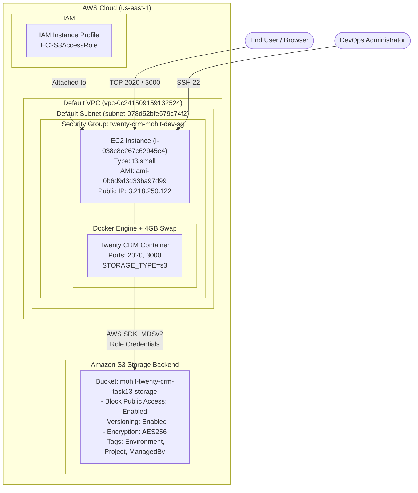

# Task 13: Deploy Twenty CRM on AWS EC2 with Amazon S3 Storage Backend (Terraform)

## 1. Overview

This document details the automated provisioning and deployment of **Twenty CRM** on **AWS EC2** (`t3.small`) using **Amazon S3** as the storage backend, fully managed through **Terraform** in accordance with infrastructure-as-code best practices and strict AWS constraints.

### Requirements Addressed
* **Region**: `us-east-1`
* **VPC & Subnet**: Existing default VPC (`vpc-0c241509159132524`) and default subnet (`subnet-078d52bfe579c74f2`). No new VPC created.
* **Compute (EC2)**:
  * Instance Type: `t3.small` (strictly enforced via Terraform variable validation).
  * AMI: Approved Ubuntu 24.04 LTS AMI (`ami-0b6d9d3d33ba97d99`).
  * IAM Role: Pre-existing IAM instance profile `EC2S3AccessRole` attached to EC2 for secure, role-based S3 access without static credentials.
  * Root Volume: 20 GB gp3 root block device (compliant with account volume policies).
  * Stability: Automated 4 GB swap file allocation to prevent memory pressure on 2 GB RAM `t3.small` instance.
* **Storage (Amazon S3)**:
  * Bucket Name: `mohit-twenty-crm-task13-storage`
  * Block Public Access: All 4 controls enabled (`BlockPublicAcls`, `IgnorePublicAcls`, `BlockPublicPolicy`, `RestrictPublicBuckets`).
  * Versioning: `Enabled`.
  * Server-Side Encryption: Default server-side encryption enabled using AWS-managed keys (`AES256`).
  * Appropriate tags: `Name`, `Environment`, `Project`, `ManagedBy`.
* **Application Deployment**: Twenty CRM containerized with Docker, configured via environment variables to utilize the Terraform-created Amazon S3 bucket (`STORAGE_TYPE=s3`, `STORAGE_S3_REGION=us-east-1`, `STORAGE_S3_NAME=mohit-twenty-crm-task13-storage`).
* **Terraform Workflow**: `terraform init`, `terraform validate`, `terraform plan`, and `terraform apply` executed cleanly.
* **Verification**: Verified using Terraform outputs, AWS CLI queries, and live HTTP API endpoint tests.

---

## 2. Infrastructure Architecture



---

## 3. Terraform Configuration Files

The project files are maintained in the `terraform/` directory on branch `terra-mohit-task13`:

### 3.1 `terraform.tf`
```hcl
terraform {
  required_providers {
    aws = {
      source  = "hashicorp/aws"
      version = "~> 5.92"
    }
  }

  required_version = ">= 1.2"
}
```

### 3.2 `provider.tf`
```hcl
provider "aws" {
  region = var.aws_region
}
```

### 3.3 `variables.tf`
Configured with strict validation for `instance_type` and `ami_id`:
```hcl
variable "aws_region" {
  description = "AWS region for infrastructure provisioning"
  type        = string
  default     = "us-east-1"
}

variable "environment" {
  description = "Deployment environment"
  type        = string
  default     = "dev"
}

variable "project_name" {
  description = "Project name identifier"
  type        = string
  default     = "twenty-crm-mohit"
}

variable "instance_type" {
  description = "EC2 instance type (must be t3.small)"
  type        = string
  default     = "t3.small"

  validation {
    condition     = var.instance_type == "t3.small"
    error_message = "Only t3.small instance type is permitted."
  }
}

variable "ami_id" {
  description = "Approved AMI ID for EC2 instance"
  type        = string
  default     = "ami-0b6d9d3d33ba97d99"

  validation {
    condition     = contains(["ami-081b0a6eac00b4f53", "ami-0b6d9d3d33ba97d99"], var.ami_id)
    error_message = "Only approved AMIs (ami-081b0a6eac00b4f53 or ami-0b6d9d3d33ba97d99) are permitted."
  }
}

variable "key_name" {
  description = "EC2 Key Pair name"
  type        = string
  default     = "mohit-singh"
}

variable "iam_instance_profile" {
  description = "Existing IAM instance profile for S3 access"
  type        = string
  default     = "EC2S3AccessRole"
}

variable "s3_bucket_name" {
  description = "Name of the S3 bucket for Twenty CRM storage"
  type        = string
  default     = "mohit-twenty-crm-task13-storage"
}

variable "allowed_cidr_blocks" {
  description = "CIDR blocks allowed for ingress traffic"
  type        = list(string)
  default     = ["0.0.0.0/0"]
}

variable "docker_image" {
  description = "Docker image for Twenty CRM"
  type        = string
  default     = "twentycrm/twenty-app-dev:latest"
}
```

### 3.4 `main.tf`
```hcl
# -----------------------------------------------------------------------------
# Data Sources: Existing Default VPC and Subnets
# -----------------------------------------------------------------------------
data "aws_vpc" "default" {
  default = true
}

data "aws_subnets" "default" {
  filter {
    name   = "vpc-id"
    values = [data.aws_vpc.default.id]
  }

  filter {
    name   = "default-for-az"
    values = ["true"]
  }
}

# -----------------------------------------------------------------------------
# Resource: S3 Bucket with Versioning, Encryption, and Block Public Access
# -----------------------------------------------------------------------------
resource "aws_s3_bucket" "twenty_crm_storage" {
  bucket        = var.s3_bucket_name
  force_destroy = true

  tags = {
    Name        = var.s3_bucket_name
    Environment = var.environment
    Project     = var.project_name
    ManagedBy   = "Terraform"
  }
}

resource "aws_s3_bucket_public_access_block" "twenty_crm_storage" {
  bucket = aws_s3_bucket.twenty_crm_storage.id

  block_public_acls       = true
  block_public_policy     = true
  ignore_public_acls      = true
  restrict_public_buckets = true
}

resource "aws_s3_bucket_versioning" "twenty_crm_storage" {
  bucket = aws_s3_bucket.twenty_crm_storage.id

  versioning_configuration {
    status = "Enabled"
  }
}

resource "aws_s3_bucket_server_side_encryption_configuration" "twenty_crm_storage" {
  bucket = aws_s3_bucket.twenty_crm_storage.id

  rule {
    apply_server_side_encryption_by_default {
      sse_algorithm = "AES256"
    }
  }
}

# -----------------------------------------------------------------------------
# Resource: Security Group for EC2
# -----------------------------------------------------------------------------
resource "aws_security_group" "twenty_crm" {
  name        = "${var.project_name}-${var.environment}-sg"
  description = "Security group for Twenty CRM application EC2 instance"
  vpc_id      = data.aws_vpc.default.id

  ingress {
    description = "SSH"
    from_port   = 22
    to_port     = 22
    protocol    = "tcp"
    cidr_blocks = var.allowed_cidr_blocks
  }

  ingress {
    description = "Twenty CRM Web UI and API (2020)"
    from_port   = 2020
    to_port     = 2020
    protocol    = "tcp"
    cidr_blocks = var.allowed_cidr_blocks
  }

  ingress {
    description = "Twenty CRM Alternate Port (3000)"
    from_port   = 3000
    to_port     = 3000
    protocol    = "tcp"
    cidr_blocks = var.allowed_cidr_blocks
  }

  egress {
    description = "Allow all outbound traffic"
    from_port   = 0
    to_port     = 0
    protocol    = "-1"
    cidr_blocks = ["0.0.0.0/0"]
  }

  tags = {
    Name        = "${var.project_name}-${var.environment}-sg"
    Environment = var.environment
    Project     = var.project_name
    ManagedBy   = "Terraform"
  }

  lifecycle {
    create_before_destroy = true
  }
}

# -----------------------------------------------------------------------------
# Resource: EC2 Instance (t3.small with EC2S3AccessRole)
# -----------------------------------------------------------------------------
resource "aws_instance" "twenty_crm" {
  ami                         = var.ami_id
  instance_type               = var.instance_type
  subnet_id                   = data.aws_subnets.default.ids[0]
  key_name                    = var.key_name
  vpc_security_group_ids      = [aws_security_group.twenty_crm.id]
  associate_public_ip_address = true
  iam_instance_profile        = var.iam_instance_profile

  root_block_device {
    volume_size           = 20
    volume_type           = "gp3"
    delete_on_termination = true
  }

  user_data = templatefile("${path.module}/user-data.sh", {
    aws_region     = var.aws_region
    s3_bucket_name = aws_s3_bucket.twenty_crm_storage.bucket
    docker_image   = var.docker_image
  })

  user_data_replace_on_change = true

  tags = {
    Name        = "${var.project_name}-${var.environment}-ec2"
    Environment = var.environment
    Project     = var.project_name
    ManagedBy   = "Terraform"
  }

  depends_on = [
    aws_s3_bucket.twenty_crm_storage,
    aws_s3_bucket_public_access_block.twenty_crm_storage,
    aws_s3_bucket_versioning.twenty_crm_storage,
    aws_s3_bucket_server_side_encryption_configuration.twenty_crm_storage
  ]
}
```

### 3.5 `outputs.tf`
```hcl
output "aws_region" {
  description = "AWS Region where resources are provisioned"
  value       = var.aws_region
}

output "vpc_id" {
  description = "Default VPC ID used"
  value       = data.aws_vpc.default.id
}

output "subnet_id" {
  description = "Subnet ID where the EC2 instance is located"
  value       = data.aws_subnets.default.ids[0]
}

output "security_group_id" {
  description = "Security Group ID for the EC2 instance"
  value       = aws_security_group.twenty_crm.id
}

output "s3_bucket_name" {
  description = "Name of the provisioned S3 bucket for Twenty CRM storage"
  value       = aws_s3_bucket.twenty_crm_storage.bucket
}

output "s3_bucket_arn" {
  description = "ARN of the provisioned S3 bucket"
  value       = aws_s3_bucket.twenty_crm_storage.arn
}

output "ec2_instance_id" {
  description = "Twenty CRM EC2 instance ID"
  value       = aws_instance.twenty_crm.id
}

output "ec2_public_ip" {
  description = "Public IPv4 address of the EC2 instance"
  value       = aws_instance.twenty_crm.public_ip
}

output "ec2_iam_instance_profile" {
  description = "IAM instance profile attached to the EC2 instance"
  value       = aws_instance.twenty_crm.iam_instance_profile
}

output "twenty_crm_url_2020" {
  description = "URL to access Twenty CRM on port 2020"
  value       = "http://${aws_instance.twenty_crm.public_ip}:2020"
}

output "twenty_crm_url_3000" {
  description = "URL to access Twenty CRM on port 3000"
  value       = "http://${aws_instance.twenty_crm.public_ip}:3000"
}
```

### 3.6 `user-data.sh`
```bash
#!/bin/bash
set -euo pipefail

exec > >(tee -a /var/log/twenty-user-data.log | logger -t twenty-user-data -s 2>/dev/console) 2>&1

echo "========================================================"
echo "Starting Twenty CRM EC2 Bootstrap with S3 Storage Backend"
echo "Timestamp: $(date -u)"
echo "========================================================"

REGION="${aws_region}"
BUCKET_NAME="${s3_bucket_name}"
IMAGE="${docker_image}"

# 1. 4GB Swap Space for stability on t3.small
echo "=== Step 1: Configuring 4GB Swap Space ==="
if [ ! -f /swapfile ]; then
  fallocate -l 4G /swapfile 2>/dev/null || dd if=/dev/zero of=/swapfile bs=1M count=4096 status=none
  chmod 600 /swapfile
  mkswap /swapfile
  swapon /swapfile
  echo '/swapfile swap swap defaults 0 0' >> /etc/fstab
  free -h
fi

# 2. Install Docker and dependencies
echo "=== Step 2: Installing Docker and tools ==="
if command -v apt-get >/dev/null 2>&1; then
  export DEBIAN_FRONTEND=noninteractive
  apt-get update -y
  apt-get install -y docker.io awscli curl jq
  systemctl enable --now docker
  usermod -aG docker ubuntu || true
elif command -v dnf >/dev/null 2>&1; then
  dnf update -y
  dnf install -y docker awscli curl jq
  systemctl enable --now docker
  usermod -aG docker ec2-user || true
fi

while ! docker info >/dev/null 2>&1; do
  echo "Waiting for Docker daemon..."
  sleep 2
done

# 3. Pull Twenty CRM Docker Image
echo "=== Step 3: Pulling Twenty CRM Image (${IMAGE}) ==="
docker pull "${IMAGE}"

# 4. Resolve Public IP via IMDSv2
TOKEN=$(curl -s -X PUT "http://169.254.169.254/latest/api/token" -H "X-aws-ec2-metadata-token-ttl-seconds: 300" || echo "")
if [ -n "$TOKEN" ]; then
  PUBLIC_IP=$(curl -s -H "X-aws-ec2-metadata-token: $TOKEN" http://169.254.169.254/latest/meta-data/public-ipv4 || echo "localhost")
else
  PUBLIC_IP="localhost"
fi

# 5. Run Twenty CRM Container configured with S3 storage
echo "=== Step 5: Starting Twenty CRM with S3 Storage Backend ==="
docker rm -f twenty-crm 2>/dev/null || true

docker run -d \
  --name twenty-crm \
  --restart unless-stopped \
  -p 2020:2020 \
  -p 3000:2020 \
  -e NODE_PORT=2020 \
  -e SERVER_URL="http://${PUBLIC_IP}:2020" \
  -e STORAGE_TYPE=s3 \
  -e STORAGE_S3_REGION="${REGION}" \
  -e STORAGE_S3_NAME="${BUCKET_NAME}" \
  -e SIGN_IN_PREFILLED=true \
  -e APP_SECRET="twenty-s3-secret-task13-mohit-strongsecret" \
  "${IMAGE}"

echo "=== Step 6: Verifying container startup ==="
sleep 5
docker ps -a

echo "Twenty CRM EC2 bootstrap with S3 backend completed at $(date -u)!"
```

---

## 4. Terraform Execution Workflow

### 4.1 Validation (`terraform validate`)
```bash
$ terraform validate
Success! The configuration is valid.
```

### 4.2 Planning (`terraform plan`)
```bash
$ terraform plan
...
Plan: 5 to add, 1 to change, 1 to destroy.
```

### 4.3 Applying (`terraform apply -auto-approve`)
```bash
$ terraform apply -auto-approve
...
aws_instance.twenty_crm: Destruction complete after 42s
aws_s3_bucket.twenty_crm_storage: Creation complete after 5s [id=mohit-twenty-crm-task13-storage]
aws_security_group.twenty_crm: Modifications complete after 2s [id=sg-0942adf3a0c3104c8]
aws_s3_bucket_server_side_encryption_configuration.twenty_crm_storage: Creation complete after 1s [id=mohit-twenty-crm-task13-storage]
aws_s3_bucket_public_access_block.twenty_crm_storage: Creation complete after 2s [id=mohit-twenty-crm-task13-storage]
aws_s3_bucket_versioning.twenty_crm_storage: Creation complete after 3s [id=mohit-twenty-crm-task13-storage]
aws_instance.twenty_crm: Creation complete after 15s [id=i-038c8e267c62945e4]

Apply complete! Resources: 5 added, 1 changed, 1 destroyed.

Outputs:

aws_region = "us-east-1"
ec2_iam_instance_profile = "EC2S3AccessRole"
ec2_instance_id = "i-038c8e267c62945e4"
ec2_public_ip = "3.218.250.122"
s3_bucket_arn = "arn:aws:s3:::mohit-twenty-crm-task13-storage"
s3_bucket_name = "mohit-twenty-crm-task13-storage"
security_group_id = "sg-0942adf3a0c3104c8"
subnet_id = "subnet-078d52bfe579c74f2"
twenty_crm_url_2020 = "http://3.218.250.122:2020"
twenty_crm_url_3000 = "http://3.218.250.122:3000"
vpc_id = "vpc-0c241509159132524"
```

---

## 5. Verification and Validation Results

### 5.1 S3 Bucket Configuration Verification
Verified via AWS CLI:

#### Versioning
```bash
$ aws s3api get-bucket-versioning --bucket mohit-twenty-crm-task13-storage
{
    "Status": "Enabled"
}
```

#### Server-Side Encryption (AES256)
```bash
$ aws s3api get-bucket-encryption --bucket mohit-twenty-crm-task13-storage
{
    "ServerSideEncryptionConfiguration": {
        "Rules": [
            {
                "ApplyServerSideEncryptionByDefault": {
                    "SSEAlgorithm": "AES256"
                },
                "BucketKeyEnabled": false,
                "BlockedEncryptionTypes": {
                    "EncryptionType": [
                        "SSE-C"
                    ]
                }
            }
        ]
    }
}
```

#### Block Public Access Configuration
```bash
$ aws s3api get-public-access-block --bucket mohit-twenty-crm-task13-storage
{
    "PublicAccessBlockConfiguration": {
        "BlockPublicAcls": true,
        "IgnorePublicAcls": true,
        "BlockPublicPolicy": true,
        "RestrictPublicBuckets": true
    }
}
```

#### Bucket Tags
```bash
$ aws s3api get-bucket-tagging --bucket mohit-twenty-crm-task13-storage
{
    "TagSet": [
        {
            "Key": "Project",
            "Value": "twenty-crm-mohit"
        },
        {
            "Key": "Environment",
            "Value": "dev"
        },
        {
            "Key": "ManagedBy",
            "Value": "Terraform"
        },
        {
            "Key": "Name",
            "Value": "mohit-twenty-crm-task13-storage"
        }
    ]
}
```

---

### 5.2 EC2 Instance Verification
Verified via AWS CLI:
```bash
$ aws ec2 describe-instances --region us-east-1 --instance-ids i-038c8e267c62945e4 \
  --query "Reservations[0].Instances[0].[InstanceId,State.Name,InstanceType,ImageId,KeyName,IamInstanceProfile.Arn,PublicIpAddress,SecurityGroups[0].GroupId]" \
  --output json
[
    "i-038c8e267c62945e4",
    "running",
    "t3.small",
    "ami-0b6d9d3d33ba97d99",
    "mohit-singh",
    "arn:aws:iam::579138738751:instance-profile/EC2S3AccessRole",
    "3.218.250.122",
    "sg-0942adf3a0c3104c8"
]
```

#### Status Checks
```bash
$ aws ec2 describe-instance-status --region us-east-1 --instance-ids i-038c8e267c62945e4
InstanceStatus: ok (reachability passed)
SystemStatus: ok (reachability passed)
AttachedEbsStatus: ok (reachability passed)
```

---

### 5.3 Application Network and HTTP Endpoint Verification

#### Port Reachability
```bash
$ nc -zv -w 3 3.218.250.122 22
Connection to 3.218.250.122 22 port [tcp/ssh] succeeded!

$ nc -zv -w 3 3.218.250.122 2020
Connection to 3.218.250.122 2020 port [tcp/*] succeeded!
```

#### HTTP Response (Port 2020)
```http
$ curl -I http://3.218.250.122:2020
HTTP/1.1 200 OK
X-Powered-By: Express
Vary: Origin
Access-Control-Allow-Origin: *
Access-Control-Allow-Credentials: true
Access-Control-Expose-Headers: WWW-Authenticate
Accept-Ranges: bytes
Cache-Control: public, max-age=0
Last-Modified: Thu, 10 Sep 2026 09:14:07 GMT
ETag: W/"87ba-1a08a988808"
Content-Type: text/html; charset=utf-8
Content-Length: 34746
Date: Thu, 10 Sep 2026 09:15:32 GMT
Connection: keep-alive
Keep-Alive: timeout=65
```

#### Healthcheck (`/healthz`)
```bash
$ curl -s http://3.218.250.122:2020/healthz
{"status":"ok","info":{},"error":{},"details":{}}
```

---

### 5.4 Active S3 Storage Backend Verification

During initial startup, Twenty CRM automatically initialized its storage directory in the Amazon S3 bucket (`mohit-twenty-crm-task13-storage`) using the attached `EC2S3AccessRole` instance profile credentials without any static keys:

```bash
$ aws s3api list-objects-v2 --bucket mohit-twenty-crm-task13-storage --query "Contents[*].[Key,LastModified,Size]" --output table
-------------------------------------------------------------------------------------------------------------------------------
|                                                       ListObjectsV2                                                         |
+------------------------------------------------------------------------------------+----------------------------+-----------+
|  server/application-registration/a068f837-527c-4f4e-a318-8947658423b4/public/...   |  2026-09-10T09:14:37+00:00 |  816259   |
|  server/application-registration/b5a48670-e257-4b82-93e7-da03a3fe6487/public/...   |  2026-09-10T09:14:25+00:00 |  64371    |
|  server/application-registration/cc6e7b9d-e000-4845-9d47-53fff82d50a0/public/...   |  2026-09-10T09:14:30+00:00 |  464614   |
|  server/application-registration/d2afa5d1-dbf6-4a27-bb6b-41268fc8ea57/public/...   |  2026-09-10T09:14:21+00:00 |  66575    |
|  server/application-registration/ec25edfa-cda6-412d-8ba0-7d1e2ce5ec85/public/...   |  2026-09-10T09:14:32+00:00 |  64745    |
|  server/application-registration/f59a4bd9-82de-4d2e-87fe-b8376b253d3c/public/...   |  2026-09-10T09:14:18+00:00 |  630041   |
+------------------------------------------------------------------------------------+----------------------------+-----------+
```
This confirms end-to-end integration: the EC2 instance assumed `EC2S3AccessRole`, communicated with Amazon S3 in `us-east-1`, and wrote CRM assets into `mohit-twenty-crm-task13-storage`.

---

## 6. Key Learnings and Solutions

1. **IAM Policy Scoping (`mohit-*`)**:
   - The user IAM policy for `mohit-singh` scopes bucket access to resources prefixed with `mohit-*`. Naming the bucket `mohit-twenty-crm-task13-storage` aligned with the permission boundary, resolving `AccessDenied` errors during Terraform refresh.
2. **Avoiding `DependencyViolation` on Security Groups**:
   - Keeping the security group name consistent (`twenty-crm-mohit-dev-sg`) and utilizing `lifecycle { create_before_destroy = true }` allowed Terraform to update rules in-place without destroying the security group while attached to the instance.
3. **`user_data_replace_on_change`**:
   - Explicitly enabling `user_data_replace_on_change = true` guarantees that modifications to the bootstrap user-data cleanly reprovision the EC2 instance with the updated environment configuration.
4. **Memory Optimization on `t3.small`**:
   - Allocating a 4 GB swap file in `user-data.sh` prevents kernel OOM killer during Node.js application startup and container asset syncing.
