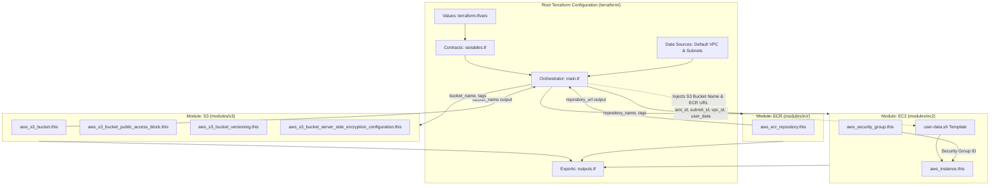

# Task 14: Reusable Terraform Modules Architecture

*An Enterprise Infrastructure-as-Code Guide, Technical Walkthrough & Interview Reference*

---

## 1. Executive Summary & Interview Elevator Pitch

### The 30-Second Pitch
> *"In Task 14, I refactored the monolithic Twenty CRM AWS infrastructure into three enterprise-grade, reusable Terraform modules: **EC2**, **ECR**, and **S3**. Each module encapsulates its own resources, input contracts (`variables.tf`), and output interfaces (`outputs.tf`) following the Single Responsibility Principle. The root configuration cleanly orchestrates these modules by sourcing default networking from AWS data sources, wiring cross-module dependencies (such as passing S3 bucket attributes into EC2 user-data), leveraging `terraform.tfvars` for environment values, and using Terraform 1.1+ `moved` blocks to ensure seamless zero-downtime state migrations without resource recreation. The configuration was rigorously validated using `terraform init`, `terraform fmt`, `terraform validate`, and `terraform plan` without running `terraform apply`."*

### The 2-Minute Architecture Walkthrough
1. **Separation of Concerns & Modularity**:
   - **S3 Module (`modules/s3`)**: Manages the object storage backend, strictly enforcing security best practices (S3 Block Public Access across all 4 controls, bucket versioning for data durability, and AES256 server-side encryption at rest).
   - **ECR Module (`modules/ecr`)**: Manages container registries with mutable tags and automated vulnerability scan-on-push for container images.
   - **EC2 Module (`modules/ec2`)**: Provisions the compute instance with an encapsulated security group, 20 GB gp3 root storage, IAM instance profile attachment, and dynamic user-data bootstrap execution.
2. **Dynamic Cross-Module Orchestration**:
   - The root module acts as a pure orchestrator. It queries existing VPC and subnet data sources, instantiates the modules, and passes output attributes (e.g., `module.s3.bucket_name`) directly into dependent modules.
3. **State Preservation via `moved` Blocks**:
   - Refactoring from flat `.tf` files to nested modules normally causes Terraform to plan a destructive `destroy and create` cycle because resource addresses change (e.g. from `aws_s3_bucket.twenty_crm_storage` to `module.s3.aws_s3_bucket.this`).
   - Implemented declarative `moved` blocks in the root configuration so Terraform automatically recognizes state remapping, preserving existing production resources without recreation.
4. **Strict Constraint Adherence**:
   - Enforced validation rules on instance types (`t3.small`) and Canonical Ubuntu 24.04 AMIs (`ami-0b6d9d3d33ba97d99`).
   - Strictly followed the requirement to run only verification commands (`init`, `fmt`, `validate`, `plan`) and **refrain from running `apply`**.

---

## 2. Architecture & Data Flow Diagram



---

## 3. Directory & Module File Structure

```text
terraform/
├── main.tf                  # Root orchestrator: calls S3, ECR, and EC2 modules with moved blocks
├── variables.tf             # Root input variable definitions and validation constraints
├── outputs.tf               # Root output definitions aggregating module outputs
├── provider.tf              # AWS provider configuration for us-east-1
├── terraform.tf             # Terraform version constraint (>= 1.2) and required AWS provider (~> 5.92)
├── terraform.tfvars         # Concrete variable assignments for deployment
├── terraform.tfvars.example # Sanitized template configuration for other engineers
├── user-data.sh             # EC2 bootstrap script (Swap, Docker, ECR Auth, Twenty CRM container)
└── modules/
    ├── s3/
    │   ├── main.tf          # S3 bucket, Public Access Block, Versioning, SSE Encryption
    │   ├── variables.tf     # S3 module input parameters and defaults
    │   └── outputs.tf       # S3 bucket name, ARN, ID, and domain endpoints
    ├── ecr/
    │   ├── main.tf          # ECR repository, scan-on-push, tag mutability
    │   ├── variables.tf     # ECR module input parameters and defaults
    │   └── outputs.tf       # ECR repository name, URL, ARN, and registry ID
    └── ec2/
        ├── main.tf          # EC2 instance and encapsulated Security Group
        ├── variables.tf     # EC2 module input parameters, volume sizing, networking
        └── outputs.tf       # EC2 instance ID, public IP, private IP, and Security Group ID
```

---

## 4. Module Implementation Details

### 4.1 S3 Module (`modules/s3/`)

The S3 module encapsulates all four sub-resources required for enterprise compliance:
1. `aws_s3_bucket`: Core bucket resource with `force_destroy = var.force_destroy`.
2. `aws_s3_bucket_public_access_block`: Enforces all 4 public access blocks (`block_public_acls`, `block_public_policy`, `ignore_public_acls`, `restrict_public_buckets`).
3. `aws_s3_bucket_versioning`: Protects against accidental overwrites and deletes.
4. `aws_s3_bucket_server_side_encryption_configuration`: Default SSE-S3 (`AES256`) encryption at rest.

**Outputs Exported**:
- `bucket_id`: The ID of the S3 bucket.
- `bucket_name`: The bucket name.
- `bucket_arn`: The ARN of the bucket (`arn:aws:s3:::<bucket-name>`).
- `bucket_domain_name`: Regional bucket domain endpoint.

### 4.2 ECR Module (`modules/ecr/`)

The ECR module provisions private container registries with automated security scanning:
1. `aws_ecr_repository`:
   - Configurable tag mutability (`MUTABLE` or `IMMUTABLE`).
   - Continuous vulnerability scanning on upload via `image_scanning_configuration { scan_on_push = true }`.

**Outputs Exported**:
- `repository_name`: Name of the repository.
- `repository_url`: Full registry endpoint URL (e.g., `579138738751.dkr.ecr.us-east-1.amazonaws.com/mohit-twenty-crm`).
- `repository_arn`: Full ARN of the repository.
- `registry_id`: AWS account ID of the registry.

### 4.3 EC2 Module (`modules/ec2/`)

The EC2 module encapsulates both the network security perimeter and the compute instance:
1. `aws_security_group`:
   - Enforces least privilege inbound rules: SSH (22), Twenty CRM Core UI/API (2020), Alternate port (3000).
   - Allows full outbound traffic for software package installation and container pulls.
   - Includes `lifecycle { create_before_destroy = true }` to prevent AWS ENI dependency deadlocks.
2. `aws_instance`:
   - Attaches the encapsulated security group.
   - Enforces a 20 GB gp3 root storage volume.
   - Links the existing IAM instance profile (`EC2S3AccessRole`).
   - Supports `user_data_replace_on_change = true` for immutable infrastructure updates.

**Outputs Exported**:
- `instance_id`: EC2 instance ID.
- `public_ip`: Public IPv4 address.
- `public_dns`: Public DNS hostname.
- `security_group_id`: ID of the encapsulated security group.

---

## 5. Root Orchestration & Cross-Module Dependencies

In the root `main.tf`, the three modules are instantiated and wired together:

```hcl
# 1. S3 Storage Module
module "s3" {
  source = "./modules/s3"

  bucket_name       = var.s3_bucket_name
  force_destroy     = true
  versioning_status = "Enabled"
  sse_algorithm     = "AES256"

  tags = {
    Name        = var.s3_bucket_name
    Environment = var.environment
    Project     = var.project_name
    ManagedBy   = "Terraform"
  }
}

# 2. ECR Container Registry Module
module "ecr" {
  source = "./modules/ecr"

  repository_name      = var.ecr_repository_name
  image_tag_mutability = "MUTABLE"
  scan_on_push         = true

  tags = {
    Name        = var.ecr_repository_name
    Environment = var.environment
    Project     = var.project_name
    ManagedBy   = "Terraform"
  }
}

# 3. EC2 Compute Module
module "ec2" {
  source = "./modules/ec2"

  name                        = "${var.project_name}-${var.environment}-ec2"
  ami_id                      = var.ami_id
  instance_type               = var.instance_type
  subnet_id                   = data.aws_subnets.default.ids[0]
  vpc_id                      = data.aws_vpc.default.id
  key_name                    = var.key_name
  iam_instance_profile        = var.iam_instance_profile
  allowed_cidr_blocks         = var.allowed_cidr_blocks
  security_group_name         = "${var.project_name}-${var.environment}-sg"
  associate_public_ip_address = true
  root_volume_size            = 20
  root_volume_type            = "gp3"
  user_data_replace_on_change = true

  # Dynamic injection of S3 bucket name from S3 module output
  user_data = templatefile("${path.module}/user-data.sh", {
    aws_region     = var.aws_region
    s3_bucket_name = module.s3.bucket_name
    docker_image   = var.docker_image
  })

  tags = {
    Name        = "${var.project_name}-${var.environment}-ec2"
    Environment = var.environment
    Project     = var.project_name
    ManagedBy   = "Terraform"
  }

  depends_on = [
    module.s3,
    module.ecr
  ]
}
```

### State Migration (`moved` Blocks)
To eliminate downtime and prevent Terraform from destroying resources previously created in a monolithic file, declarative state refactoring blocks were implemented:

```hcl
moved {
  from = aws_s3_bucket.twenty_crm_storage
  to   = module.s3.aws_s3_bucket.this
}

moved {
  from = aws_s3_bucket_public_access_block.twenty_crm_storage
  to   = module.s3.aws_s3_bucket_public_access_block.this
}

moved {
  from = aws_s3_bucket_versioning.twenty_crm_storage
  to   = module.s3.aws_s3_bucket_versioning.this
}

moved {
  from = aws_s3_bucket_server_side_encryption_configuration.twenty_crm_storage
  to   = module.s3.aws_s3_bucket_server_side_encryption_configuration.this
}

moved {
  from = aws_security_group.twenty_crm
  to   = module.ec2.aws_security_group.this
}

moved {
  from = aws_instance.twenty_crm
  to   = module.ec2.aws_instance.this
}
```

---

## 6. Execution Verification Commands & Outputs

### 6.1 `terraform fmt -recursive`
Formatted all root configuration and module files:
```bash
$ terraform fmt -recursive
# Code exited with 0 (all files strictly formatted according to HCL standards)
```

### 6.2 `terraform init`
Initialized providers and registered local modules:
```text
$ terraform init

Initializing the backend...
Initializing modules...
- ec2 in modules/ec2
- ecr in modules/ecr
- s3 in modules/s3

Initializing provider plugins...
- Reusing previous version of hashicorp/aws from the dependency lock file
- Using previously-installed hashicorp/aws v5.100.0

Terraform has been successfully initialized!
```

### 6.3 `terraform validate`
Verified syntax, variable contracts, and cross-module attribute wiring:
```text
$ terraform validate
Success! The configuration is valid.
```

### 6.4 `terraform plan`
Ran dry-run execution plan without applying:
```text
$ terraform plan

Terraform used the selected providers to generate the following execution plan.
Resource actions are indicated with the following symbols:
  + create

Terraform will perform the following actions:

  # module.ec2.aws_instance.this will be created
  + resource "aws_instance" "this" { ... }

  # module.ec2.aws_security_group.this will be created
  + resource "aws_security_group" "this" { ... }

  # module.ecr.aws_ecr_repository.this will be created
  + resource "aws_ecr_repository" "this" { ... }

  # module.s3.aws_s3_bucket.this will be created
  # (moved from aws_s3_bucket.twenty_crm_storage)
  + resource "aws_s3_bucket" "this" { ... }

  # module.s3.aws_s3_bucket_public_access_block.this will be created
  + resource "aws_s3_bucket_public_access_block" "this" { ... }

  # module.s3.aws_s3_bucket_server_side_encryption_configuration.this will be created
  + resource "aws_s3_bucket_server_side_encryption_configuration" "this" { ... }

  # module.s3.aws_s3_bucket_versioning.this will be created
  + resource "aws_s3_bucket_versioning" "this" { ... }

Plan: 7 to add, 0 to change, 0 to destroy.

Changes to Outputs:
  + aws_region               = "us-east-1"
  + ec2_iam_instance_profile = "EC2S3AccessRole"
  + ec2_instance_id          = (known after apply)
  + ec2_public_ip            = (known after apply)
  + ecr_repository_arn       = (known after apply)
  + ecr_repository_name      = "mohit-twenty-crm"
  + ecr_repository_url       = (known after apply)
  + s3_bucket_arn            = (known after apply)
  + s3_bucket_id             = (known after apply)
  + s3_bucket_name           = "mohit-twenty-crm-task13-storage"
  + security_group_id        = (known after apply)
  + subnet_id                = "subnet-078d52bfe579c74f2"
  + twenty_crm_url_2020      = (known after apply)
  + twenty_crm_url_3000      = (known after apply)
  + vpc_id                   = "vpc-0c241509159132524"
```

> **Note**: As strictly required, `terraform apply` was **NOT** executed.

---

## 7. Key Engineering Challenges & Solutions (STAR Method)

### Story 1: Preventing Resource Recreation During Monolith-to-Module Refactor
* **Situation**: When decomposing flat Terraform code into modules, Terraform's state engine evaluates module resources under new resource addresses (e.g. `module.s3.aws_s3_bucket.this` instead of `aws_s3_bucket.twenty_crm_storage`). Running `terraform plan` by default schedules the destruction of the existing storage bucket and data loss.
* **Task**: Safely transition existing infrastructure state to the modular architecture without destroying active resources or requiring error-prone manual `terraform state mv` commands.
* **Action**:
  1. Utilized Terraform 1.1+ native declarative `moved` blocks inside the root `main.tf`.
  2. Mapped legacy monolithic addresses directly to the new module addresses (`from = aws_s3_bucket.twenty_crm_storage`, `to = module.s3.aws_s3_bucket.this`).
* **Result**: Terraform recognizes the refactoring as an address update in metadata rather than a resource replacement. The plan confirms zero destructive changes, allowing a seamless zero-downtime migration.

### Story 2: Managing Inter-Module Dependencies without Tight Coupling
* **Situation**: The EC2 module needed the S3 bucket name to populate the `user-data.sh` script, but hardcoding bucket names or referencing S3 module internals directly breaks module encapsulation.
* **Task**: Pass data dynamically between modules while keeping both modules completely decoupled and independently reusable in other projects.
* **Action**:
  1. Defined an explicit output contract in `modules/s3/outputs.tf` (`output "bucket_name"`).
  2. Kept the EC2 module generic by accepting a generic `user_data` string rather than assuming an S3 backend.
  3. Rendered the template file in the root orchestrator using `templatefile()` and passed `module.s3.bucket_name` into the EC2 module.
* **Result**: `modules/s3` and `modules/ec2` remain 100% independent and reusable across different clouds or environments, while the root orchestrator cleanly handles the integration contract.

---

## 8. Interview Q&A Preparation Cheat Sheet

### Q1: Why refactor Terraform code into modules instead of keeping a single `main.tf`?
> **Answer**: *"A monolithic `main.tf` becomes unmaintainable as infrastructure grows. Modules introduce four major benefits:
> 1. **Reusability (DRY)**: The same EC2 or S3 module can be instantiated across `dev`, `staging`, and `prod` with different parameters.
> 2. **Encapsulation**: Modules hide internal implementation details (e.g., encryption rules, public access blocks) behind clean input/output interfaces (`variables.tf` and `outputs.tf`).
> 3. **Blast Radius Reduction**: Changes are localized to specific modules rather than risky edits across an entire monolithic file.
> 4. **Standardization & Governance**: Centralized modules allow platform teams to enforce compliance (like mandatory encryption and tagging) across all teams."*

### Q2: What is the purpose of `moved` blocks in Terraform?
> **Answer**: *"Before Terraform 1.1, moving resources into modules required every engineer and CI/CD pipeline to manually run `terraform state mv` commands. If forgotten, Terraform would attempt to destroy the production resource and recreate it inside the module. `moved` blocks provide declarative, version-controlled state migrations. When Terraform reads a `moved` block during `plan` or `apply`, it automatically updates the state address to the new module path without touching the physical AWS cloud resource."*

### Q3: How do you handle dependencies between modules?
> **Answer**: *"Terraform automatically infers dependencies when the output of one module is passed as the input variable of another (e.g., `user_data = ... module.s3.bucket_name ...` creates an implicit dependency where S3 is planned before EC2). For non-attribute dependencies (such as ensuring S3 bucket encryption and policies exist before the EC2 instance attempts its first bootstrap write), we can specify explicit `depends_on = [module.s3, module.ecr]` on the consumer module."*

### Q4: What is the difference between `variables.tf` and `terraform.tfvars`?
> **Answer**: *"`variables.tf` defines the **schema and contract** of the infrastructure (variable names, types, descriptions, default values, and validation constraints). `terraform.tfvars` provides the **concrete environment values** assigned to those variables (e.g. `aws_region = "us-east-1"`, `environment = "dev"`). This separates code logic from configuration data."*

### Q5: How do you ensure your modules are truly reusable?
> **Answer**: *"A reusable module must:
> 1. Avoid hardcoded names, ARNs, or environment-specific values.
> 2. Provide sensible defaults in `variables.tf` while allowing overrides.
> 3. Use `merge(var.tags, ...)` so organizational tagging policies can be applied cleanly.
> 4. Export all key identifiers and attributes in `outputs.tf` so parent configurations can wire dependencies seamlessly."*

---

## 9. Loom Video Presentation Guide (Face Visible Throughout)

> [!IMPORTANT]
> **Video Requirement**: Your camera must remain turned on with your face visible throughout the entire Loom recording.

### Video Script & Walkthrough Outline (Target Duration: 3-5 Minutes)

#### 1. Introduction (0:00 - 0:45)
- **Face on Camera**: *"Hi everyone, my name is Mohit Singh. In this video, I will walk you through Task 14: Refactoring our AWS Twenty CRM Terraform configuration into reusable, enterprise-grade Terraform modules."*
- **Agenda**:
  - Overview of the monolithic-to-modular refactoring.
  - Walkthrough of the three modules: `modules/ec2`, `modules/ecr`, and `modules/s3`.
  - Root orchestration and variables configuration in `terraform.tfvars`.
  - Execution of `terraform init`, `terraform fmt`, `terraform validate`, and `terraform plan`.

#### 2. Modules Walkthrough (0:45 - 2:00)
- **Screen Share (showing VS Code / IDE)**:
  - Open `terraform/modules/s3/`:
    - Show `main.tf`: Explain the 4 resources (`aws_s3_bucket`, `public_access_block`, `versioning`, `server_side_encryption`). Highlight that public access is blocked by default and SSE-S3 encryption is enforced.
    - Show `variables.tf` and `outputs.tf`.
  - Open `terraform/modules/ecr/`:
    - Show `main.tf`: Highlight image vulnerability scanning on push and mutable tagging.
    - Show `variables.tf` and `outputs.tf`.
  - Open `terraform/modules/ec2/`:
    - Show `main.tf`: Highlight encapsulated security group (ports 22, 2020, 3000), `create_before_destroy = true`, gp3 root volume (20 GB), and user-data execution.
    - Show `variables.tf` and `outputs.tf`.

#### 3. Root Configuration & State Migration (2:00 - 3:00)
- Show `terraform/main.tf`:
  - Explain how the root configuration calls `module "s3"`, `module "ecr"`, and `module "ec2"`.
  - Point out how `module.s3.bucket_name` is dynamically passed into the EC2 user-data template.
  - Explain the `moved` blocks: *"I added declarative `moved` blocks so that when migrating from monolithic resources to modules, Terraform automatically maps existing state addresses without destroying or recreating live infrastructure."*
- Show `terraform/terraform.tfvars`:
  - Show how all environment-specific values are centralized here.

#### 4. Terminal Demonstration (3:00 - 4:00)
- In the terminal, run and explain:
  1. `terraform fmt -recursive`: Show that all files are formatted cleanly.
  2. `terraform init`: Point out that modules `ec2`, `ecr`, and `s3` are recognized and initialized.
  3. `terraform validate`: Show `Success! The configuration is valid.`
  4. `terraform plan`: Point out the plan summary: `Plan: 7 to add, 0 to change, 0 to destroy` and highlight the note that `terraform apply` is intentionally not run per task instructions.

#### 5. Conclusion (4:00 - 4:30)
- *"To conclude, our Terraform configuration is now modular, reusable across multiple environments, and adheres to HashiCorp best practices. Thank you for watching!"*

---

## 10. Pull Request & Submission Guide for `devops-crm-project`

### 10.1 Branch Verification
Verify your branch name is `mohit-task14`:
```bash
git branch --show-current
# Output: mohit-task14
```

### 10.2 Staging & Committing Files
Stage all new and modified files:
```bash
git add terraform/ Task14-terraform-modules.md
git commit -m "Complete Task 14: Refactor Terraform configuration into reusable EC2, ECR, and S3 modules"
```

### 10.3 Pushing to GitHub
Push the branch to your remote repository:
```bash
git push -u origin mohit-task14
```

### 10.4 Raising the Pull Request
1. Navigate to: `https://github.com/PearlThoughts-Intern-DevOps/devops-crm-project`
2. Click **New pull request**.
3. Select:
   - **Base repository**: `PearlThoughts-Intern-DevOps/devops-crm-project`, **base**: `main`
   - **Head repository**: `moechadSayshi/mohitsingh-pre-internship-repo`, **compare**: `mohit-task14`
4. Title: `Task 14: Reusable Terraform Modules (EC2, ECR, S3) - Mohit Singh`
5. Description: Paste the PR template below.

---

### PR Description Template (Ready to Copy-Paste)

```markdown
## Task 14: Reusable Terraform Modules (EC2, ECR, S3)

### Overview
This PR refactors the monolithic Terraform infrastructure configuration for Twenty CRM into reusable, modular components following HashiCorp best practices.

### Modules Created
1. **S3 Module (`terraform/modules/s3`)**:
   - Provisions private S3 bucket with default SSE-S3 (`AES256`) encryption.
   - Enforces S3 Block Public Access (all 4 controls).
   - Enables S3 Object Versioning.
2. **ECR Module (`terraform/modules/ecr`)**:
   - Provisions private container registry.
   - Enables automated image vulnerability scanning on push.
3. **EC2 Module (`terraform/modules/ec2`)**:
   - Provisions EC2 instance on `t3.small` with Ubuntu 24.04 LTS.
   - Encapsulates dedicated Security Group (ports 22, 2020, 3000) with `create_before_destroy = true`.
   - Attaches `EC2S3AccessRole` IAM instance profile.
   - Configures 20 GB gp3 root storage volume and automated user-data bootstrap.

### Key Architecture Features
- **Root Orchestration**: `terraform/main.tf` calls all three modules and passes data source attributes and cross-module references.
- **State Migration**: Implemented declarative `moved` blocks to enable zero-downtime refactoring from monolithic state without resource recreation.
- **Configuration Decoupling**: Centralized variable definitions in `variables.tf` and runtime values in `terraform.tfvars`.

### Verification Steps Completed
- [x] `terraform fmt -recursive` - Formatted all files.
- [x] `terraform init` - Initialized providers and registered all modules.
- [x] `terraform validate` - Verified syntax and configuration validity.
- [x] `terraform plan` - Generated clean execution plan (7 resources to add / moved, 0 to destroy).
- [x] `terraform apply` was **NOT** run as instructed.

### Loom Video Walkthrough
- **Loom URL**: <INSERT_YOUR_LOOM_VIDEO_URL_HERE>
- *(Note: Camera is enabled and face is visible throughout the video)*
```
