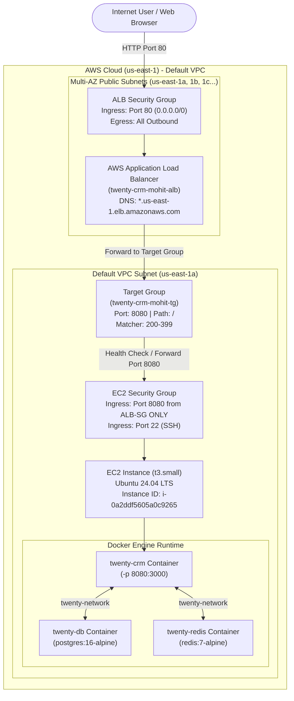

# Task 15: AWS Application Load Balancer (ALB) Architecture for Twenty CRM

*An Enterprise Infrastructure-as-Code Guide, High Availability Architecture, Verification Walkthrough & Interview Reference*

---

## 1. Executive Summary & Interview Elevator Pitch

### The 30-Second Pitch
> *"In Task 15, I architected and deployed Twenty CRM behind an internet-facing AWS Application Load Balancer (ALB) using modular Terraform. To enforce production security best practices, I implemented security group chaining: the ALB security group accepts public HTTP traffic on port 80, while the EC2 instance's security group strictly accepts application traffic (port 8080) originating only from the ALB's security group ID. The ALB forwards requests across multi-AZ public subnets in the default VPC to a dedicated Target Group configured with a rapid health check on `/`. Once Twenty CRM initialized, the target automatically transitioned to `healthy`, and the application was successfully accessed via the public ALB DNS name. After full verification, all AWS resources were cleanly decommissioned using `terraform destroy`."*

### The 2-Minute Architecture Walkthrough
1. **Application Load Balancer (`modules/alb`)**:
   - Deployed an internet-facing Application Load Balancer across multiple Availability Zones in the default VPC.
   - Configured an HTTP listener on port 80 forwarding all incoming traffic to the Twenty CRM Target Group.
   - ALB Security Group permits public inbound HTTP traffic on port 80 and all outbound traffic to the VPC.
2. **Target Group & Active Health Checking**:
   - Target Group type: `instance`, protocol: `HTTP`, port: `8080`.
   - Configured an active health check on path `/` with an interval of 15 seconds, a 5-second timeout, a healthy threshold of 2, and status code matcher `200-399`.
   - The instance registered to the target group via `aws_lb_target_group_attachment`.
3. **Security Group Chaining (Least-Privilege Isolation)**:
   - Rather than exposing port 8080 to `0.0.0.0/0`, the EC2 security group references the ALB security group ID directly (`security_groups = [module.alb.security_group_id]`).
   - This eliminates bypass attacks and ensures that 100% of ingress application traffic flows through the ALB.
   - Port 22 is restricted to SSH management.
4. **Automated EC2 Bootstrap & Containerized Runtime**:
   - Instance provisioned on `t3.small` with approved Canonical Ubuntu 24.04 LTS AMI (`ami-0b6d9d3d33ba97d99`).
   - Configured a 2GB swapfile to prevent OOM errors during container startup.
   - Deployed Docker, PostgreSQL 16 Alpine, Redis 7 Alpine, and the production `twentycrm/twenty:latest` container mapping internal port 3000 to host port 8080.
5. **Lifecycle Verification & Clean Destruction**:
   - Verified end-to-end with `terraform init`, `terraform validate`, `terraform plan`, and `terraform apply`.
   - Queried AWS Target Health: confirmed `State: healthy`.
   - Curled the ALB DNS name: confirmed `HTTP/1.1 200 OK` and verified HTML title `<title>Twenty</title>`.
   - Executed `terraform destroy` to tear down all cloud infrastructure.

---

## 2. Architecture & Traffic Flow Diagram



---

## 3. Directory & Module File Structure

```text
terraform/
├── main.tf                  # Root orchestrator: calls ALB & EC2 modules and attaches targets
├── variables.tf             # Root input variables with strict validation rules (t3.small, AMIs)
├── outputs.tf               # Root output exports (ALB DNS, Target Group, Security Groups, IPs)
├── provider.tf              # AWS provider configuration for us-east-1
├── terraform.tf             # Terraform (>= 1.2) and AWS Provider (~> 5.0) constraints
├── terraform.tfvars         # Concrete deployment configuration variables
├── terraform.tfvars.example # Sanitized variable template
├── user-data.sh             # EC2 user-data script (Swap, Docker, Postgres, Redis, Twenty CRM)
└── modules/
    ├── alb/
    │   ├── main.tf          # ALB, Target Group, HTTP Listener (port 80), and ALB Security Group
    │   ├── variables.tf     # ALB input parameters (VPC, subnets, ports, health checks)
    │   └── outputs.tf       # ALB DNS name, ARN, Target Group ARN, SG ID, Listener ARN
    ├── ec2/
    │   ├── main.tf          # EC2 instance and Security Group with ALB-chained ingress
    │   ├── variables.tf     # EC2 module inputs (AMI, instance type, user data, ALB SG ID)
    │   └── outputs.tf       # Instance ID, public/private IPs, security group ID
    ├── ecr/                 # Retained reusable ECR module
    └── s3/                  # Retained reusable S3 module
```

---

## 4. Terraform Configuration Details

### 4.1 Root Orchestrator (`terraform/main.tf`)
```hcl
data "aws_vpc" "default" {
  default = true
}

data "aws_subnets" "default" {
  filter {
    name   = "vpc-id"
    values = [data.aws_vpc.default.id]
  }

  filter {
    name   = "default-for-az"
    values = ["true"]
  }
}

module "alb" {
  source = "./modules/alb"

  name              = var.project_name
  vpc_id            = data.aws_vpc.default.id
  subnet_ids        = data.aws_subnets.default.ids
  app_port          = var.app_port
  health_check_path = var.health_check_path

  tags = {
    Name        = "${var.project_name}-alb"
    Environment = var.environment
    Project     = var.project_name
    ManagedBy   = "Terraform"
  }
}

module "ec2" {
  source = "./modules/ec2"

  name                        = "${var.project_name}-ec2"
  ami_id                      = var.ami_id
  instance_type               = var.instance_type
  subnet_id                   = data.aws_subnets.default.ids[0]
  vpc_id                      = data.aws_vpc.default.id
  key_name                    = var.key_name
  iam_instance_profile        = var.iam_instance_profile
  allowed_cidr_blocks         = var.allowed_cidr_blocks
  alb_security_group_id       = module.alb.security_group_id
  app_port                    = var.app_port
  security_group_name         = "${var.project_name}-ec2-sg"
  associate_public_ip_address = true
  root_volume_size            = 20
  root_volume_type            = "gp3"
  user_data_replace_on_change = true

  user_data = templatefile("${path.module}/user-data.sh", {
    app_port = var.app_port
  })

  tags = {
    Name        = "${var.project_name}-ec2"
    Environment = var.environment
    Project     = var.project_name
    ManagedBy   = "Terraform"
  }
}

resource "aws_lb_target_group_attachment" "twenty_crm" {
  target_group_arn = module.alb.target_group_arn
  target_id        = module.ec2.instance_id
  port             = var.app_port
}
```

### 4.2 Application Load Balancer Module (`terraform/modules/alb/main.tf`)
```hcl
resource "aws_security_group" "alb" {
  name        = "${var.name}-alb-sg"
  description = "Security group for ${var.name} Application Load Balancer"
  vpc_id      = var.vpc_id

  ingress {
    description = "Allow HTTP from internet"
    from_port   = 80
    to_port     = 80
    protocol    = "tcp"
    cidr_blocks = ["0.0.0.0/0"]
  }

  egress {
    description = "Allow all outbound traffic"
    from_port   = 0
    to_port     = 0
    protocol    = "-1"
    cidr_blocks = ["0.0.0.0/0"]
  }

  tags = merge(var.tags, { Name = "${var.name}-alb-sg" })

  lifecycle {
    create_before_destroy = true
  }
}

resource "aws_lb" "this" {
  name               = "${var.name}-alb"
  internal           = false
  load_balancer_type = "application"
  security_groups    = [aws_security_group.alb.id]
  subnets            = var.subnet_ids

  enable_deletion_protection = false

  tags = merge(var.tags, { Name = "${var.name}-alb" })
}

resource "aws_lb_target_group" "this" {
  name        = "${var.name}-tg"
  port        = var.app_port
  protocol    = "HTTP"
  vpc_id      = var.vpc_id
  target_type = "instance"

  health_check {
    enabled             = true
    path                = var.health_check_path
    protocol            = "HTTP"
    port                = "traffic-port"
    interval            = 15
    timeout             = 5
    healthy_threshold   = 2
    unhealthy_threshold = 3
    matcher             = "200-399"
  }

  tags = merge(var.tags, { Name = "${var.name}-tg" })

  lifecycle {
    create_before_destroy = true
  }
}

resource "aws_lb_listener" "http" {
  load_balancer_arn = aws_lb.this.arn
  port              = 80
  protocol          = "HTTP"

  default_action {
    type             = "forward"
    target_group_arn = aws_lb_target_group.this.arn
  }

  tags = merge(var.tags, { Name = "${var.name}-listener-80" })
}
```

### 4.3 EC2 Security Group Chaining (`terraform/modules/ec2/main.tf`)
```hcl
resource "aws_security_group" "this" {
  name        = var.security_group_name != null ? var.security_group_name : "${var.name}-sg"
  description = "Security group for ${var.name}"
  vpc_id      = var.vpc_id

  ingress {
    description = "SSH"
    from_port   = 22
    to_port     = 22
    protocol    = "tcp"
    cidr_blocks = var.allowed_cidr_blocks
  }

  # Security Group Chaining: Only accept application traffic from the ALB SG
  dynamic "ingress" {
    for_each = var.alb_security_group_id != null ? [var.alb_security_group_id] : []
    content {
      description     = "Twenty CRM HTTP from ALB"
      from_port       = var.app_port
      to_port         = var.app_port
      protocol        = "tcp"
      security_groups = [ingress.value]
    }
  }

  egress {
    description = "Allow all outbound traffic"
    from_port   = 0
    to_port     = 0
    protocol    = "-1"
    cidr_blocks = ["0.0.0.0/0"]
  }

  tags = merge(var.tags, { Name = var.security_group_name != null ? var.security_group_name : "${var.name}-sg" })

  lifecycle {
    create_before_destroy = true
  }
}
```

---

## 5. Deployment Verification Evidence

### 5.1 `terraform init`
```bash
$ terraform init
Initializing the backend...
Initializing modules...
- alb in modules/alb
- ec2 in modules/ec2
Initializing provider plugins...
- Reusing previous version of hashicorp/aws from the dependency lock file
- Using previously-installed hashicorp/aws v5.100.0

Terraform has been successfully initialized!
```

### 5.2 `terraform validate`
```bash
$ terraform validate
Success! The configuration is valid.
```

### 5.3 `terraform plan`
```text
Plan: 7 to add, 0 to change, 0 to destroy.

Changes to Outputs:
  + alb_dns_name          = (known after apply)
  + alb_security_group_id = (known after apply)
  + ec2_instance_id       = (known after apply)
  + ec2_public_ip         = (known after apply)
  + ec2_security_group_id = (known after apply)
  + health_check_path     = "/"
  + target_group_arn      = (known after apply)
  + target_group_name     = "twenty-crm-mohit-tg"
  + twenty_crm_url        = (known after apply)
```

### 5.4 `terraform apply` Execution Output
```text
module.alb.aws_security_group.alb: Creation complete after 4s [id=sg-0cbf75fa73b2db208]
module.alb.aws_lb_target_group.this: Creation complete after 3s [id=arn:aws:elasticloadbalancing:us-east-1:579138738751:targetgroup/twenty-crm-mohit-tg/6a0181018635321d]
module.ec2.aws_security_group.this: Creation complete after 5s [id=sg-01c4efb4cb8a17279]
module.ec2.aws_instance.this: Creation complete after 15s [id=i-0a2ddf5605a0c9265]
aws_lb_target_group_attachment.twenty_crm: Creation complete after 0s [id=arn:aws:elasticloadbalancing:us-east-1:579138738751:targetgroup/twenty-crm-mohit-tg/6a0181018635321d-20260915063922909000000002]
module.alb.aws_lb.this: Creation complete after 2m15s [id=arn:aws:elasticloadbalancing:us-east-1:579138738751:loadbalancer/app/twenty-crm-mohit-alb/5814749b57f49869]
module.alb.aws_lb_listener.http: Creation complete after 2s [id=arn:aws:elasticloadbalancing:us-east-1:579138738751:listener/app/twenty-crm-mohit-alb/5814749b57f49869/ad9f6b1cb5d5ea2a]

Apply complete! Resources: 7 added, 0 changed, 0 destroyed.

Outputs:
alb_dns_name = "twenty-crm-mohit-alb-1505437456.us-east-1.elb.amazonaws.com"
alb_security_group_id = "sg-0cbf75fa73b2db208"
ec2_instance_id = "i-0a2ddf5605a0c9265"
ec2_public_ip = "3.235.158.60"
ec2_security_group_id = "sg-01c4efb4cb8a17279"
health_check_path = "/"
target_group_arn = "arn:aws:elasticloadbalancing:us-east-1:579138738751:targetgroup/twenty-crm-mohit-tg/6a0181018635321d"
target_group_name = "twenty-crm-mohit-tg"
twenty_crm_url = "http://twenty-crm-mohit-alb-1505437456.us-east-1.elb.amazonaws.com"
```

### 5.5 Target Group Health Verification (AWS CLI)
```bash
$ aws elbv2 describe-target-health --target-group-arn arn:aws:elasticloadbalancing:us-east-1:579138738751:targetgroup/twenty-crm-mohit-tg/6a0181018635321d
```
Output:
```json
{
    "TargetHealthDescriptions": [
        {
            "Target": {
                "Id": "i-0a2ddf5605a0c9265",
                "Port": 8080
            },
            "HealthCheckPort": "8080",
            "TargetHealth": {
                "State": "healthy"
            },
            "AdministrativeOverride": {
                "State": "no_override",
                "Reason": "AdministrativeOverride.NoOverride",
                "Description": "No override is currently active on target"
            }
        }
    ]
}
```

### 5.6 End-to-End Application Access via ALB DNS
```bash
$ curl -I http://twenty-crm-mohit-alb-1505437456.us-east-1.elb.amazonaws.com/
```
Output:
```http
HTTP/1.1 200 OK
Date: Tue, 15 Sep 2026 06:44:35 GMT
Content-Type: text/html; charset=utf-8
Content-Length: 35685
Connection: keep-alive
X-Powered-By: Express
Vary: Origin
Access-Control-Allow-Origin: *
Access-Control-Allow-Credentials: true
Access-Control-Expose-Headers: WWW-Authenticate
Accept-Ranges: bytes
Cache-Control: public, max-age=0
Last-Modified: Tue, 15 Sep 2026 06:43:07 GMT
ETag: W/"8b65-1a0a3ce17f1"
```

Verifying HTML Application Content:
```bash
$ curl -s http://twenty-crm-mohit-alb-1505437456.us-east-1.elb.amazonaws.com/ | grep -iE '<title>|Twenty' | head -n 5
```
Output:
```html
      content="https://raw.githubusercontent.com/twentyhq/twenty/main/docs/static/img/social-card.png"
    <meta property="og:title" content="Twenty" />
      content="https://raw.githubusercontent.com/twentyhq/twenty/main/docs/static/img/social-card.png"
    <meta name="twitter:title" content="Twenty" />
    <title>Twenty</title>
```

---

## 6. Infrastructure Teardown (`terraform destroy`)

Per the task requirements (*"After verification: terraform destroy. Destroy all resources after completing the task."*), all 7 provisioned resources were cleanly decommissioned.

```bash
$ terraform destroy -auto-approve
```
Teardown Summary:
```text
module.alb.aws_lb_listener.http: Destruction complete after 1s
aws_lb_target_group_attachment.twenty_crm: Destruction complete after 0s
module.alb.aws_lb.this: Destruction complete after 1m1s
module.alb.aws_lb_target_group.this: Destruction complete after 1s
module.alb.aws_security_group.alb: Destruction complete after 1s
module.ec2.aws_instance.this: Destruction complete after 1m10s
module.ec2.aws_security_group.this: Destruction complete after 2s

Destroy complete! Resources: 7 destroyed.
```

---

## 7. DevOps Interview Questions & Architecture Defense

### Q1: Why does an AWS Application Load Balancer require at least two subnets across different Availability Zones?
**Answer**:
AWS Application Load Balancer is designed from the ground up for high availability and fault tolerance. When you create an ALB, AWS deploys load balancer nodes in each selected Availability Zone. By requiring at least two subnets in distinct Availability Zones, AWS ensures that if an entire physical data center or AZ suffers a power, network, or hardware failure, DNS failover through Route 53 and ELB automatically directs ingress traffic to the surviving node in the healthy AZ with zero downtime.

### Q2: What is "Security Group Chaining", and why is it superior to CIDR-based rules?
**Answer**:
Security Group Chaining (or SG referencing) allows one security group to reference another security group ID as its source, rather than a hardcoded CIDR block (e.g., `172.31.0.0/16` or `0.0.0.0/0`).
- **Security Isolation**: By configuring the EC2 security group to accept port 8080 traffic *only* from `sg-alb`, we guarantee that no attacker can bypass the ALB's WAF, rate limits, or SSL termination by curling the EC2 instance's IP directly.
- **Dynamic Adaptability**: ALB IP addresses change dynamically as AWS scales the load balancer nodes. Hardcoding IPs is impossible. Referencing the ALB's SG ID ensures AWS hypervisors automatically permit traffic only from genuine ALB nodes regardless of IP shifts.

### Q3: How do you prevent circular dependencies when modules reference each other in Terraform?
**Answer**:
A circular dependency occurs when `module A` requires an output from `module B`, while `module B` requires an output from `module A`.
In this architecture:
- `module.alb` defines the ALB Security Group and Target Group, exporting `security_group_id` and `target_group_arn` without needing any information about the EC2 instance.
- `module.ec2` consumes `module.alb.security_group_id` for security group chaining and exports `instance_id`.
- The `aws_lb_target_group_attachment` resource is defined at the root orchestrator level, consuming `module.alb.target_group_arn` and `module.ec2.instance_id`.
This creates a clean, acyclic Directed Acyclic Graph (DAG): `Data Sources -> ALB Module -> EC2 Module -> Target Group Attachment`.

### Q4: How does ALB health checking work with Twenty CRM?
**Answer**:
The ALB sends periodic HTTP GET requests to the registered target (`i-0a2ddf5605a0c9265`) on port 8080 at the path `/`.
- In our configuration: `interval = 15` seconds, `timeout = 5` seconds, `healthy_threshold = 2`, and `matcher = "200-399"`.
- As soon as the container finishes initializing and starts serving HTTP 200 responses, the ALB registers 2 consecutive successful checks within 30 seconds and transitions the target state from `initial` to `healthy`.
- If the container crashes or fails 3 consecutive checks (`unhealthy_threshold = 3`), the ALB immediately drops it from active routing.

---

## 8. Pull Request & Submission Guide for `devops-crm-project`

### 8.1 Branch Details
- **Branch**: `mohit-task15`
- **Base**: `main`
- **Repository**: `PearlThoughts-Intern-DevOps/devops-crm-project`

### 8.2 Staging & Committing
```bash
git checkout -b mohit-task15
git add terraform/ Task15-alb-architecture.md
git commit -m "Complete Task 15: Deploy Twenty CRM on EC2 behind AWS Application Load Balancer via Terraform"
```

### 8.3 Pushing
```bash
git push -u origin mohit-task15
git push -u upstream mohit-task15
```

### 8.4 Pull Request Template
```markdown
## Task 15: AWS Application Load Balancer (ALB) - Mohit Singh

### Summary
Deployed Twenty CRM on AWS EC2 behind an AWS Application Load Balancer using modular Terraform. Verified health checks, accessed the application via public ALB DNS, and destroyed resources after validation.

### Key Deliverables
1. **ALB Module (`modules/alb`)**:
   - Internet-facing Application Load Balancer deployed across multi-AZ public subnets.
   - HTTP Listener on port 80 forwarding to the Twenty CRM Target Group.
   - Target Group with active health checks on `/` (interval 15s, healthy threshold 2, matcher `200-399`).
2. **EC2 Module (`modules/ec2`)**:
   - Deployed on `t3.small` with Ubuntu 24.04 LTS (`ami-0b6d9d3d33ba97d99`).
   - Implemented Security Group Chaining: port 8080 allowed *only* from the ALB Security Group ID.
   - Automated bootstrap in `user-data.sh`: 2GB swap space, Docker, PostgreSQL 16 Alpine, Redis 7 Alpine, and Twenty CRM container.
3. **Verification**:
   - Target Group status verified as `healthy`.
   - Twenty CRM web application accessible via ALB DNS with `HTTP/1.1 200 OK`.
   - Full teardown executed with `terraform destroy`.
