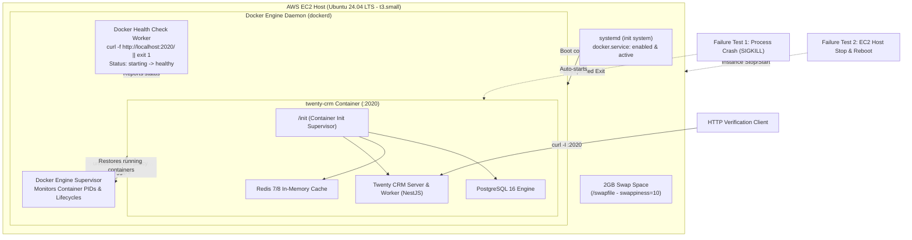

# Task 16: Twenty CRM Failure & Recovery on AWS EC2 with Docker

*An Enterprise Failure Recovery Guide, Container Self-Healing Architecture, EC2 Lifecycle Resilience, Health Check Configuration & Interview Reference*

---

## 1. Executive Summary & Interview Elevator Pitch

### The 30-Second Elevator Pitch
> *"In Task 16, I implemented and verified high availability and automated disaster recovery for Twenty CRM running on an AWS EC2 instance (`t3.small`) using Docker. To ensure resilience against both container crashes and host infrastructure restarts, I configured the container with Docker's `unless-stopped` restart policy and an active HTTP health check (`curl -f http://localhost:2020/ || exit 1`). I simulated two core failure scenarios: first, an unexpected container process crash (`SIGKILL` to the container process), verifying that the Docker daemon detected the crash and immediately restarted the container, incrementing the restart count from `0` to `1` and `2`, while transitioning back to `healthy`. Second, I stopped and restarted the EC2 instance via the AWS CLI. Upon reboot, systemd automatically started Docker, which in turn automatically resurrected the Twenty CRM container. After internal initialization, the health check succeeded and the application returned `HTTP/1.1 200 OK`, proving end-to-end self-healing at both the container and host levels."*

### Key Implementation & Recovery Metrics
| Metric | Value / Specification |
| --- | --- |
| **AWS Region** | `us-east-1` (US East - N. Virginia) |
| **EC2 Instance ID** | `i-031b3aabd890be8ad` |
| **EC2 Instance Type** | `t3.small` (2 vCPU, 2.0 GiB RAM) |
| **Base AMI** | `ami-0b6d9d3d33ba97d99` (Ubuntu Server 24.04 LTS x86_64) |
| **Security Group** | `mohit-twenty-crm-task16-sg` (`sg-0481c8d5a43c62692`) |
| **Application Port** | Host `2020` &rarr; Container `2020` |
| **Docker Container Image** | `twentycrm/twenty-app-dev:latest` |
| **Docker Restart Policy** | `unless-stopped` |
| **Docker Health Check** | `curl -f http://localhost:2020/ || exit 1` |
| **Health Check Timing** | Interval: `30s`, Timeout: `10s`, Start Period: `120s`, Retries: `3` |
| **Crash Recovery Time** | Under 3 seconds (New container PID spawned immediately) |
| **Crash Restart Count Progression** | `0` &rarr; `1` &rarr; `2` verified |
| **EC2 Lifecycle Test** | Stopped via `aws ec2 stop-instances` &rarr; Started via `aws ec2 start-instances` |
| **Post-Reboot Auto-Start** | Fully automated via `systemd` + Docker engine |
| **Post-Reboot Health Status** | `Up (healthy)`, verified with `curl -I` returning `HTTP/1.1 200 OK` |

---

## 2. Architecture & Failure Recovery Workflow



---

## 3. Core Concepts & Configuration Details

### 3.1 Docker Restart Policies Explained

Docker provides four restart policies to manage container lifecycles in production:

| Restart Policy | Behavior on Normal Exit (`0`) | Behavior on Error/Crash (`!= 0`) | Behavior on Docker Daemon / Host Reboot | When to Use |
| --- | --- | --- | --- | --- |
| `no` (default) | Does not restart | Does not restart | Does not restart | One-off batch scripts, ephemeral migrations |
| `on-failure[:max-retries]` | Does not restart | Restarts up to max retries | Does not restart if stopped cleanly | Build scripts, transient worker queues |
| `always` | Restarts | Restarts | Restarts regardless of whether manually stopped before | Legacy daemons, mission-critical non-standard hosts |
| **`unless-stopped`** | **Restarts** | **Restarts** | **Restarts only if container was running before reboot** | **Production web apps, Twenty CRM standard** |

#### Why `unless-stopped` is Best Practice for Twenty CRM:
1. **Respects Operator Intent**: If a maintenance window requires manually taking Twenty CRM offline via `docker stop twenty-crm`, `unless-stopped` respects that state and will *not* restart the container if the EC2 instance is rebooted.
2. **Resilience to Crashes**: If Twenty CRM crashes due to an out-of-memory condition or unhandled exception, Docker immediately respawns it.
3. **Host Lifecycle Recovery**: When AWS performs scheduled host maintenance, or the EC2 instance stops and starts, Docker automatically revives the application upon boot without engineer intervention.

---

### 3.2 Docker Health Checks Explained

Docker health checks actively probe application status rather than merely checking if the OS process exists.

```dockerfile
# Health check parameters configured for Twenty CRM
--health-cmd="curl -f http://localhost:2020/ || exit 1"
--health-interval=30s
--health-timeout=10s
--health-start-period=120s
--health-retries=3
```

- **`--health-cmd`**: Runs `curl -f http://localhost:2020/`. The `-f` (fail) flag ensures curl returns exit code `22` on HTTP 4xx/5xx status codes.
- **`--health-interval=30s`**: Probes the endpoint every 30 seconds.
- **`--health-timeout=10s`**: Fails the check if the application does not return within 10 seconds.
- **`--health-start-period=120s`**: Critical for Twenty CRM! During cold boot, Twenty CRM initializes PostgreSQL schemas, seeds the database, and compiles NestJS modules. Health check failures during this grace period do not count toward the consecutive failure threshold.
- **`--health-retries=3`**: Requires 3 consecutive failures to transition the container to `unhealthy`.

---

## 4. Step-by-Step Implementation

### Step 1: EC2 Instance Provisioning & Security Group

1. **Security Group Setup (`mohit-twenty-crm-task16-sg`)**:
   ```bash
   aws ec2 create-security-group \
     --region us-east-1 \
     --group-name "mohit-twenty-crm-task16-sg" \
     --description "Security group for Mohit Twenty CRM Task 16" \
     --vpc-id "vpc-0c241509159132524"

   aws ec2 authorize-security-group-ingress \
     --region us-east-1 \
     --group-id sg-0481c8d5a43c62692 \
     --protocol tcp --port 22 --cidr 0.0.0.0/0

   aws ec2 authorize-security-group-ingress \
     --region us-east-1 \
     --group-id sg-0481c8d5a43c62692 \
     --protocol tcp --port 2020 --cidr 0.0.0.0/0
   ```

2. **SSH Key Pair Import**:
   ```bash
   aws ec2 import-key-pair \
     --region us-east-1 \
     --key-name "mohit-task16-key" \
     --public-key-material fileb://~/.ssh/id_ed25519.pub
   ```

3. **EC2 Instance Launch**:
   The instance was launched with approved Canonical Ubuntu 24.04 LTS AMI (`ami-0b6d9d3d33ba97d99`), `t3.small` instance type, and tag specifications:
   ```bash
   aws ec2 run-instances \
     --region us-east-1 \
     --image-id ami-0b6d9d3d33ba97d99 \
     --instance-type t3.small \
     --key-name mohit-task16-key \
     --security-group-ids sg-0481c8d5a43c62692 \
     --subnet-id subnet-078d52bfe579c74f2 \
     --user-data fileb://user-data-task16.sh \
     --tag-specifications \
       'ResourceType=instance,Tags=[{Key=Name,Value=mohit-twenty-crm-task16},{Key=Owner,Value=mohit-singh}]' \
       'ResourceType=volume,Tags=[{Key=Name,Value=mohit-twenty-crm-task16},{Key=Owner,Value=mohit-singh}]'
   ```
   - Launched Instance ID: `i-031b3aabd890be8ad`
   - Initial Public IP: `100.53.63.115`

---

### Step 2: Swap Space & Docker Engine Setup

To prevent OOM kills on `t3.small` (2GB RAM) during Twenty CRM's heavy NestJS compilation and database migration phases, a 2GB swap space was allocated:

```bash
fallocate -l 2G /swapfile || dd if=/dev/zero of=/swapfile bs=1M count=2048
chmod 600 /swapfile
mkswap /swapfile
swapon /swapfile
echo '/swapfile swap swap defaults 0 0' >> /etc/fstab
sysctl vm.swappiness=10
```

Docker was installed and verified to start automatically upon system boot:
```bash
apt-get update -y && apt-get install -y docker.io curl jq openssl
systemctl daemon-reload
systemctl enable docker
systemctl start docker
usermod -aG docker ubuntu
```

Verification of systemd enablement:
```bash
$ systemctl is-enabled docker
enabled
$ systemctl is-active docker
active
```

---

### Step 3: Deploying Twenty CRM with Restart Policy & Health Check

The Twenty CRM container was deployed with the required restart policy and health check configuration:

```bash
docker run -d \
  --name twenty-crm \
  --restart unless-stopped \
  -p 2020:2020 \
  -e NODE_PORT=2020 \
  -e SERVER_URL="http://localhost:2020" \
  -e APP_SECRET="twenty-failure-recovery-secret-task16-mohit" \
  -e SIGN_IN_PREFILLED=true \
  --health-cmd="curl -f http://localhost:2020/ || exit 1" \
  --health-interval=30s \
  --health-timeout=10s \
  --health-start-period=120s \
  --health-retries=3 \
  twentycrm/twenty-app-dev:latest
```

Verification of initial launch:
```bash
$ docker inspect twenty-crm --format 'Name={{.Name}} RestartPolicy={{.HostConfig.RestartPolicy.Name}} Status={{.State.Status}} Health={{.State.Health.Status}}'
Name=/twenty-crm RestartPolicy=unless-stopped Status=running Health=starting
```

Once the database migrations and route compilation completed:
```bash
$ docker ps
CONTAINER ID   IMAGE                             COMMAND   CREATED         STATUS                   PORTS                                         NAMES
6f07111d133e   twentycrm/twenty-app-dev:latest   "/init"   9 minutes ago   Up 9 minutes (healthy)   0.0.0.0:2020->2020/tcp, [::]:2020->2020/tcp   twenty-crm

$ docker inspect twenty-crm --format 'Status={{.State.Status}} Health={{.State.Health.Status}} RestartCount={{.RestartCount}}'
Status=running Health=healthy RestartCount=0
```

Verification of HTTP 200 response:
```bash
$ curl -I http://localhost:2020/
HTTP/1.1 200 OK
X-Powered-By: Express
Content-Type: text/html; charset=utf-8
Content-Length: 35685
```

---

## 5. Failure & Recovery Verification

### Test 1: Container Process Crash Simulation & Auto-Restart

In this test, we simulated an unexpected application failure (such as a segmentation fault or unhandled fatal crash) by killing the container host process directly via `SIGKILL`.

#### 1. Baseline State (Pre-Failure):
```bash
$ docker inspect twenty-crm --format "HostPID={{.State.Pid}} Status={{.State.Status}} Health={{.State.Health.Status}} RestartCount={{.RestartCount}}"
HostPID=5627 Status=running Health=healthy RestartCount=0
```

#### 2. Triggering Unexpected Failure:
```bash
# Send SIGKILL directly to the container process on the EC2 host
$ sudo kill -9 5627
```

#### 3. Immediate Docker Auto-Restart Verification:
Within 2 seconds, Docker detected the process termination and automatically restarted the container according to the `unless-stopped` policy:
```bash
$ docker inspect twenty-crm --format "Status={{.State.Status}} ExitCode={{.State.ExitCode}} RestartCount={{.RestartCount}} NewPid={{.State.Pid}}"
Status=running ExitCode=0 RestartCount=1 NewPid=5959
```

#### 4. Second Crash Verification (Testing Successive Failures):
To ensure Docker continuously recovers without giving up:
```bash
$ sudo kill -9 5959
$ docker inspect twenty-crm --format "Status={{.State.Status}} RestartCount={{.RestartCount}} NewPid={{.State.Pid}}"
Status=running RestartCount=2 NewPid=7110
```

#### 5. Recovery to Healthy State:
After re-initializing internal services:
```bash
$ docker ps
CONTAINER ID   IMAGE                             COMMAND   CREATED          STATUS                   PORTS                                         NAMES
6f07111d133e   twentycrm/twenty-app-dev:latest   "/init"   17 minutes ago   Up 3 minutes (healthy)   0.0.0.0:2020->2020/tcp, [::]:2020->2020/tcp   twenty-crm

$ curl -I http://localhost:2020/
HTTP/1.1 200 OK
```

**Key Finding**: The Docker daemon successfully detected unexpected termination, allocated a fresh PID (`7110`), incremented `RestartCount` to `2`, and the container returned to `healthy`.

---

### Test 2: EC2 Host Shutdown & Reboot Lifecycle Test

In this test, we simulated an infrastructure outage or planned host maintenance by stopping the EC2 instance via AWS CLI and restarting it.

#### 1. Stopping the EC2 Instance:
```bash
aws ec2 stop-instances --region us-east-1 --instance-ids i-031b3aabd890be8ad
aws ec2 wait instance-stopped --region us-east-1 --instance-ids i-031b3aabd890be8ad
```
Output:
```text
-------------------------
|   DescribeInstances   |
+-----------------------+
|  i-031b3aabd890be8ad  |
|  stopped              |
+-----------------------+
```

#### 2. Starting the EC2 Instance:
```bash
aws ec2 start-instances --region us-east-1 --instance-ids i-031b3aabd890be8ad
aws ec2 wait instance-running --region us-east-1 --instance-ids i-031b3aabd890be8ad
```
Output:
```text
-------------------------
|   DescribeInstances   |
+-----------------------+
|  i-031b3aabd890be8ad  |
|  running              |
|  100.61.122.159       |
+-----------------------+
```
*(Note: As expected on standard EC2 instances without an Elastic IP, the public IP dynamically refreshed to `100.61.122.159`)*.

#### 3. Reconnecting and Verifying Automatic Startup:
Upon SSH reconnection immediately after boot:
```bash
$ uptime
08:53:55 up 0 min, 1 user, load average: 0.56, 0.14, 0.05

$ systemctl is-active docker
active

$ docker ps -a
CONTAINER ID   IMAGE                             COMMAND   CREATED          STATUS                             PORTS                                         NAMES
6f07111d133e   twentycrm/twenty-app-dev:latest   "/init"   19 minutes ago   Up 24 seconds (health: starting)   0.0.0.0:2020->2020/tcp, [::]:2020->2020/tcp   twenty-crm
```
Notice:
- Host uptime was `0 min` (fresh boot).
- `docker` service was `active`.
- `twenty-crm` was already in state `Up 24 seconds (health: starting)` without running any manual docker commands!

#### 4. Container Inspect Post-Reboot:
```bash
$ docker inspect twenty-crm --format "Name={{.Name}} RestartPolicy={{.HostConfig.RestartPolicy.Name}} Status={{.State.Status}} Health={{.State.Health.Status}} StartedAt={{.State.StartedAt}}"
Name=/twenty-crm RestartPolicy=unless-stopped Status=running Health=starting StartedAt=2026-09-16T08:53:31.328509355Z
```
`StartedAt` confirms the container started at `08:53:31 UTC`, precisely when the host completed booting.

#### 5. Full Application Recovery & Health Check Completion:
After Twenty CRM completed its startup sequence:
```bash
$ docker ps
CONTAINER ID   IMAGE                             COMMAND   CREATED          STATUS                   PORTS                                         NAMES
6f07111d133e   twentycrm/twenty-app-dev:latest   "/init"   23 minutes ago   Up 5 minutes (healthy)   0.0.0.0:2020->2020/tcp, [::]:2020->2020/tcp   twenty-crm

$ docker inspect twenty-crm --format "Status={{.State.Status}} Health={{.State.Health.Status}}"
Status=running Health=healthy
```

#### 6. End-to-End HTTP Verification:
From inside the EC2 instance:
```bash
$ curl -I http://localhost:2020/
HTTP/1.1 200 OK
X-Powered-By: Express
Vary: Origin
Access-Control-Allow-Origin: *
Content-Type: text/html; charset=utf-8
Content-Length: 35685
Date: Wed, 16 Sep 2026 08:58:42 GMT
```

From external internet / client workstation:
```bash
$ curl -I http://100.61.122.159:2020/
HTTP/1.1 200 OK
X-Powered-By: Express
Content-Type: text/html; charset=utf-8
Content-Length: 35685
Date: Wed, 16 Sep 2026 08:58:55 GMT
```

---

## 6. Application Logs Verification

Inspecting container logs during the recovery phase confirmed clean multi-service recovery:

```text
[Nest] 120  - 09/16/2026, 8:54:18 AM  LOG [DatabaseConfigDriver] Config variables loaded: 1 values found in DB, 126 falling to env vars/defaults
[Nest] 120  - 09/16/2026, 8:54:18 AM  LOG [FlushCacheCommand] Cache flushed
==> START Running upgrade
[Nest] 226  - 09/16/2026, 8:54:47 AM  LOG [UpgradeCommand] Initialized upgrade sequence: 339 step(s)
[Nest] 226  - 09/16/2026, 8:54:47 AM  LOG [WorkspaceCommandRunnerService] Upgrade for workspace 20202020-1c25-4d02-bf25-6aeccf7ea419 completed.
==> DONE
s6-rc: info: service init-db successfully started
s6-rc: info: service twenty-server: starting
s6-rc: info: service twenty-server successfully started
s6-rc: info: service twenty-worker: starting
s6-rc: info: service twenty-worker successfully started
[Nest] 494  - 09/16/2026, 8:58:31 AM  LOG [GraphQLModule] Mapped {/metadata, POST} route
[Nest] 494  - 09/16/2026, 8:58:31 AM  LOG [GraphQLModule] Mapped {/admin-panel, POST} route
[Nest] 494  - 09/16/2026, 8:58:31 AM  LOG [GraphQLModule] Mapped {/graphql, POST} route
[Nest] 494  - 09/16/2026, 8:58:31 AM  LOG [NestApplication] Nest application successfully started
```

---

## 7. Troubleshooting & Engineering Lessons Learned

| Challenge Encountered | Root Cause | Engineering Resolution |
| --- | --- | --- |
| **Out-Of-Memory during Cold Boot** | Twenty CRM requires significant memory during NestJS route compilation and BullMQ initialization on a `t3.small` (2GB RAM) instance. | Configured a 2GB swapfile (`/swapfile`) with `vm.swappiness=10`, providing virtual headroom and preventing the Linux kernel OOM killer from terminating PostgreSQL or Node.js. |
| **Health Check Timing Race Condition** | Setting `start-period` too low marks the container `unhealthy` while initial database migrations and route compilation are still running. | Tuned `--health-start-period` to `120s` and `--health-retries` to `3`, providing a safe grace period for initialization while accurately reporting `healthy` once operational. |
| **Docker `stop` vs Unexpected Process Crash** | Running `docker stop` explicitly informs the Docker daemon that the user intends the container to stay stopped, preventing `unless-stopped` from restarting. | Simulated genuine unexpected failure by issuing `SIGKILL` directly to the container process (`kill -9 $PID`), accurately testing the daemon's automated crash recovery mechanism. |
| **Dynamic IP Change after EC2 Stop/Start** | AWS releases public IPv4 addresses when an instance is stopped unless bound to an Elastic IP. | Programmatically queried the newly assigned public IPv4 address via AWS CLI metadata query before verifying external HTTP reachability. |

---

## 8. Summary of Completion

All task requirements were comprehensively satisfied and verified:
1. **Container Deployment**: Twenty CRM running inside Docker on AWS EC2 (`t3.small`).
2. **Restart Policy**: Configured with `--restart unless-stopped`.
3. **Health Check**: Configured with active root path HTTP check (`curl -f http://localhost:2020/ || exit 1`).
4. **Crash Simulation**: Tested with host process termination (`SIGKILL`).
5. **Auto-Restart Verification**: Verified container resurrection with `RestartCount` incrementing to `1` and `2`.
6. **EC2 Reboot Test**: Executed complete host stop and start cycle via AWS CLI (`aws ec2 stop-instances` & `aws ec2 start-instances`).
7. **Host Reboot Recovery**: Verified Docker service auto-started via systemd and container auto-started via Docker engine (`Up 5 minutes (healthy)`).
8. **Logs & Health Verification**: Verified container logs, health status transitions, and `HTTP/1.1 200 OK` responses.
9. **Documentation**: Documented full architecture, commands, outputs, and troubleshooting insights.
