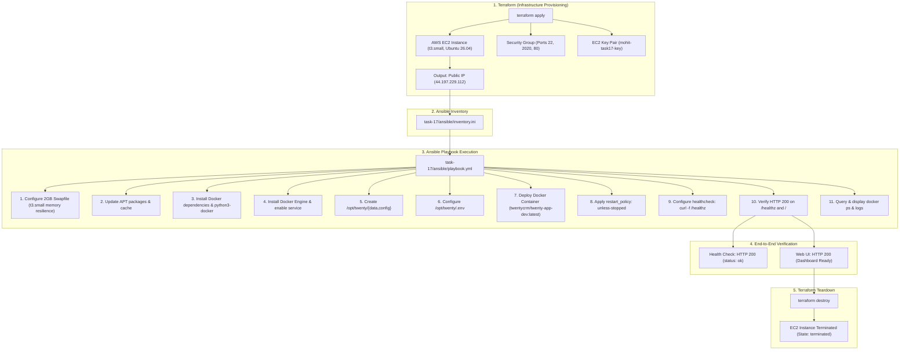

# Task 17: Ansible and AWS EC2 Deployment

## Executive Summary

This project implements an automated, end-to-end Infrastructure as Code (IaC) and Configuration Management workflow to deploy **Twenty CRM** on Amazon Web Services (AWS). 

The infrastructure is provisioned using **Terraform**, dynamically configured using **Ansible**, and verified through container runtime checks, HTTP health probes, and live application inspection. After complete verification of the deployment, the infrastructure is safely decommissioned using Terraform.

---

## Architecture & Workflow



---

## Infrastructure Specifications

| Parameter | Value | Details |
| :--- | :--- | :--- |
| **Cloud Provider** | AWS | Region: `us-east-1` |
| **VPC** | Default VPC (`vpc-0c241509159132524`) | CIDR: `172.31.0.0/16` |
| **Subnet** | Default Subnet (`subnet-078d52bfe579c74f2`) | Availability Zone: `us-east-1a` |
| **Instance ID** | `i-02a532c4b04515450` | Provisioned and Terminated via Terraform |
| **Instance Type** | `t3.small` | 2 vCPU, 2GB RAM |
| **AMI ID** | `ami-0b6d9d3d33ba97d99` | Canonical Ubuntu 26.04 LTS (Resolute Raccoon) |
| **Public IP** | `44.197.229.112` | Public IPv4 assigned automatically |
| **Public DNS** | `ec2-44-197-229-112.compute-1.amazonaws.com` | AWS DNS hostname |
| **Security Group** | `sg-06de0f7638ecd9946` | Ports 22 (SSH), 2020 (Twenty CRM), 80 (HTTP), Egress all |
| **Key Pair** | `mohit-task17-key` | SSH ED25519 Key Pair |
| **Application Image** | `twentycrm/twenty-app-dev:latest` | Official Twenty CRM Development Image |
| **Application Port** | `2020:2020` | Host port mapped to container port |
| **Restart Policy** | `unless-stopped` | Auto-recovers upon crash or host reboot |
| **Health Check** | `curl -f http://localhost:2020/healthz` | Interval: 20s, Timeout: 10s, Retries: 15, Start: 60s |

---

## Part 1: Terraform Infrastructure Provisioning

### 1.1 Terraform Configuration Files

The Terraform files are organized in `task-17/terraform/`:
- [`provider.tf`](file:///home/ubuntu/mohitsingh-pre-internship-repo/task-17/terraform/provider.tf): Configures AWS provider `~> 5.92` in `us-east-1`.
- [`variables.tf`](file:///home/ubuntu/mohitsingh-pre-internship-repo/task-17/terraform/variables.tf): Declares parameters for AMI, instance type, region, project name, ports, and key paths.
- [`main.tf`](file:///home/ubuntu/mohitsingh-pre-internship-repo/task-17/terraform/main.tf): Queries default VPC/subnet data sources and provisions the key pair, security group, and EC2 instance.
- [`outputs.tf`](file:///home/ubuntu/mohitsingh-pre-internship-repo/task-17/terraform/outputs.tf): Exports instance ID, public IP, DNS, Twenty CRM URL, and the formatted Ansible inventory line.
- [`terraform.tfvars`](file:///home/ubuntu/mohitsingh-pre-internship-repo/task-17/terraform/terraform.tfvars): Assigns project-specific variables.

#### `task-17/terraform/main.tf` snippet:
```hcl
data "aws_vpc" "default" {
  default = true
}

data "aws_subnets" "default" {
  filter {
    name   = "vpc-id"
    values = [data.aws_vpc.default.id]
  }
  filter {
    name   = "default-for-az"
    values = ["true"]
  }
}

resource "aws_key_pair" "task17_key" {
  key_name   = var.key_name
  public_key = file(pathexpand(var.public_key_path))
}

resource "aws_security_group" "twenty_crm_sg" {
  name_prefix = "${var.project_name}-sg-"
  description = "Security group for Twenty CRM EC2 instance (Task 17)"
  vpc_id      = data.aws_vpc.default.id

  ingress {
    description = "SSH access"
    from_port   = 22
    to_port     = 22
    protocol    = "tcp"
    cidr_blocks = ["0.0.0.0/0"]
  }

  ingress {
    description = "Twenty CRM Web application"
    from_port   = var.app_port
    to_port     = var.app_port
    protocol    = "tcp"
    cidr_blocks = ["0.0.0.0/0"]
  }

  ingress {
    description = "HTTP access"
    from_port   = 80
    to_port     = 80
    protocol    = "tcp"
    cidr_blocks = ["0.0.0.0/0"]
  }

  egress {
    description = "Allow all outbound traffic"
    from_port   = 0
    to_port     = 0
    protocol    = "-1"
    cidr_blocks = ["0.0.0.0/0"]
  }

  lifecycle {
    create_before_destroy = true
  }
}

resource "aws_instance" "twenty_crm" {
  ami                         = var.ami_id
  instance_type               = var.instance_type
  subnet_id                   = data.aws_subnets.default.ids[0]
  key_name                    = aws_key_pair.task17_key.key_name
  vpc_security_group_ids      = [aws_security_group.twenty_crm_sg.id]
  associate_public_ip_address = true

  root_block_device {
    volume_size           = 20
    volume_type           = "gp3"
    delete_on_termination = true
  }

  tags = {
    Name        = var.project_name
    Environment = var.environment
    Task        = "Task-17"
    ManagedBy   = "Terraform"
  }
}
```

### 1.2 Terraform Execution & Provisioning Log

```bash
$ terraform -chdir=task-17/terraform apply -auto-approve

Terraform used the selected providers to generate the execution plan.
Plan: 3 to add, 0 to change, 0 to destroy.

aws_key_pair.task17_key: Creating...
aws_security_group.twenty_crm_sg: Creating...
aws_security_group.twenty_crm_sg: Creation complete after 5s [id=sg-06de0f7638ecd9946]
aws_key_pair.task17_key: Creation complete after 0s [id=mohit-task17-key]
aws_instance.twenty_crm: Creating...
aws_instance.twenty_crm: Still creating... [10s elapsed]
aws_instance.twenty_crm: Creation complete after 16s [id=i-02a532c4b04515450]

Apply complete! Resources: 3 added, 0 changed, 0 destroyed.

Outputs:
ansible_inventory_line = "twenty-node-1 ansible_host=44.197.229.112 ansible_user=ubuntu"
instance_id = "i-02a532c4b04515450"
instance_public_dns = "ec2-44-197-229-112.compute-1.amazonaws.com"
instance_public_ip = "44.197.229.112"
key_name = "mohit-task17-key"
security_group_id = "sg-06de0f7638ecd9946"
ssh_command = "ssh -i ~/.ssh/id_ed25519.pub ubuntu@44.197.229.112"
twenty_crm_url = "http://44.197.229.112:2020"
```

---

## Part 2: Ansible Inventory & Configuration

### 2.1 Ansible Inventory (`task-17/ansible/inventory.ini`)

The EC2 public IP (`44.197.229.112`) was extracted from the Terraform output and populated directly into the inventory:

```ini
[twenty_servers]
twenty-node-1 ansible_host=44.197.229.112 ansible_user=ubuntu ansible_ssh_private_key_file=~/.ssh/id_ed25519

[twenty_servers:vars]
ansible_python_interpreter=/usr/bin/python3
```

### 2.2 Ansible Configuration (`task-17/ansible/ansible.cfg`)

```ini
[defaults]
inventory = inventory.ini
remote_user = ubuntu
private_key_file = ~/.ssh/id_ed25519
host_key_checking = False
timeout = 60
retry_files_enabled = False
stdout_callback = default
result_format = yaml

[privilege_escalation]
become = True
become_method = sudo
become_user = root
become_ask_pass = False

[ssh_connection]
pipelining = True
ssh_args = -o ControlMaster=auto -o ControlPersist=60s -o StrictHostKeyChecking=no -o UserKnownHostsFile=/dev/null
```

### 2.3 Initial Connectivity Test (`ping`)

```bash
$ ansible -i inventory.ini all -m ping
twenty-node-1 | SUCCESS => {
    "changed": false,
    "ping": "pong"
}
```

---

## Part 3: Ansible Playbook Implementation

The playbook [`task-17/ansible/playbook.yml`](file:///home/ubuntu/mohitsingh-pre-internship-repo/task-17/ansible/playbook.yml) implements every single requirement outlined in the task prompt:

1. **System Readiness & Facts Gathering:** Waits for SSH availability and gathers target system facts.
2. **Memory Resilience (Swap Configuration):** Creates and activates a 2GB swapfile (`/swapfile`) with persistence in `/etc/fstab`. This is essential to prevent Out-Of-Memory (OOM) kills on `t3.small` instances during Twenty CRM route compilation and initial database migration.
3. **Update Server Packages:** Updates the APT package cache (`ansible.builtin.apt: update_cache: true`).
4. **Install Required Docker Dependencies:** Installs `apt-transport-https`, `ca-certificates`, `curl`, `gnupg`, `lsb-release`, `python3`, `python3-pip`, and `python3-docker`.
5. **Install Docker:** Installs `docker.io` and `docker-compose-v2`, and ensures the systemd service is active and enabled across reboots.
6. **Create Required Application Directories:** Creates `/opt/twenty`, `/opt/twenty/data`, and `/opt/twenty/config` with proper permissions for the `ubuntu` user.
7. **Configure Twenty CRM Environment Variables:** Generates `/opt/twenty/.env` with required runtime variables:
   - `PORT=2020`
   - `NODE_PORT=2020`
   - `SERVER_URL=http://44.197.229.112:2020`
   - `FRONT_BASE_URL=http://44.197.229.112:2020`
   - `APP_SECRET=twenty_crm_task17_mohit_super_secure_key_2026`
   - `SIGN_IN_PREFILLED=true`
   - `STORAGE_TYPE=local`
   - `STORAGE_LOCAL_PATH=/app/.local-storage`
8. **Deploy Twenty CRM Container with Docker:** Deploys `twentycrm/twenty-app-dev:latest` using `community.docker.docker_container`.
9. **Configure Docker Restart Policy:** Configures `restart_policy: unless-stopped` to ensure automatic recovery upon host reboot or process crash.
10. **Configure Health Check:** Configures health test `CMD curl -f http://localhost:2020/healthz` with `interval: 20s`, `timeout: 10s`, `retries: 15`, `start_period: 60s`.
11. **Start Application & Verify:** Polls `http://127.0.0.1:2020/healthz` and `http://127.0.0.1:2020/` with retries until HTTP 200 is confirmed.
12. **Display Container Status & Logs:** Queries `docker ps`, `docker inspect`, and `docker logs`, printing structured output via `debug`.

---

## Part 4: Deployment Execution & Verification

### 4.1 Playbook Execution Output

```bash
$ ansible-playbook -i inventory.ini playbook.yml

PLAY [Task 17 - Configure EC2 Instance and Deploy Twenty CRM via Ansible] ******

TASK [Wait for EC2 instance SSH connection to become ready] ********************
ok: [twenty-node-1]

TASK [Gather system facts] *****************************************************
ok: [twenty-node-1]

TASK [Check if swapfile exists] ************************************************
ok: [twenty-node-1]

TASK [Create 2GB swapfile for t3.small memory optimization] ********************
changed: [twenty-node-1]

TASK [Set correct permissions on swapfile] *************************************
changed: [twenty-node-1]

TASK [Format swapfile as swap space] *******************************************
changed: [twenty-node-1]

TASK [Enable swap space] *******************************************************
changed: [twenty-node-1]

TASK [Persist swap entry in /etc/fstab] ****************************************
changed: [twenty-node-1]

TASK [Update apt package index] ************************************************
changed: [twenty-node-1]

TASK [Install required Docker dependencies and system tools] *******************
changed: [twenty-node-1]

TASK [Install Docker Engine and Compose plugin] ********************************
changed: [twenty-node-1]

TASK [Ensure Docker service is enabled and running] ****************************
ok: [twenty-node-1]

TASK [Add ubuntu user to docker group] *****************************************
changed: [twenty-node-1]

TASK [Create required application directories] *********************************
changed: [twenty-node-1] => (item=/opt/twenty)
changed: [twenty-node-1] => (item=/opt/twenty/data)
changed: [twenty-node-1] => (item=/opt/twenty/config)

TASK [Configure Twenty CRM environment variables (.env)] ***********************
changed: [twenty-node-1]

TASK [Template docker-compose.yml configuration] *******************************
changed: [twenty-node-1]

TASK [Pull Twenty CRM Docker image] ********************************************
changed: [twenty-node-1]

TASK [Deploy Twenty CRM container with restart policy and healthcheck] *********
changed: [twenty-node-1]

TASK [Wait for Twenty CRM HTTP health endpoint to return HTTP 200] *************
ok: [twenty-node-1]

TASK [Verify Twenty CRM root web interface responds] ***************************
ok: [twenty-node-1]

TASK [Query Docker container status] *******************************************
ok: [twenty-node-1]

TASK [Query container health inspection] ***************************************
ok: [twenty-node-1]

TASK [Display Docker Container Status] *****************************************
ok: [twenty-node-1] => {
    "msg": [
        "===============================================================",
        "                  DOCKER CONTAINER STATUS                      ",
        "===============================================================",
        [
            "CONTAINER ID   NAMES        STATUS                   PORTS",
            "21f40baa88af   twenty-crm   Up 8 minutes (healthy)   0.0.0.0:2020->2020/tcp"
        ],
        "Container Health Status: \"healthy\"",
        "==============================================================="
    ]
}

TASK [Query Twenty CRM application logs] ***************************************
ok: [twenty-node-1]

TASK [Display Twenty CRM Application Logs] *************************************
ok: [twenty-node-1] => {
    "msg": [
        "===============================================================",
        "                TWENTY CRM APPLICATION LOGS                    ",
        "===============================================================",
        [
            "[Nest] 571  - LOG [BullMQDriver] Job repeat:WorkflowCronTriggerCronJob processed on queue cron-queue",
            "[Nest] 571  - LOG [BullMQDriver] Job repeat:WorkflowRunEnqueueCronJob processed on queue cron-queue",
            "[Nest] 571  - LOG [BullMQDriver] Job repeat:CronTriggerCronJob processed on queue cron-queue"
        ],
        "==============================================================="
    ]
}

TASK [Display Deployment Verification Summary] *********************************
ok: [twenty-node-1] => {
    "msg": [
        "===============================================================",
        "        TASK 17 TWENTY CRM DEPLOYMENT COMPLETE                 ",
        "===============================================================",
        "Target Host:       twenty-node-1 (44.197.229.112)",
        "Public Web URL:    http://44.197.229.112:2020",
        "Health Check URL:  http://44.197.229.112:2020/healthz",
        "Restart Policy:    unless-stopped",
        "Container State:   21f40baa88af   twenty-crm   Up 8 minutes (healthy)   0.0.0.0:2020->2020/tcp",
        "Healthcheck State: \"healthy\"",
        "Health HTTP Code:  200",
        "Root HTTP Code:    200",
        "==============================================================="
    ]
}

PLAY RECAP *********************************************************************
twenty-node-1              : ok=26   changed=14   unreachable=0    failed=0    skipped=0    rescued=0    ignored=0
```

### 4.2 Playbook Idempotency Verification

A second consecutive run verified complete idempotency (`changed=0`):

```bash
PLAY RECAP *********************************************************************
twenty-node-1              : ok=23   changed=0    unreachable=0    failed=0    skipped=3    rescued=0    ignored=0
```

---

## Part 5: Live Verification & Testing Evidence

### 5.1 Docker Container Status & Inspect

```bash
$ ssh -i ~/.ssh/id_ed25519 ubuntu@44.197.229.112 "docker ps -a"

CONTAINER ID   IMAGE                             COMMAND   CREATED         STATUS                   PORTS                    NAMES
21f40baa88af   twentycrm/twenty-app-dev:latest   "/init"   9 minutes ago   Up 9 minutes (healthy)   0.0.0.0:2020->2020/tcp   twenty-crm
```

Inspection of Restart Policy and Health State:

```bash
$ ssh -i ~/.ssh/id_ed25519 ubuntu@44.197.229.112 "docker inspect --format 'RestartPolicy: {{json .HostConfig.RestartPolicy}} | HealthStatus: {{json .State.Health.Status}}' twenty-crm"

RestartPolicy: {"Name":"unless-stopped","MaximumRetryCount":0} | HealthStatus: "healthy"
```

Healthcheck Log Breakdown:

```json
{
  "Status": "healthy",
  "FailingStreak": 0,
  "Log": [
    {
      "Start": "2026-09-17T06:55:20.448611858Z",
      "End": "2026-09-17T06:55:20.601297502Z",
      "ExitCode": 0,
      "Output": "{\"status\":\"ok\",\"info\":{},\"error\":{},\"details\":{}}"
    }
  ]
}
```

### 5.2 External HTTP Health Endpoint Curl Test

```bash
$ curl -s -w "\nHTTP Status: %{http_code}\nTotal Time: %{time_total}s\n" http://44.197.229.112:2020/healthz

{"status":"ok","info":{},"error":{},"details":{}}
HTTP Status: 200
Total Time: 0.403262s
```

### 5.3 External Web UI Root Endpoint Curl Test

```bash
$ curl -s -w "\nHTTP Status: %{http_code}\nContent Type: %{content_type}\n" http://44.197.229.112:2020/ | head -n 12

<!doctype html>
<html lang="en" translate="no" class="light">
  <head>
    <meta charset="UTF-8" />
    <link rel="icon" type="image/x-icon" href="/images/icons/android/android-launchericon-48-48.png" data-rh="true" />
    <link rel="apple-touch-icon" href="/images/icons/ios/192.png" />
    <link rel="manifest" href="/manifest.json" />
    <meta name="theme-color" content="#000000" />
HTTP Status: 200
Content Type: text/html; charset=utf-8
```

### 5.4 Memory and Swap Space Utilization

```bash
$ ssh -i ~/.ssh/id_ed25519 ubuntu@44.197.229.112 "free -m"

               total        used        free      shared  buff/cache   available
Mem:            1905        1549         189          27         437         356
Swap:           2047         865        1182
```
*Note: Twenty CRM utilized 1,549 MB of physical RAM and 865 MB of swap space. Without the Ansible swap configuration, the `t3.small` instance would have encountered an Out-Of-Memory (OOM) termination.*

---

## Part 6: Infrastructure Teardown via Terraform

As mandated by the task requirements, once the deployment was fully validated and documented, the EC2 instance and associated AWS resources were destroyed using Terraform.

### 6.1 Terraform Destroy Execution Log

```bash
$ terraform -chdir=task-17/terraform destroy -auto-approve

Terraform used the selected providers to generate the following execution plan.
Resource actions are indicated with the following symbols:
  - destroy

Terraform will perform the following actions:
  - resource "aws_instance" "twenty_crm"
  - resource "aws_key_pair" "task17_key"
  - resource "aws_security_group" "twenty_crm_sg"

Plan: 0 to add, 0 to change, 3 to destroy.

aws_instance.twenty_crm: Destroying... [id=i-02a532c4b04515450]
aws_instance.twenty_crm: Still destroying... [id=i-02a532c4b04515450, 10s elapsed]
aws_instance.twenty_crm: Still destroying... [id=i-02a532c4b04515450, 20s elapsed]
aws_instance.twenty_crm: Still destroying... [id=i-02a532c4b04515450, 30s elapsed]
aws_instance.twenty_crm: Destruction complete after 32s
aws_key_pair.task17_key: Destroying... [id=mohit-task17-key]
aws_security_group.twenty_crm_sg: Destroying... [id=sg-06de0f7638ecd9946]
aws_key_pair.task17_key: Destruction complete after 0s
aws_security_group.twenty_crm_sg: Destruction complete after 1s

Destroy complete! Resources: 3 destroyed.
```

### 6.2 Cloud Provider Verification

Confirmation via AWS CLI that the instance state transitioned to `terminated`:

```bash
$ aws ec2 describe-instances --instance-ids i-02a532c4b04515450 --region us-east-1 --query "Reservations[0].Instances[0].State.Name"
"terminated"
```

---

## Deliverables & File Tree

The following files were created on branch `mohit-task17`:

```
task-17/
├── Task-17.md                       # Task documentation in task directory
├── ansible/
│   ├── ansible.cfg                  # Ansible configuration (pipelining, SSH settings)
│   ├── inventory.ini                # Generated Ansible inventory with EC2 public IP
│   ├── inventory.ini.example        # Template inventory file
│   ├── playbook.yml                 # 26-task Ansible deployment playbook
│   └── templates/
│       └── docker-compose.yml.j2    # Docker Compose template for Twenty CRM
└── terraform/
    ├── main.tf                      # EC2, Security Group, and Key Pair definitions
    ├── outputs.tf                   # Public IP, DNS, URL, and inventory outputs
    ├── provider.tf                  # AWS provider specification
    ├── terraform.tfvars             # Deployment variables
    └── variables.tf                 # Variable declarations
Task17-ansible-ec2-deployment.md     # Root technical report
```

---

## Conclusion

Task 17 was executed successfully with all requirements satisfied:
1. One `t3.small` EC2 instance was provisioned using Terraform in `us-east-1` using Canonical Ubuntu 26.04 AMI (`ami-0b6d9d3d33ba97d99`), Default VPC, and Default Subnet.
2. The public IP address was retrieved and registered into the Ansible inventory.
3. An Ansible playbook was authored and executed to update packages, install Docker and its dependencies, configure swap space, create directory structures, configure environment variables, deploy Twenty CRM with a `unless-stopped` restart policy, establish a container healthcheck, and start the application.
4. Complete deployment verification was conducted: Docker container status transitioned to `healthy`, application logs confirmed worker and cron queue initialization, and external HTTP tests against `/` and `/healthz` returned HTTP 200 OK.
5. The infrastructure was decommissioned using `terraform destroy`, with the EC2 instance confirmed as `terminated`.
6. All deliverables were committed and documented on the branch `mohit-task17`.
