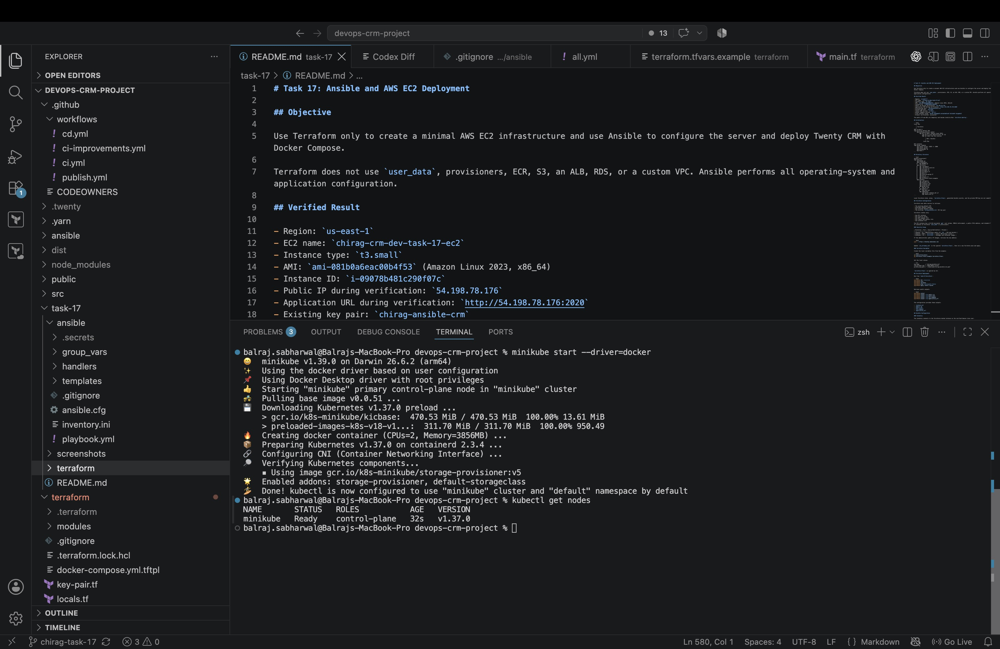
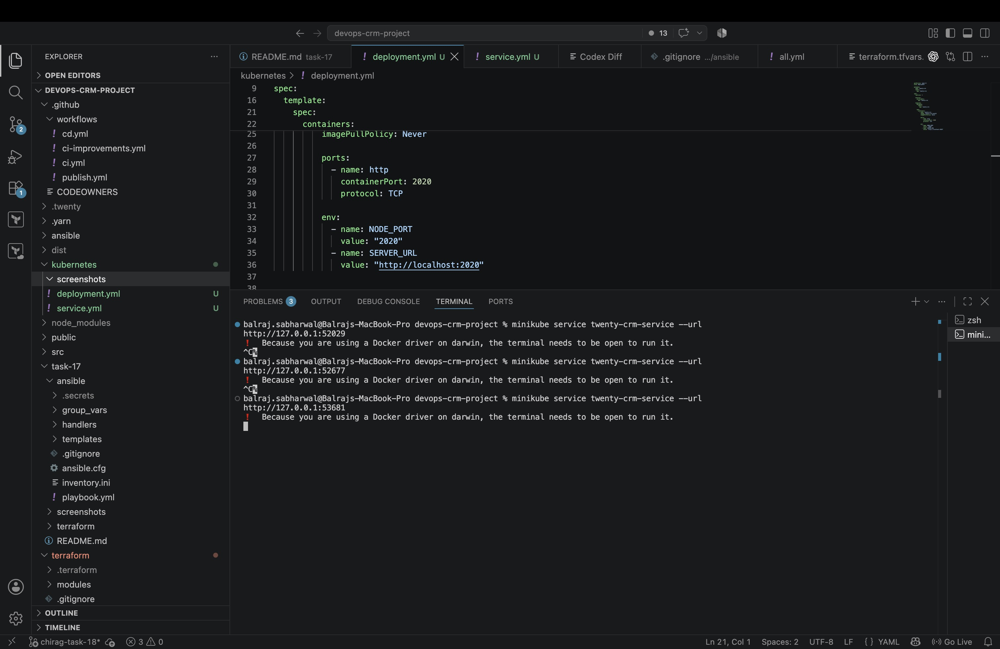
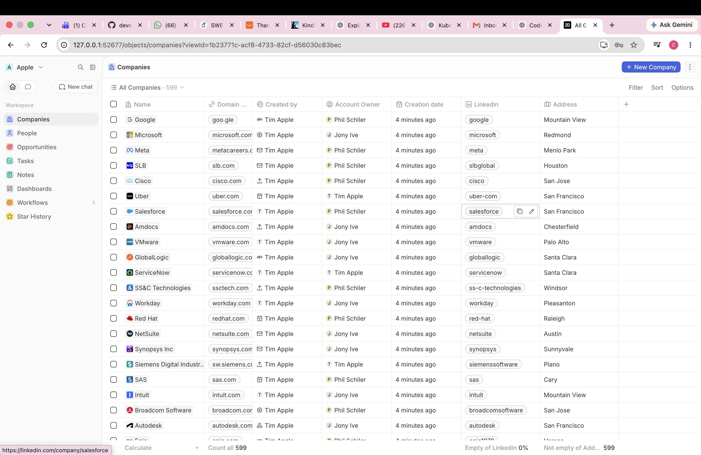
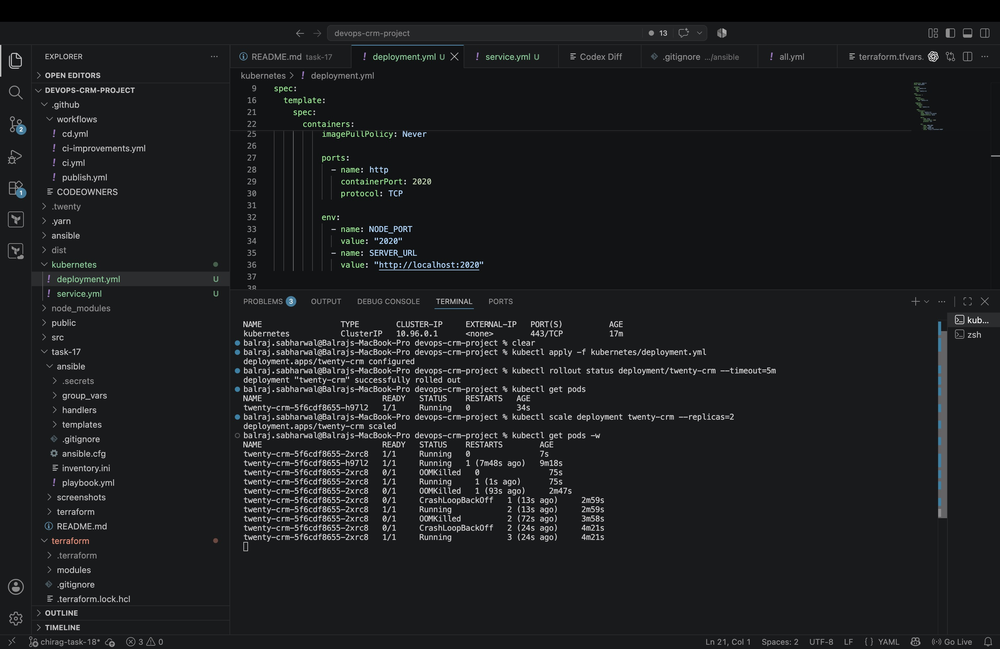
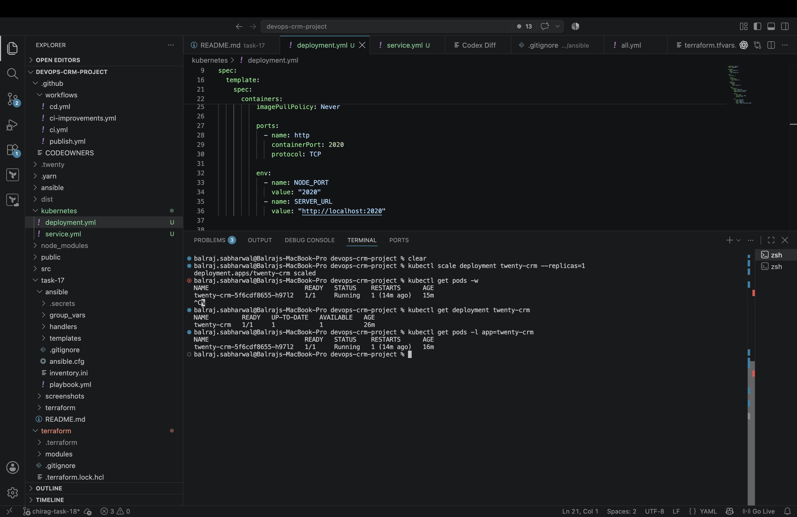
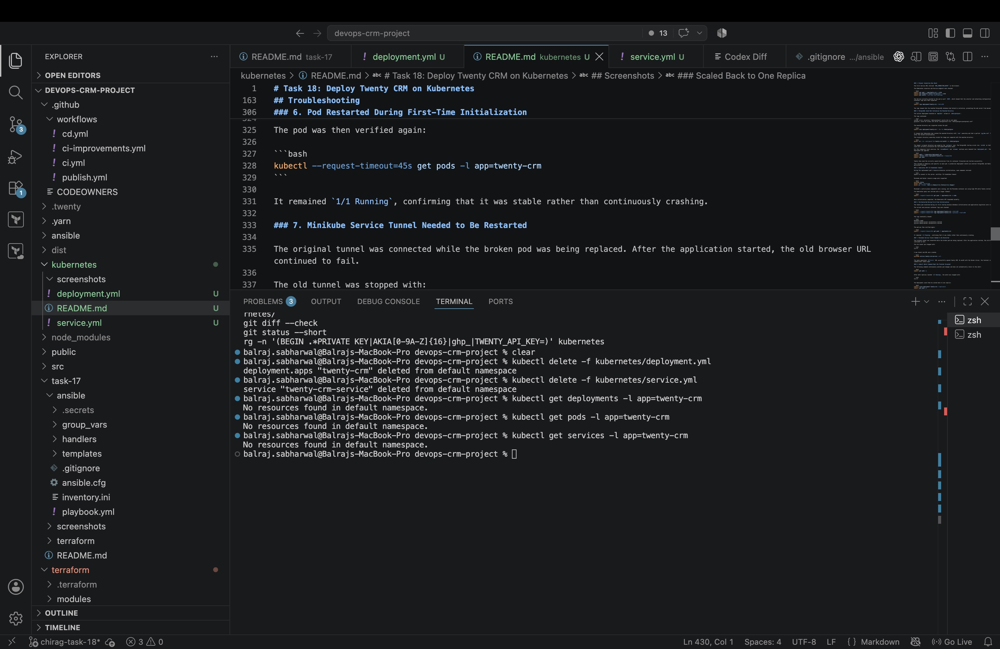

# Task 18: Deploy Twenty CRM on Kubernetes

## Objective

Deploy Twenty CRM locally on Kubernetes using Minikube, expose it through a NodePort Service, verify application access, test scaling from one replica to two replicas, and scale back to one replica.

## Architecture

```text
Browser
   |
   v
Minikube service tunnel
   |
   v
NodePort Service
twenty-crm-service
Port 2020 -> Container port 2020
   |
   v
Twenty CRM Deployment
   |
   +-- Twenty CRM Pod 1
   |
   +-- Twenty CRM Pod 2 (during scaling test)
```

## Prerequisites

- macOS
- Docker
- Minikube
- kubectl
- Existing Twenty CRM Docker image

Versions used:

```text
Minikube: v1.39.0
kubectl:  v1.37.0
```

## Directory Structure

```text
kubernetes/
├── deployment.yml
├── service.yml
├── README.md
└── screenshots/
    ├── 01-minikube-node-ready.jpeg
    ├── 02-minikube-service-tunnel.jpeg
    ├── 03-twenty-crm-browser.png
    ├── 04-scaled-to-two-replicas.jpeg
    ├── 05-scaled-back-to-one.jpeg
    └── 06-kubernetes-cleanup.jpeg
```

## Docker Image

The existing Twenty CRM development image was used:

```text
twentycrm/twenty-app-dev@sha256:53381e68f6fa50808f624f4c0125ce2143c6d21321ba25886e1115c73367c6e6
```

It was tagged locally for Task 18:

```bash
docker tag \
  twentycrm/twenty-app-dev@sha256:53381e68f6fa50808f624f4c0125ce2143c6d21321ba25886e1115c73367c6e6 \
  twenty-crm:task18
```

The image was loaded into Minikube:

```bash
minikube image load twenty-crm:task18
minikube image ls | grep 'twenty-crm:task18'
```

The Deployment uses `imagePullPolicy: Never` so Kubernetes uses the image already loaded into Minikube.

## Deployment

The Deployment is named `twenty-crm` and starts with one replica.

Important fields:

- `apiVersion`: selects the Kubernetes Deployment API.
- `kind`: identifies the resource as a Deployment.
- `metadata`: defines the resource name and labels.
- `replicas`: defines the desired number of pods.
- `selector.matchLabels`: identifies the pods managed by the Deployment.
- `template`: defines how new pods are created.
- `containers`: defines the Twenty CRM container.
- `image`: selects `twenty-crm:task18`.
- `containerPort`: documents that Twenty CRM listens on port `2020`.

## Service

The Service is named `twenty-crm-service`.

Important fields:

- `selector`: routes traffic to pods labelled `app: twenty-crm`.
- `port`: exposes port `2020` through the Service.
- `targetPort`: forwards traffic to container port `2020`.
- `nodePort`: exposes port `30220` on the Minikube node.
- `type: NodePort`: makes the application accessible outside the cluster.

## Start Minikube

```bash
minikube start --driver=docker
kubectl get nodes
```

## Deploy Twenty CRM

```bash
kubectl apply -f kubernetes/
kubectl get deployments
kubectl get pods
kubectl get services
```

## Access Twenty CRM

```bash
minikube service twenty-crm-service --url
```

On macOS with the Docker driver, the command creates a local tunnel. The terminal must remain open while using the generated URL.

## Scale from One to Two Replicas

```bash
kubectl scale deployment twenty-crm --replicas=2
kubectl get pods
```

Kubernetes created another pod to make the actual number of replicas match the desired count of two.

## Scale from Two to One Replica

```bash
kubectl scale deployment twenty-crm --replicas=1
kubectl get pods
```

Kubernetes terminated one pod because the desired replica count was reduced to one.

## Verification Commands

```bash
kubectl get deployments
kubectl get pods
kubectl get services
kubectl get events --sort-by=.lastTimestamp
```

## Troubleshooting

### 1. Minikube and kubectl Were Not Installed

The initial prerequisite check returned:

```text
zsh: command not found: minikube
zsh: command not found: kubectl
```

Homebrew and the Mac architecture were checked:

```bash
brew --version
uname -m
```

Both Kubernetes tools were installed and verified:

```bash
brew install minikube kubectl
minikube version
kubectl version --client
```

### 2. Deployment Filename Extension Mismatch

The Deployment file was created as:

```text
kubernetes/deployment.yml
```

The first validation command incorrectly used `.yaml`:

```bash
kubectl apply --dry-run=client -f kubernetes/deployment.yaml
```

This produced:

```text
error: the path "kubernetes/deployment.yaml" does not exist
```

The command was corrected to use the actual filename:

```bash
kubectl apply --dry-run=client -f kubernetes/deployment.yml
```

Successful result:

```text
deployment.apps/twenty-crm created (dry run)
```

### 3. Browser Connection Was Reset

The first Service URL returned `ERR_CONNECTION_RESET` in the browser.

The Kubernetes resources and Service endpoint were checked:

```bash
kubectl get pods -l app=twenty-crm -o wide
kubectl get endpoints twenty-crm-service -o wide
kubectl get events --sort-by=.lastTimestamp
```

The Service correctly pointed to the pod on port `2020`, which showed that the selector and networking configuration were working. Container logs were then inspected:

```bash
kubectl logs deployment/twenty-crm --tail=250
```

The logs showed that the bundled PostgreSQL database had failed to initialize, preventing the web server from becoming available.

### 4. PostgreSQL Could Not Initialize the Mounted Directory

The initial Deployment mounted an `emptyDir` volume at `/data/postgres`.

The logs contained:

```text
initdb: error: directory "/data/postgres" exists but is not empty
postgres: could not access the server configuration file "/data/postgres/postgresql.conf"
```

The mounted directory was inspected inside the pod:

```bash
kubectl exec deployment/twenty-crm -- ls -la /data/postgres
```

It showed that Kubernetes had created the mounted directory with `root` ownership and that a partial `pg_hba.conf` file remained after the failed initialization.

The original directory ownership inside the image was compared with the mounted directory:

```bash
docker run --rm --entrypoint ls twenty-crm:task18 -la /data/postgres
```

The image's original directory was owned by the `postgres` user. The PostgreSQL startup script runs `initdb` as that user, so it could not correctly initialize the root-owned Kubernetes mount.

For this temporary local exercise, the `volumeMounts` and `volumes` sections were removed from `deployment.yml`. The corrected Deployment was applied:

```bash
kubectl apply -f kubernetes/deployment.yml
kubectl rollout status deployment/twenty-crm --timeout=5m
kubectl get pods
```

Twenty then used the correctly owned directories from its container filesystem and started successfully.

This storage is temporary and specific to each pod. A production deployment should use external PostgreSQL and Redis services with persistent storage.

### 5. Kubernetes API TLS Handshake Timeout

During the replacement pod's resource-intensive initialization, some commands returned:

```text
Unable to connect to the server: net/http: TLS handshake timeout
```

Minikube and Docker resource usage were inspected:

```bash
minikube status
docker stats --no-stream
docker ps --format 'table {{.Names}}\t{{.Status}}\t{{.Image}}'
```

Minikube's control-plane components were running, but the Minikube container was using high CPU while Twenty initialized.

The Kubernetes query was retried with a longer timeout:

```bash
kubectl --request-timeout=45s get pods -l app=twenty-crm -o wide
```

Once initialization completed, the Kubernetes API responded normally.

### 6. Pod Restarted During First-Time Initialization

The Twenty pod restarted during its first startup because database initialization and application migrations were resource-intensive.

The current and previous container logs were checked:

```bash
kubectl --request-timeout=45s logs deployment/twenty-crm --tail=160
kubectl --request-timeout=45s logs deployment/twenty-crm --previous --tail=100
```

The logs eventually showed:

```text
Database ready
service twenty-server successfully started
service twenty-worker successfully started
```

The pod was then verified again:

```bash
kubectl --request-timeout=45s get pods -l app=twenty-crm
```

It remained `1/1 Running`, confirming that it was stable rather than continuously crashing.

### 7. Minikube Service Tunnel Needed to Be Restarted

The original tunnel was connected while the broken pod was being replaced. After the application started, the old browser URL continued to fail.

The old tunnel was stopped with:

```text
Ctrl+C
```

A new tunnel and URL were created:

```bash
minikube service twenty-crm-service --url
```

The newly generated `127.0.0.1` URL successfully opened Twenty CRM. On macOS with the Docker driver, the terminal running this command must remain open.

### 8. kubectl Watch Command Kept the Terminal Occupied

The following command continuously watches pod changes and does not automatically return to the shell:

```bash
kubectl get pods -w
```

After both replicas reached `1/1 Running`, the watch was stopped with:

```text
Ctrl+C
```

The Deployment could then be scaled back to one replica:

```bash
kubectl scale deployment twenty-crm --replicas=1
kubectl get pods -w
```

After one pod remained, `Ctrl+C` was used again before running the final verification commands.

### Additional Diagnostic Commands

These commands are useful for future Kubernetes problems:

```bash
kubectl describe pod <pod-name>
kubectl logs <pod-name>
kubectl logs <pod-name> --previous
kubectl get events --sort-by=.lastTimestamp
kubectl get endpoints twenty-crm-service
```

## Cleanup

Run cleanup only after all screenshots have been captured:

```bash
kubectl delete -f kubernetes/deployment.yml
kubectl delete -f kubernetes/service.yml
```

Verify removal:

```bash
kubectl get deployments
kubectl get pods
kubectl get services
```

Minikube itself does not need to be deleted.

## Screenshots

### Minikube Node Ready



### Minikube Service Tunnel



### Twenty CRM Access



### Scaled to Two Replicas



### Scaled Back to One Replica



### Kubernetes Cleanup


