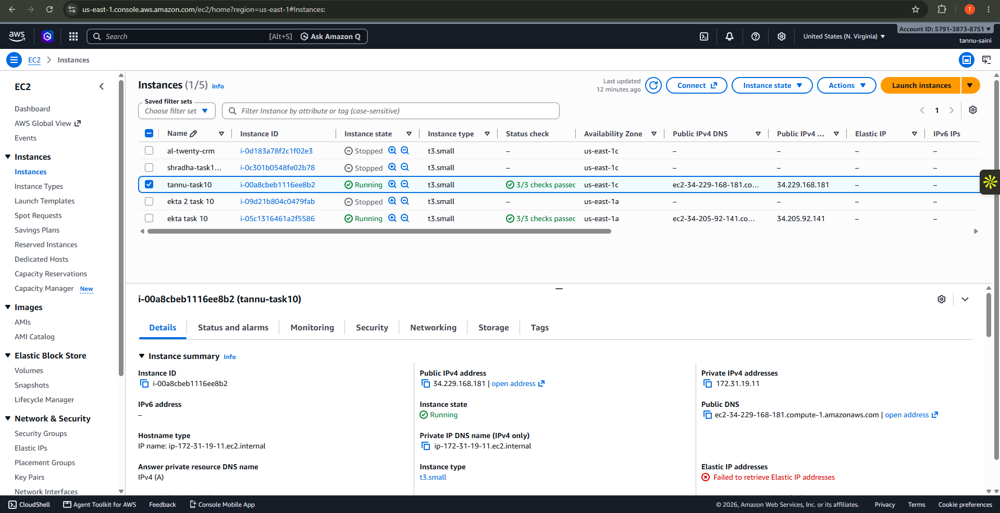
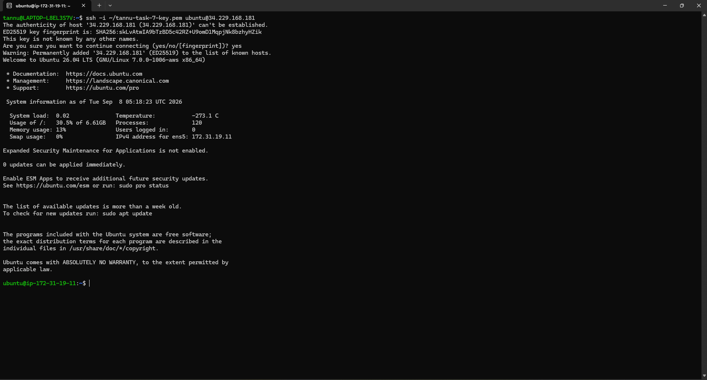
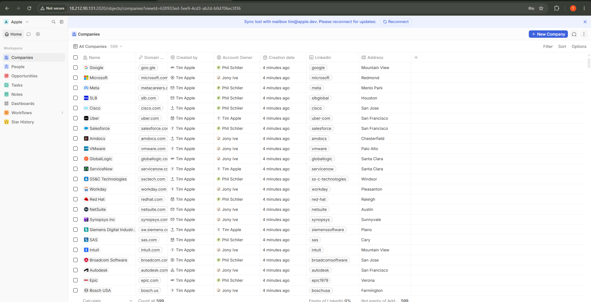
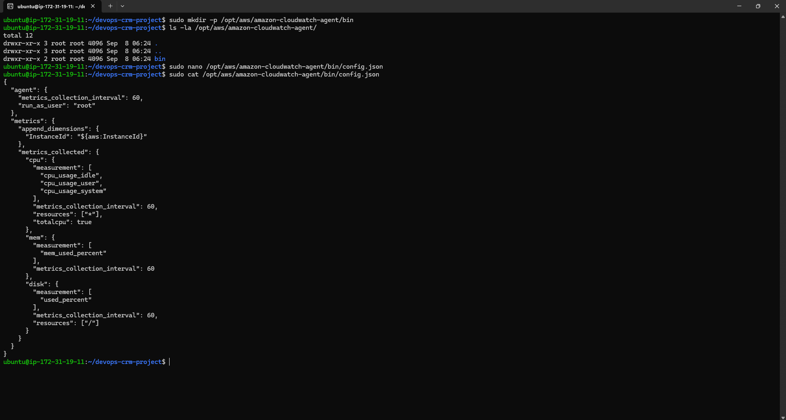
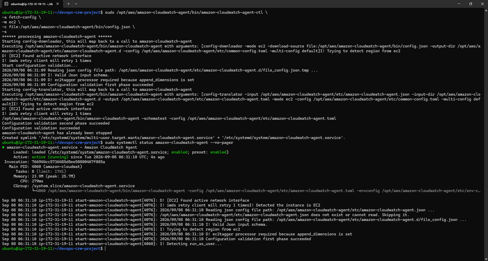
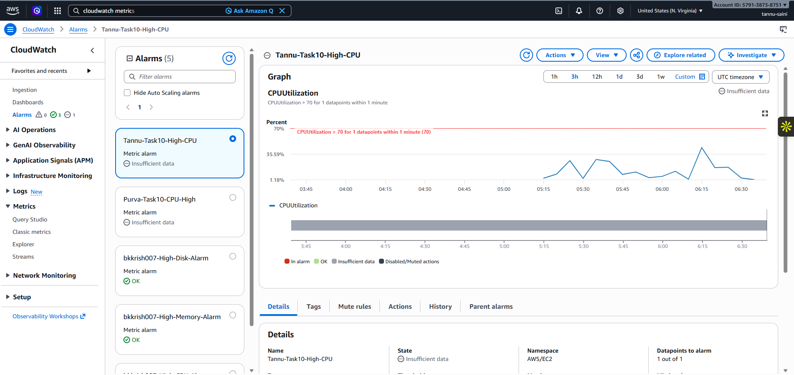
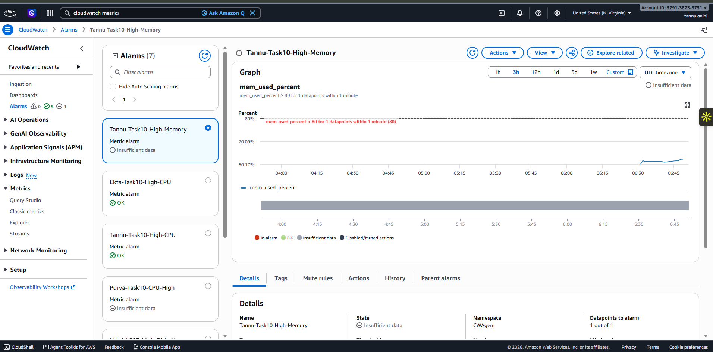
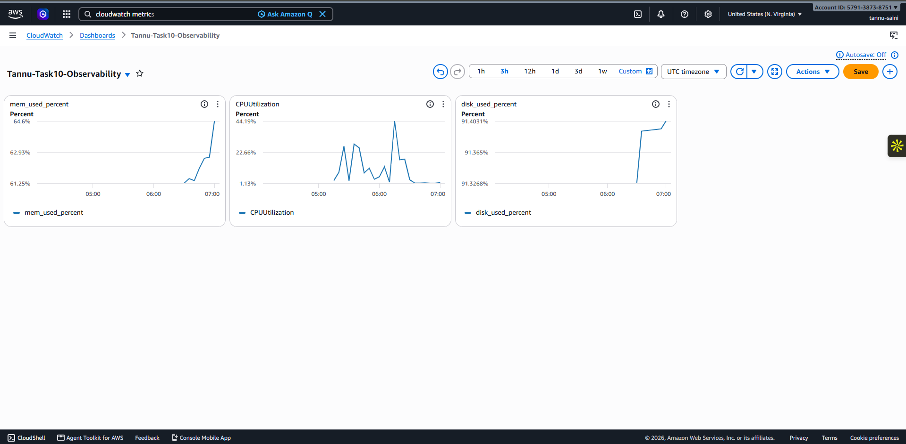

# Task 10: AWS Observability with CloudWatch

## Objective

Implemented AWS observability for the Twenty CRM application running on an Amazon EC2 instance using Amazon CloudWatch.

The setup includes EC2 monitoring, CloudWatch Agent configuration, CPU/memory/disk metrics, CloudWatch alarms, a personal dashboard, and live metric testing.

## 1. EC2 Instance Setup

* Launched an Ubuntu EC2 instance in AWS.
* Instance type: `t3.small`
* AWS Region: `us-east-1 (N. Virginia)`
* Connected to the instance using SSH.
* Instance ID: `i-00a8cbeb1116ee8b2`





## 2. Twenty CRM Deployment

Twenty CRM was deployed and run on the EC2 instance using Docker.

* Application port: `2020`
* Docker was installed and configured.
* Twenty CRM was successfully started and verified as healthy.
* The application was accessed through the EC2 instance.



## 3. CloudWatch Agent Installation and Configuration

The Amazon CloudWatch Agent was installed and configured on the EC2 instance.

The agent was configured with:

* Metrics collection interval: 60 seconds
* CPU monitoring
* Memory monitoring
* Disk monitoring
* EC2 Instance ID as a metric dimension





## 4. CloudWatch Metrics

The CloudWatch Agent collects the following metrics:

### CPU

* `cpu_usage_idle`
* `cpu_usage_user`
* `cpu_usage_system`

### Memory

* `mem_used_percent`

### Disk

* `used_percent`

Disk monitoring was configured for the root filesystem `/`.

The metrics were configured with a 60-second collection interval.

## 5. CloudWatch Alarms

Two CloudWatch alarms were created.

### CPU Alarm

Alarm name:

`Tannu-Task10-High-CPU`

Configuration:

* Namespace: `AWS/EC2`
* Metric: `CPUUtilization`
* Statistic: Average
* Period: 1 minute
* Threshold: Greater than 70%



### Memory Alarm

Alarm name:

`Tannu-Task10-High-Memory`

Configuration:

* Namespace: `CWAgent`
* Metric: `mem_used_percent`
* Statistic: Average
* Period: 1 minute
* Threshold: Greater than 80%



The alarms were created without notification actions because SNS notification configuration was not required for this task.

## 6. CloudWatch Dashboard

Created a personal CloudWatch dashboard:

`Tannu-Task10-Observability`

The dashboard contains three monitoring widgets:

* `CPUUtilization`
* `mem_used_percent`
* `disk_used_percent`

The widgets were configured for the EC2 instance and provide a single view of CPU, memory, and disk utilization.



## 7. Live Metric Testing

Live metric testing was performed after configuring the CloudWatch monitoring setup.

Twenty CRM activity was generated on the running application.

A temporary CPU load was also generated on the EC2 instance using two background `yes` processes:

```bash
yes > /dev/null & P1=$!
yes > /dev/null & P2=$!
```

The CPU load was then stopped using:

```bash
kill $P1 $P2
```

This test was performed to generate CPU activity and verify that the CloudWatch CPU metric responds to changes in system activity.

The CloudWatch dashboard was refreshed after the test to verify updated metric data.

## 8. Issues Faced and Solutions

### Disk Space Issue

The EC2 instance had limited disk space, which caused Docker and package installation issues.

The issue was handled by:

* Cleaning package cache
* Removing unnecessary files
* Pruning unused Docker resources
* Removing unnecessary `node_modules`
* Checking disk usage before continuing

### Memory Pressure

The `t3.small` instance had limited memory while running Twenty CRM and its supporting services.

A 1 GB swap file was configured to provide additional virtual memory:

```bash
sudo fallocate -l 1G /swapfile
sudo chmod 600 /swapfile
sudo mkswap /swapfile
sudo swapon /swapfile
```

This helped the instance handle the application workload without changing the EC2 instance type.

### Redis Memory Overcommit

Redis-related memory behavior was addressed by enabling memory overcommit:

```bash
sudo sysctl vm.overcommit_memory=1
```

The configuration was also persisted using:

```bash
echo 'vm.overcommit_memory = 1' | sudo tee /etc/sysctl.d/99-twenty.conf
```

### EC2 Permission Restrictions

Attempts to modify the EC2 volume and instance attributes were blocked by the provided IAM permissions.

The following actions were denied:

* `ec2:ModifyVolume`
* `ec2:ModifyInstanceAttribute`

Therefore, the existing `t3.small` instance configuration was retained and the memory limitation was handled using swap.

## 9. Verification

The following components were successfully verified:

* EC2 instance running
* SSH connectivity
* Docker running
* Twenty CRM running successfully
* CloudWatch Agent running
* CPU metrics available
* Memory metrics available
* Disk metrics available
* CPU alarm created
* Memory alarm created
* CloudWatch dashboard created
* Live CPU activity test performed
* Metric data refreshed after testing

## 10. Final Status

AWS observability for Twenty CRM was successfully implemented using Amazon CloudWatch.

The final setup provides:

* EC2 infrastructure monitoring
* CPU monitoring
* Memory monitoring
* Disk monitoring
* CPU alerting
* Memory alerting
* A personal CloudWatch dashboard
* Live metric-change testing

The monitoring setup is ready for ongoing observation and troubleshooting of the Twenty CRM application running on EC2.
