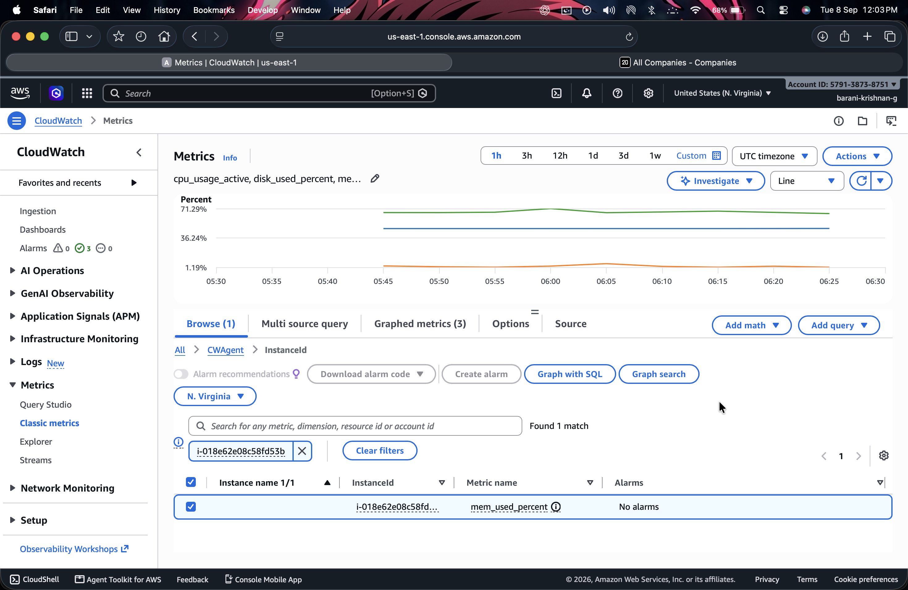
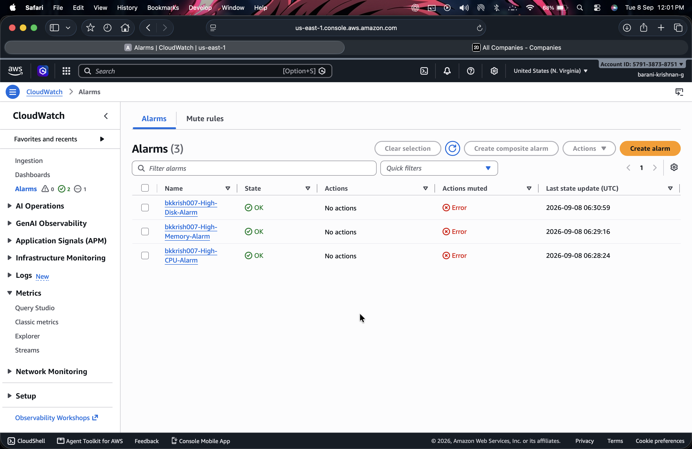

Task 10: AWS Observability with CloudWatch

Name: Barani Krishnan G  
Domain: DevOps  
Project: devops-crm-project / Twenty CRM  
Date: 8 September 2026  
AWS Region: us-east-1  

1. Objective

The objective of this task was to implement end-to-end AWS observability for the Twenty CRM application running on an Amazon EC2 instance using Amazon CloudWatch.

The implementation covered the following core areas:
- Exploring default EC2 hypervisor-level metrics.
- Installing and configuring the Amazon CloudWatch Agent for operating-system-level metrics.
- Collecting active CPU utilization, memory utilization, and root disk usage metrics.
- Publishing custom metrics under the dedicated CWAgent namespace.
- Creating CloudWatch alarms for proactive threshold monitoring.
- Building a centralized CloudWatch dashboard (bkkrish007-Observability) with real-time graphs.
- Performing application activity testing to validate metric responsiveness.

2. Environment

The infrastructure environment and deployment specifications used for this task are summarized below:

| Component | Details |
| :--- | :--- |
| Cloud Provider | Amazon Web Services (AWS) |
| AWS Region | us-east-1 |
| Compute Service | Amazon EC2 |
| EC2 Instance ID | i-018e62e08c58fd53b |
| Instance Type | t3.small (2 vCPU, 2 GiB RAM) |
| Operating System | Ubuntu 24.04 LTS |
| Public IPv4 Address | 54.234.38.9 |
| Application | Twenty CRM |
| Application Port | 2020 |
| Container Runtime | Docker Engine & Docker Compose |
| Monitoring Service | Amazon CloudWatch |
| Agent | Amazon CloudWatch Agent |
| IAM Role | CloudWatchAgentEC2Role |
| Custom Namespace | CWAgent |
| Dashboard Name | bkkrish007-Observability |

3. EC2 and Twenty CRM Deployment

An Amazon EC2 instance was launched using Ubuntu on a t3.small instance type in the us-east-1 region. Secure access to the instance was established via SSH using the configured key pair:

```bash
ssh -i <key-pair>.pem ubuntu@54.234.38.9
```

The Twenty CRM application repository was cloned on the instance, and the multi-container stack was started using Docker Compose:

```bash
docker compose up -d --build
```

The running containers were verified using:

```bash
docker ps
```

The following core containers were confirmed running and healthy:
- devops-crm-twenty-server
- devops-crm-app
- PostgreSQL and Redis supporting services

A local health check was performed directly on the host:

```bash
curl -I http://127.0.0.1:2020/
```

The endpoint returned an HTTP 200 response. The web application was then accessed through the public browser URL:

```text
http://54.234.38.9:2020
```

4. Default EC2 CloudWatch Metrics

Default EC2 monitoring provides basic hypervisor-level metrics automatically without requiring any agent installation. The following default metrics were examined:
- CPU Utilization (AWS/EC2 -> CPUUtilization)
- Network In and Out (AWS/EC2 -> NetworkIn, NetworkOut)
- Disk Read and Write Operations / Bytes

Default EC2 monitoring operates from the hypervisor outside the guest operating system. Consequently, it cannot capture operating-system-level memory usage (RAM) or disk utilization percentages of mounted file systems. To achieve full observability, the Amazon CloudWatch Agent was deployed inside the instance.

5. CloudWatch Agent Installation and Configuration

The Amazon CloudWatch Agent was installed on the EC2 instance to collect internal operating system metrics and forward them to CloudWatch.

Directory Layout:
- Installation Directory: /opt/aws/amazon-cloudwatch-agent/
- Configuration Directory: /opt/aws/amazon-cloudwatch-agent/etc/
- Log Directory: /opt/aws/amazon-cloudwatch-agent/logs/
- Configuration File: /opt/aws/amazon-cloudwatch-agent/etc/amazon-cloudwatch-agent.json

IAM Role Configuration:
To grant the EC2 instance permission to publish metrics to CloudWatch, the IAM role CloudWatchAgentEC2Role (with the CloudWatchAgentServerPolicy policy attached) was assigned to the EC2 instance profile.

Agent Configuration File:
The configuration file /opt/aws/amazon-cloudwatch-agent/etc/amazon-cloudwatch-agent.json was defined as follows:

```json
{
  "agent": {
    "metrics_collection_interval": 60,
    "run_as_user": "root"
  },
  "metrics": {
    "namespace": "CWAgent",
    "append_dimensions": {
      "InstanceId": "${aws:InstanceId}"
    },
    "metrics_collected": {
      "cpu": {
        "resources": ["*"],
        "measurement": [
          {
            "name": "cpu_usage_active",
            "unit": "Percent"
          }
        ],
        "totalcpu": true
      },
      "mem": {
        "measurement": [
          {
            "name": "mem_used_percent",
            "unit": "Percent"
          }
        ]
      },
      "disk": {
        "resources": ["/"],
        "measurement": [
          {
            "name": "disk_used_percent",
            "unit": "Percent"
          }
        ],
        "ignore_file_system_types": [
          "sysfs",
          "devtmpfs",
          "tmpfs",
          "devpts",
          "squashfs",
          "proc",
          "overlay"
        ]
      }
    }
  }
}
```

Starting the Service:
The CloudWatch Agent configuration was applied, and the service was started using:

```bash
sudo /opt/aws/amazon-cloudwatch-agent/bin/amazon-cloudwatch-agent-ctl \
  -a fetch-config \
  -m ec2 \
  -s \
  -c file:/opt/aws/amazon-cloudwatch-agent/etc/amazon-cloudwatch-agent.json
```

Service status was verified using systemctl:

```bash
sudo systemctl status amazon-cloudwatch-agent
```

The service confirmed an active (running) status. Agent execution logs were verified at /opt/aws/amazon-cloudwatch-agent/logs/amazon-cloudwatch-agent.log.

6. CloudWatch Metrics

Custom metrics collected by the agent were published under the CWAgent namespace and indexed by the InstanceId dimension (i-018e62e08c58fd53b).

| Metric Type | Metric Name | Description | Status |
| :--- | :--- | :--- | :--- |
| Active CPU Usage | cpu_usage_active | Measures the percentage of CPU time actively processing workloads. | Verified (~2.76% baseline) |
| Memory Utilization | mem_used_percent | Measures total RAM percentage used by running processes and containers. | Verified (~66% - 71%) |
| Disk Space Usage | disk_used_percent | Measures the percentage of used disk space on the root filesystem (/). | Verified (~47.4%) |

All three metrics were verified in the CloudWatch Metrics console by selecting the CWAgent namespace and filtering by the InstanceId dimension.

7. CloudWatch Alarms

CloudWatch alarms were created to provide proactive notifications and threshold monitoring for instance resources.

| Alarm Name | Metric | Statistic | Period | Threshold | Status |
| :--- | :--- | :--- | :--- | :--- | :--- |
| bkkrish007-High-CPU-Alarm | cpu_usage_active | Average | 1 Minute | High CPU usage limit | OK |
| bkkrish007-High-Memory-Alarm | mem_used_percent | Average | 1 Minute | High memory usage limit | OK |
| bkkrish007-High-Disk-Alarm | disk_used_percent | Average | 1 Minute | High disk usage limit | OK |

Alarm State Overview:
- OK: Metric is within the configured threshold limit.
- ALARM: Metric has crossed the configured threshold.
- INSUFFICIENT_DATA: Newly created alarm is collecting initial data points before state evaluation.

During initial evaluation, the disk alarm displayed Insufficient data while aggregating initial metric intervals. Upon subsequent collection cycles, all alarms settled into the OK state.

8. CloudWatch Dashboard

A dedicated dashboard named bkkrish007-Observability was created in the us-east-1 region to provide a consolidated operational view of the Twenty CRM host.

Configured Dashboard Widgets:
- CPU Utilization Graph: Displays cpu_usage_active over time to highlight processor demand.
- Memory Utilization Graph: Displays mem_used_percent to monitor container memory footprint.
- Disk Space Utilization Graph: Displays disk_used_percent to track storage volume usage.

Each widget is configured with the CWAgent namespace and filtered using the InstanceId dimension (i-018e62e08c58fd53b).

9. Application Activity Testing

After completing the CloudWatch monitoring setup, user activity was performed within Twenty CRM to test metric responsiveness:
1. Logged into the Twenty CRM web UI at http://54.234.38.9:2020.
2. Created a new Company record, generating application and database transactions.
3. Inspected the bkkrish007-Observability dashboard over a 1-hour viewing window.
4. Confirmed visible metric spikes in CPU and memory utilization corresponding to the application workload.

10. Monitoring Verification

The verification status of all components implemented in Task 10 is summarized below:

| Component | Status | Remarks |
| :--- | :--- | :--- |
| EC2 Instance | Verified | Instance i-018e62e08c58fd53b running on Ubuntu t3.small |
| Twenty CRM | Running | Web interface reachable on port 2020 |
| Docker Compose | Working | Multi-container stack healthy and running |
| CloudWatch Agent | Configured | System service active and sending data |
| CPU Metric | Verified | cpu_usage_active publishing under CWAgent |
| Memory Metric | Verified | mem_used_percent publishing under CWAgent |
| Disk Metric | Verified | disk_used_percent publishing under CWAgent |
| CPU Alarm | OK | bkkrish007-High-CPU-Alarm active and evaluated |
| Memory Alarm | OK | bkkrish007-High-Memory-Alarm active and evaluated |
| Disk Alarm | OK | bkkrish007-High-Disk-Alarm active and evaluated |
| Dashboard | Created | bkkrish007-Observability displaying live metrics |
| Application Activity | Tested | Verified metric responsiveness after company creation |

11. Screenshot Documentation

Visual evidence capturing each stage of deployment, agent configuration, dashboard setup, and alarms is documented below.

Twenty CRM Application Accessible via Public IP:


Docker Compose Deployment and Container Health:


CloudWatch Metrics under CWAgent Namespace:


Centralized Observability Dashboard:


Dashboard Metrics After Application Activity:


Configured CloudWatch Alarms:


12. Issues and Solutions

The following issues were encountered and resolved during implementation:

| Issue | Cause | Solution |
| :--- | :--- | :--- |
| EC2 Instance Termination & IP Change | The previous EC2 instance was terminated, causing its public IP to be lost. | Launched new instance i-018e62e08c58fd53b with IP 54.234.38.9, updated application configuration, and redeployed. |
| CloudWatch Permission Denied | CloudWatch Agent lacked permissions to publish metric data. | Attached CloudWatchAgentEC2Role (with CloudWatchAgentServerPolicy) to the EC2 instance profile. |
| Metric Ingestion Delay | The agent collects metrics at 60-second intervals and requires aggregation time. | Allowed 2-3 collection cycles to complete, verified the CWAgent namespace, and filtered by InstanceId. |
| Disk Alarm Initial Insufficient Data | New alarms require sufficient consecutive metric data points for state evaluation. | Waited for metric data stream to populate; alarm automatically transitioned to OK. |
| Local Git Branch Cleanup | Unintended modified files from previous tasks appeared in git status. | Cleaned the working tree, restored modified template files, and checked out fresh branch bkkrish007-task10. |

13. GitHub Submission

Task 10 Directory Structure:

| File / Folder Path | Type | Description |
| :--- | :--- | :--- |
| task10/ | Directory | Root directory for Task 10 deliverables |
| task10/task10.md | File | Comprehensive task documentation report |
| task10/amazon-cloudwatch-agent.json | File | CloudWatch Agent metrics configuration |
| task10/screenshots/ | Directory | Implementation proof screenshots |

Sensitive Data Protection:
- .env file was omitted from Git staging.
- SSH .pem key files were not committed.
- AWS credentials and access keys were excluded.
- Binary agent downloads and node_modules/ were excluded.

Git Workflow Commands:
```bash
# Verify clean workspace
git status

# Create and checkout task branch
git checkout -b bkkrish007-task10

# Stage task deliverables
git add task10/

# Commit changes
git commit -m "Add Task 10 AWS observability files"

# Push branch to remote repository
git push -u origin bkkrish007-task10
```

Pull Request Details:
- Branch Name: bkkrish007-task10
- Pull Request Title: Task 10: AWS CloudWatch Observability for Twenty CRM
- Submission Contents: Documentation report (task10.md), configuration (amazon-cloudwatch-agent.json), and verification screenshots.

14. Conclusion

AWS CloudWatch observability was successfully implemented for Twenty CRM running on Amazon EC2. By configuring the Amazon CloudWatch Agent, system-level metrics for CPU usage, memory utilization, and disk space were captured and published under the custom CWAgent namespace. Threshold alarms were created and validated in the OK state, and a centralized dashboard (bkkrish007-Observability) was built to monitor host performance in real time. End-to-end functionality was confirmed through application load generation and verification.
